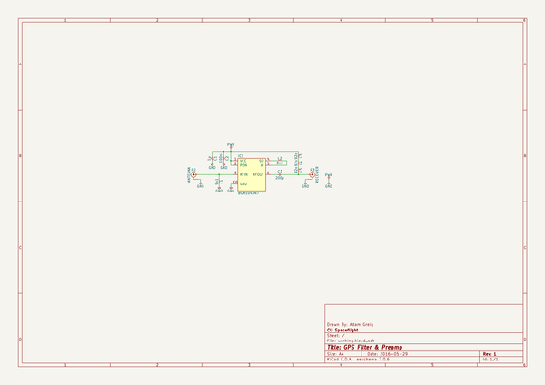
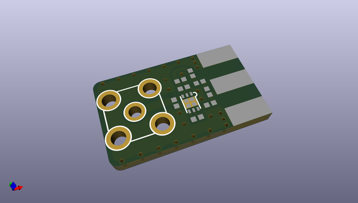
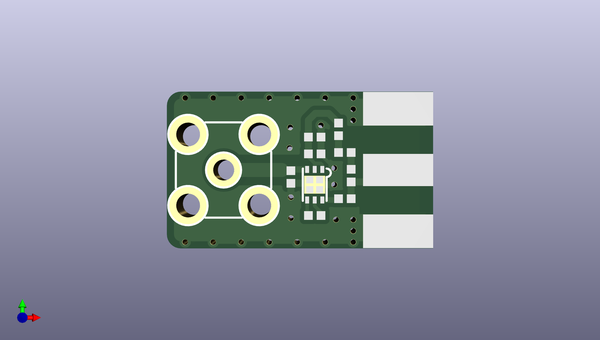
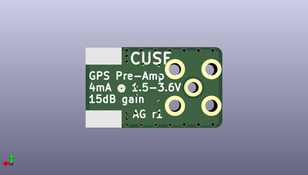

# m3_avionics
 
## summary 
* id: adamgreig_m3_avionics_gps_preamp
* user: adamgreig
* name: m3_avionics
* board: gps_preamp
* repo: https://github.com/adamgreig/m3-avionics
* src_file_repo_kicad_pcb: m3radio/gps-preamp/gps-preamp.kicad_pcb
* src_file_repo_kicad_pcb_link: https://github.com/adamgreig/m3-avionics/tree/master/m3radio/gps-preamp/gps-preamp.kicad_pcb

* src_file_repo_sch: m3radio/gps-preamp/gps-preamp.sch
* src_file_repo_sch_link: https://github.com/adamgreig/m3-avionics/tree/master/m3radio/gps-preamp/gps-preamp.sch
* full details link: https://github.com/oomlout/oomlout_oomp_project_bot_v_2/tree/main/projects/adamgreig_m3_avionics_gps_preamp/current_version/working  

## schematic  
  
[schematic (pdf)](working_schematic.pdf) 

## pcb  
 
  
  
  
[board (pdf)](working.pdf)  

## working_bom
| Id | Designator | Footprint | Quantity | Designation | Supplier and ref |  | None | 
| --- | --- | --- | --- | --- | --- | --- | --- | 
| 1 | C1 | 0402 | 1 | 1µ |  |  | [''] | 
| 2 | C2 | 0402 | 1 | 100n |  |  | [''] | 
| 3 | C3 | 0402 | 1 | 200p |  |  | [''] | 
| 4 | IC1 | DFN-6-EP-BGM | 1 | BGM1043N7 |  |  | [''] | 
| 5 | L1 | 0402 | 1 | 9n1 |  |  | [''] | 
| 6 | L2 | 0402 | 1 | 8n2 |  |  | [''] | 
| 7 | L3,L4,L5 | 0402 | 3 | 92n |  |  | [''] | 
| 8 | P2 | SMA-PTH | 1 | ANTENNA |  |  | [''] | 
| 9 | P3 | SMA-EDGE | 1 | RECEIVER |  |  | [''] | 

## bom_schematic
| Ref | Qnty | Value | Cmp name | Footprint | Description | Vendor | DNP | 
| --- | --- | --- | --- | --- | --- | --- | --- | 
| C1 | 1 | 1µ | C | agg:0402 |  |  |  | 
| C2 | 1 | 100n | C | agg:0402 |  |  |  | 
| C3 | 1 | 200p | C | agg:0402 |  |  |  | 
| IC1 | 1 | BGM1043N7 | BGM1043N7 | agg:DFN-6-EP-BGM |  |  |  | 
| L1 | 1 | 9n1 | L | agg:0402 |  |  |  | 
| L2 | 1 | 8n2 | L | agg:0402 |  |  |  | 
| L3, L4, L5 | 3 | 92n | L | agg:0402 |  |  |  | 
| P2 | 1 | ANTENNA | COAX | agg:SMA-PTH |  |  |  | 
| P3 | 1 | RECEIVER | COAX | agg:SMA-EDGE |  |  |  | 

