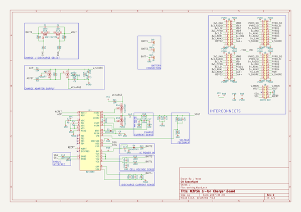
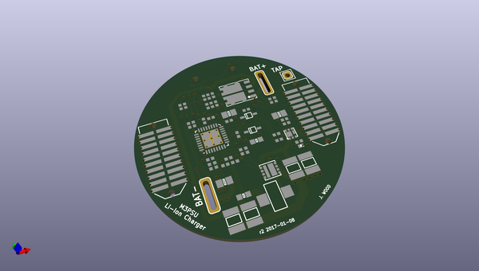
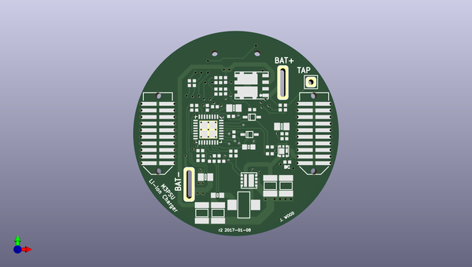
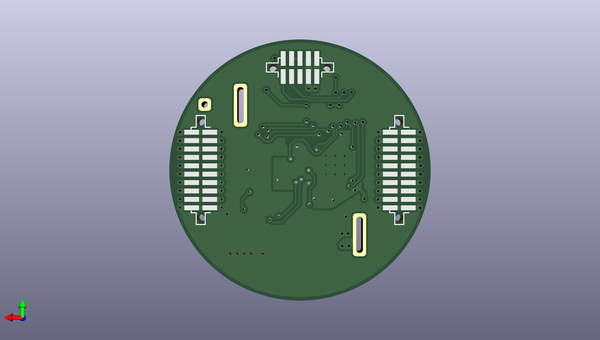

# m3_avionics
 
## summary 
* id: adamgreig_m3_avionics_li_ion_charger_board
* user: adamgreig
* name: m3_avionics
* board: li_ion_charger_board
* repo: https://github.com/adamgreig/m3-avionics
* src_file_repo_kicad_pcb: m3psu/pcb/Li-Ion-Charger-Board/Li-Ion-Charger-Board.kicad_pcb
* src_file_repo_kicad_pcb_link: https://github.com/adamgreig/m3-avionics/tree/master/m3psu/pcb/Li-Ion-Charger-Board/Li-Ion-Charger-Board.kicad_pcb

* src_file_repo_sch: m3psu/pcb/Li-Ion-Charger-Board/Li-Ion-Charger-Board.sch
* src_file_repo_sch_link: https://github.com/adamgreig/m3-avionics/tree/master/m3psu/pcb/Li-Ion-Charger-Board/Li-Ion-Charger-Board.sch
* full details link: https://github.com/oomlout/oomlout_oomp_project_bot_v_2/tree/main/projects/adamgreig_m3_avionics_li_ion_charger_board/current_version/working  

## schematic  
  
[schematic (pdf)](working_schematic.pdf) 

## pcb  
 
  
  
  
[board (pdf)](working.pdf)  

## working_bom
| Id | Designator | Footprint | Quantity | Designation | Supplier and ref |  | None | 
| --- | --- | --- | --- | --- | --- | --- | --- | 
| 1 | J1 | TFML-110-02-L-D | 1 | WEST TOP |  |  | [''] | 
| 2 | J4 | TFML-110-02-L-D | 1 | EAST TOP |  |  | [''] | 
| 3 | J3 | SIL-254P-01 | 1 | TAP |  |  | [''] | 
| 4 | J7 | SIL-254P-01 | 1 | BAT+ |  |  | [''] | 
| 5 | J8 | SIL-254P-01 | 1 | BAT- |  |  | [''] | 
| 6 | C1,C2,C8,C10,C11,C14,C15,C16,C17 | 0402 | 9 | 100n |  |  | [''] | 
| 7 | C3,C13 | 0402 | 2 | 1µ |  |  | [''] | 
| 8 | C4,C7 | 0805 | 2 | 2µ2 |  |  | [''] | 
| 9 | C5,C6,C18,C19 | 1210 | 4 | 10µ |  |  | [''] | 
| 10 | C9 | 0603 | 1 | 1µ5 |  |  | [''] | 
| 11 | C12 | 0402 | 1 | 100p |  |  | [''] | 
| 12 | C20 | 0402 | 1 | 22p |  |  | [''] | 
| 13 | D3,D4 | SOD-323 | 2 | SCHOTTKY |  |  | [''] | 
| 14 | IC1 | QFN-32-EP-TI | 1 | BQ40Z60 |  |  | [''] | 
| 15 | L1 | SRP5030T | 1 | 2µ2 |  |  | [''] | 
| 16 | Q1 | PowerFLAT-5x6 | 1 | NFET2 |  |  | [''] | 
| 17 | Q2 | SOT-883-B | 1 | NFET |  |  | [''] | 
| 18 | Q4 | PowerPair-3x3 | 1 | SiZ340DT |  |  | [''] | 
| 19 | R1 | 0402 | 1 | 10K |  |  | [''] | 
| 20 | R2,R7,R9 | 0402 | 3 | 10M |  |  | [''] | 
| 21 | R3,R4,R8 | 0402 | 3 | 5K1 |  |  | [''] | 
| 22 | R10,R11,R15,R16 | 0402 | 4 | 100R |  |  | [''] | 
| 23 | R12 | 0402 | 1 | 100K |  |  | [''] | 
| 24 | R13 | 0402 | 1 | 2R |  |  | [''] | 
| 25 | R14,R19 | 0402 | 2 | 10R |  |  | [''] | 
| 26 | R17 | 0805 | 1 | 5m |  |  | [''] | 
| 27 | R18 | 0603 | 1 | 10m |  |  | [''] | 
| 28 | R20 | 0402 | 1 | 330K |  |  | [''] | 
| 29 | R21 | 0402 | 1 | 56K2 |  |  | [''] | 
| 30 | Q3 | SON2x2N | 1 | NFET_GDS |  |  | [''] | 
| 31 | J2 | SFML-110-02-L-D-LC | 1 | WEST BOT |  |  | [''] | 
| 32 | J5 | SFML-110-02-L-D-LC | 1 | EAST BOT |  |  | [''] | 
| 33 | J6 | SFML-105-02-L-D-LC | 1 | NORTH BOT |  |  | [''] | 

## bom_schematic
| Ref | Qnty | Value | Cmp name | Footprint | Description | Vendor | DNP | 
| --- | --- | --- | --- | --- | --- | --- | --- | 
| C1, C2, C8, C10, C11, C14, C15, C16, C17 | 9 | 100n | C | agg:0402 |  |  |  | 
| C3, C13 | 2 | 1µ | C | agg:0402 |  |  |  | 
| C4, C7 | 2 | 2µ2 | C | agg:0805 |  |  |  | 
| C5, C6, C18, C19 | 4 | 10µ | C | agg:1210 |  |  |  | 
| C9 | 1 | 1µ5 | C | agg:0603 |  |  |  | 
| C12 | 1 | 100p | C | agg:0402 |  |  |  | 
| C20 | 1 | 22p | C | agg:0402 |  |  |  | 
| D3, D4 | 2 | SCHOTTKY | SCHOTTKY | agg:SOD-323 |  |  |  | 
| IC1 | 1 | BQ40Z60 | BQ40Z60 | agg:QFN-32-EP-TI |  |  |  | 
| J1 | 1 | WEST TOP | CONN_02x10 | agg:TFML-110-02-L-D |  |  |  | 
| J2 | 1 | WEST BOT | CONN_02x10 | agg:SFML-110-02-L-D-LC |  |  |  | 
| J3 | 1 | TAP | CONN_01x01 | agg:SIL-254P-01 |  |  |  | 
| J4 | 1 | EAST TOP | CONN_02x10 | agg:TFML-110-02-L-D |  |  |  | 
| J5 | 1 | EAST BOT | CONN_02x10 | agg:SFML-110-02-L-D-LC |  |  |  | 
| J6 | 1 | NORTH BOT | CONN_02x05 | agg:SFML-105-02-L-D-LC |  |  |  | 
| J7 | 1 | BAT+ | CONN_01x01 | agg:SIL-254P-01 |  |  |  | 
| J8 | 1 | BAT- | CONN_01x01 | agg:SIL-254P-01 |  |  |  | 
| L1 | 1 | 2µ2 | L | agg:SRP5030T |  |  |  | 
| Q1 | 1 | NFET2 | NFET2 | agg:PowerFLAT-5x6 |  |  |  | 
| Q2 | 1 | NFET | NFET_GDS | agg:SOT-883-B |  |  |  | 
| Q3 | 1 | NFET_GDS | NFET_GDS | agg:SON2x2N |  |  |  | 
| Q4 | 1 | SiZ340DT | SiZ340DT | agg:PowerPair-3x3 |  |  |  | 
| R1 | 1 | 10K | R | agg:0402 |  |  |  | 
| R2, R7, R9 | 3 | 10M | R | agg:0402 |  |  |  | 
| R3, R4, R8 | 3 | 5K1 | R | agg:0402 |  |  |  | 
| R10, R11, R15, R16 | 4 | 100R | R | agg:0402 |  |  |  | 
| R12 | 1 | 100K | R | agg:0402 |  |  |  | 
| R13 | 1 | 2R | R | agg:0402 |  |  |  | 
| R14, R19 | 2 | 10R | R | agg:0402 |  |  |  | 
| R17 | 1 | 5m | R | agg:0805 |  |  |  | 
| R18 | 1 | 10m | R | agg:0603 |  |  |  | 
| R20 | 1 | 330K | R | agg:0402 |  |  |  | 
| R21 | 1 | 56K2 | R | agg:0402 |  |  |  | 

