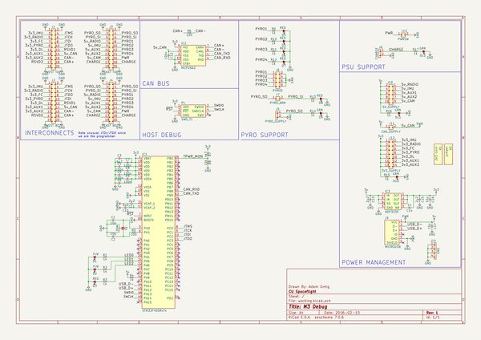
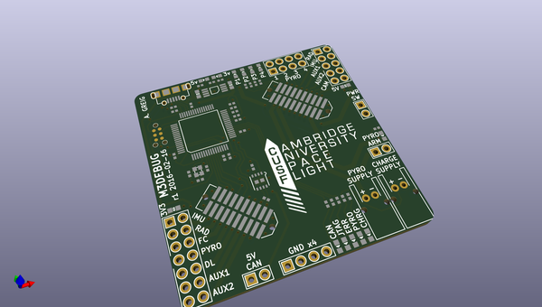
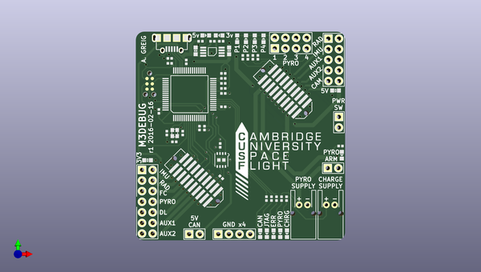
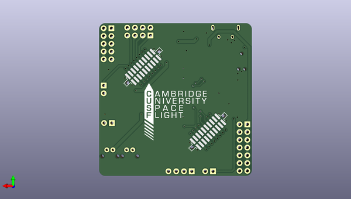

# m3_avionics
 
## summary 
* id: adamgreig_m3_avionics_m3debug
* user: adamgreig
* name: m3_avionics
* board: m3debug
* repo: https://github.com/adamgreig/m3-avionics
* src_file_repo_kicad_pcb: m3debug/pcb/m3debug.kicad_pcb
* src_file_repo_kicad_pcb_link: https://github.com/adamgreig/m3-avionics/tree/master/m3debug/pcb/m3debug.kicad_pcb

* src_file_repo_sch: m3debug/pcb/m3debug.sch
* src_file_repo_sch_link: https://github.com/adamgreig/m3-avionics/tree/master/m3debug/pcb/m3debug.sch
* full details link: https://github.com/oomlout/oomlout_oomp_project_bot_v_2/tree/main/projects/adamgreig_m3_avionics_m3debug/current_version/working  

## schematic  
  
[schematic (pdf)](working_schematic.pdf) 

## pcb  
 
  
  
  
[board (pdf)](working.pdf)  

## working_bom
| Id | Designator | Footprint | Quantity | Designation | Supplier and ref |  | None | 
| --- | --- | --- | --- | --- | --- | --- | --- | 
| 1 | C1,C2 | 0402 | 2 | 10p |  |  | [''] | 
| 2 | C3 | 0402 | 1 | 4µ7 |  |  | [''] | 
| 3 | C4,C5,C7,C8,C9,C12 | 0402 | 6 | 100n |  |  | [''] | 
| 4 | C6 | 0402 | 1 | 1µ |  |  | [''] | 
| 5 | C10,C11 | 0402 | 2 | 2µ2 |  |  | [''] | 
| 6 | C13,C15 | 0603 | 2 | 2µ2 |  |  | [''] | 
| 7 | C14 | 0402 | 1 | 1n |  |  | [''] | 
| 8 | C16,C17 | 0603 | 2 | 10µ |  |  | [''] | 
| 9 | D1,D2 | 0603-LED | 2 | YLW |  |  | [''] | 
| 10 | D3,D4,D5,D6,D7,D8 | 0603-LED | 6 | RED |  |  | [''] | 
| 11 | D9,D10,D11,D12 | 0603-LED | 4 | GRN |  |  | [''] | 
| 12 | IC1 | LQFP-64 | 1 | STM32F405RxTx |  |  | [''] | 
| 13 | IC2 | DFN-8-EP-MICROCHIP | 1 | MCP2562 |  |  | [''] | 
| 14 | IC3 | MSOP-8 | 1 | ADP3335 |  |  | [''] | 
| 15 | J1 | TFML-110-02-L-D | 1 | WEST TOP |  |  | [''] | 
| 16 | J3 | TFML-110-02-L-D | 1 | EAST TOP |  |  | [''] | 
| 17 | J5 | S02B-PASK-2 | 1 | PYRO_SUPPLY |  |  | [''] | 
| 18 | J6 | DIL-254P-08 | 1 | PYROS |  |  | [''] | 
| 19 | J8 | S02B-PASK-2 | 1 | CHARGE |  |  | [''] | 
| 20 | J9 | MICROUSB_MOLEX_47589-0001 | 1 | MICROUSB |  |  | [''] | 
| 21 | J10 | DIL-254P-10 | 1 | 5V_SUPPLY |  |  | [''] | 
| 22 | J12 | DIL-254P-14 | 1 | 3V3_SUPPLY |  |  | [''] | 
| 23 | P1 | TC2030-NL | 1 | SWD_TC |  |  | [''] | 
| 24 | R1,R2,R3,R4,R9,R10,R11,R12,R13,R14,R15,R16,R17 | 0402 | 13 | 1k |  |  | [''] | 
| 25 | R5 | 0402 | 1 | 100 |  |  | [''] | 
| 26 | R6 | 0402 | 1 | 120 |  |  | [''] | 
| 27 | R7 | 0402 | 1 | 4k7 |  |  | [''] | 
| 28 | R8 | 0402 | 1 | 10k |  |  | [''] | 
| 29 | Y1 | XTAL-20x16 | 1 | 26M |  |  | [''] | 
| 30 | J7 | SIL-254P-02 | 1 | PYRO_ARM |  |  | [''] | 
| 31 | J11 | SIL-254P-02 | 1 | CAN_SUPPLY |  |  | [''] | 
| 32 | J13 | SIL-254P-02 | 1 | PWRSW |  |  | [''] | 
| 33 | J14 | SIL-254P-04 | 1 | GND |  |  | [''] | 
| 34 | G***,G*** | cusf_logo_full | 2 | LOGO |  |  | [''] | 
| 35 | J2 | SFML-110-02-L-D-LC | 1 | WEST BOT |  |  | [''] | 
| 36 | J4 | SFML-110-02-L-D-LC | 1 | EAST BOT |  |  | [''] | 

## bom_schematic
| Ref | Qnty | Value | Cmp name | Footprint | Description | Vendor | DNP | 
| --- | --- | --- | --- | --- | --- | --- | --- | 
| C1, C2 | 2 | 10p | C | agg:0402 |  |  |  | 
| C3 | 1 | 4µ7 | C | agg:0402 |  |  |  | 
| C4, C5, C7, C8, C9, C12 | 6 | 100n | C | agg:0402 |  |  |  | 
| C6 | 1 | 1µ | C | agg:0402 |  |  |  | 
| C10, C11 | 2 | 2µ2 | C | agg:0402 |  |  |  | 
| C13, C15 | 2 | 2µ2 | C | agg:0603 |  |  |  | 
| C14 | 1 | 1n | C | agg:0402 |  |  |  | 
| C16, C17 | 2 | 10µ | C | agg:0603 |  |  |  | 
| D1, D2 | 2 | YLW | LED | agg:0603-LED |  |  |  | 
| D3, D4, D5, D6, D7, D8 | 6 | RED | LED | agg:0603-LED |  |  |  | 
| D9, D10, D11, D12 | 4 | GRN | LED | agg:0603-LED |  |  |  | 
| IC1 | 1 | STM32F405RxTx | STM32F405RxTx | agg:LQFP-64 |  |  |  | 
| IC2 | 1 | MCP2562 | MCP2562 | agg:DFN-8-EP-MICROCHIP |  |  |  | 
| IC3 | 1 | ADP3335 | ADP3335 | agg:MSOP-8 |  |  |  | 
| J1 | 1 | WEST TOP | CONN_02x10 | agg:TFML-110-02-L-D |  |  |  | 
| J2 | 1 | WEST BOT | CONN_02x10 | agg:SFML-110-02-L-D-LC |  |  |  | 
| J3 | 1 | EAST TOP | CONN_02x10 | agg:TFML-110-02-L-D |  |  |  | 
| J4 | 1 | EAST BOT | CONN_02x10 | agg:SFML-110-02-L-D-LC |  |  |  | 
| J5 | 1 | PYRO_SUPPLY | CONN_01x02 | agg:S02B-PASK-2 |  |  |  | 
| J6 | 1 | PYROS | CONN_02x04 | agg:DIL-254P-08 |  |  |  | 
| J7 | 1 | PYRO_ARM | CONN_02x01 | agg:SIL-254P-02 |  |  |  | 
| J8 | 1 | CHARGE | CONN_01x02 | agg:S02B-PASK-2 |  |  |  | 
| J9 | 1 | MICROUSB | MICROUSB | agg:MICROUSB_MOLEX_47589-0001 |  |  |  | 
| J10 | 1 | 5V_SUPPLY | CONN_02x05 | agg:DIL-254P-10 |  |  |  | 
| J11 | 1 | CAN_SUPPLY | CONN_02x01 | agg:SIL-254P-02 |  |  |  | 
| J12 | 1 | 3V3_SUPPLY | CONN_02x07 | agg:DIL-254P-14 |  |  |  | 
| J13 | 1 | PWRSW | CONN_02x01 | agg:SIL-254P-02 |  |  |  | 
| J14 | 1 | GND | CONN_01x04 | agg:SIL-254P-04 |  |  |  | 
| P1 | 1 | SWD_TC | SWD_TC | agg:TC2030-NL |  |  |  | 
| R1, R2, R3, R4, R9, R10, R11, R12, R13, R14, R15, R16, R17 | 13 | 1k | R | agg:0402 |  |  |  | 
| R5 | 1 | 100 | R | agg:0402 |  |  |  | 
| R6 | 1 | 120 | R | agg:0402 |  |  |  | 
| R7 | 1 | 4k7 | R | agg:0402 |  |  |  | 
| R8 | 1 | 10k | R | agg:0402 |  |  |  | 
| X1 | 1 | 2x3 conn | PART |  |  |  |  | 
| X2 | 1 | jumper | PART |  |  |  |  | 
| Y1 | 1 | 26M | SMD_XTAL | agg:XTAL-20x16 |  |  |  | 

