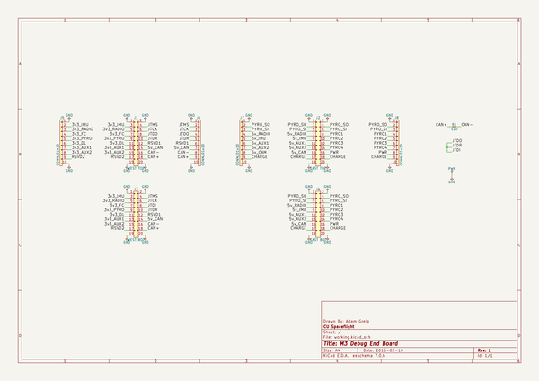

# m3_avionics
 
## summary 
* id: adamgreig_m3_avionics_m3debug_end
* user: adamgreig
* name: m3_avionics
* board: m3debug_end
* repo: https://github.com/adamgreig/m3-avionics
* src_file_repo_kicad_pcb: m3debug/end_pcb/m3debug_end.kicad_pcb
* src_file_repo_kicad_pcb_link: https://github.com/adamgreig/m3-avionics/tree/master/m3debug/end_pcb/m3debug_end.kicad_pcb

* src_file_repo_sch: m3debug/end_pcb/m3debug_end.sch
* src_file_repo_sch_link: https://github.com/adamgreig/m3-avionics/tree/master/m3debug/end_pcb/m3debug_end.sch
* full details link: https://github.com/oomlout/oomlout_oomp_project_bot_v_2/tree/main/projects/adamgreig_m3_avionics_m3debug_end/current_version/working  

## schematic  
  
[schematic (pdf)](working_schematic.pdf)  

## pcb  
 
  
  
  
[board (pdf)](working.pdf)  

## working_bom
| Id | Designator | Footprint | Quantity | Designation | Supplier and ref |  | None | 
| --- | --- | --- | --- | --- | --- | --- | --- | 
| 1 | J1 | TFML-110-02-L-D | 1 | WEST TOP |  |  | [''] | 
| 2 | J2 | TFML-110-02-L-D | 1 | EAST TOP |  |  | [''] | 
| 3 | R1 | 0402 | 1 | 120 |  |  | [''] | 
| 4 | J5,J6,J7,J8 | SIL-254P-10 | 4 | CONN_01x10 |  |  | [''] | 
| 5 | J3 | SFML-110-02-L-D-LC | 1 | WEST BOT |  |  | [''] | 
| 6 | J4 | SFML-110-02-L-D-LC | 1 | EAST BOT |  |  | [''] | 

## bom_schematic
| Ref | Qnty | Value | Cmp name | Footprint | Description | Vendor | DNP | 
| --- | --- | --- | --- | --- | --- | --- | --- | 
| J1 | 1 | WEST TOP | CONN_02x10 | agg:TFML-110-02-L-D |  |  |  | 
| J2 | 1 | EAST TOP | CONN_02x10 | agg:TFML-110-02-L-D |  |  |  | 
| J3 | 1 | WEST BOT | CONN_02x10 | agg:SFML-110-02-L-D-LC |  |  |  | 
| J4 | 1 | EAST BOT | CONN_02x10 | agg:SFML-110-02-L-D-LC |  |  |  | 
| J5, J6, J7, J8 | 4 | CONN_01x10 | CONN_01x10 | agg:SIL-254P-10 |  |  |  | 
| R1 | 1 | 120 | R | agg:0402 |  |  |  | 

