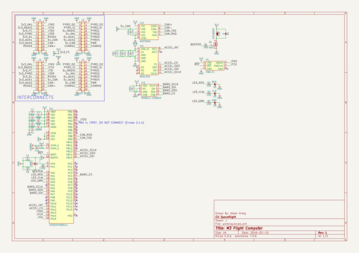
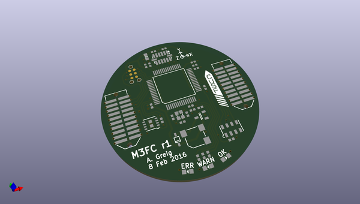
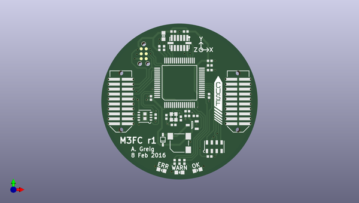
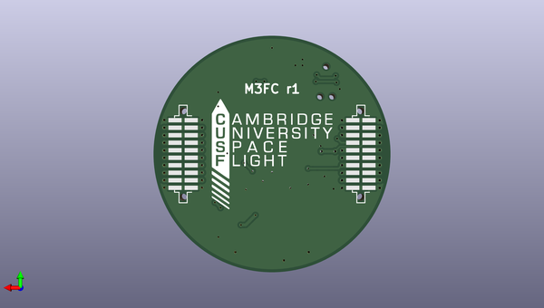

# m3_avionics
 
## summary 
* id: adamgreig_m3_avionics_m3fc
* user: adamgreig
* name: m3_avionics
* board: m3fc
* repo: https://github.com/adamgreig/m3-avionics
* src_file_repo_kicad_pcb: m3fc/pcb/m3fc.kicad_pcb
* src_file_repo_kicad_pcb_link: https://github.com/adamgreig/m3-avionics/tree/master/m3fc/pcb/m3fc.kicad_pcb

* src_file_repo_sch: m3fc/pcb/m3fc.sch
* src_file_repo_sch_link: https://github.com/adamgreig/m3-avionics/tree/master/m3fc/pcb/m3fc.sch
* full details link: https://github.com/oomlout/oomlout_oomp_project_bot_v_2/tree/main/projects/adamgreig_m3_avionics_m3fc/current_version/working  

## schematic  
  
[schematic (pdf)](working_schematic.pdf)  

## pcb  
 
  
  
  
[board (pdf)](working.pdf)  

## working_bom
| Id | Designator | Footprint | Quantity | Designation | Supplier and ref |  | None | 
| --- | --- | --- | --- | --- | --- | --- | --- | 
| 1 | C15,C14,C16,C17,C3,C4,C7,C8,C9 | 0402 | 9 | 100n |  |  | [''] | 
| 2 | C13 | 0603 | 1 | 10µ |  |  | [''] | 
| 3 | D1 | 0603-LED | 1 | RED |  |  | [''] | 
| 4 | D2 | 0603-LED | 1 | YLW |  |  | [''] | 
| 5 | D3 | 0603-LED | 1 | GRN |  |  | [''] | 
| 6 | IC3 | DFN-8-EP-MICROCHIP | 1 | MCP2562 |  |  | [''] | 
| 7 | IC4 | ADXL3x5 | 1 | ADXL345 |  |  | [''] | 
| 8 | IC2 | MS5611 | 1 | MS5611-01BA03 |  |  | [''] | 
| 9 | P1 | TC2030-NL | 1 | SWD_TC |  |  | [''] | 
| 10 | Q1 | SOT-23 | 1 | NFET |  |  | [''] | 
| 11 | R1,R2,R3,R4,R5 | 0402 | 5 | 100 |  |  | [''] | 
| 12 | J3 | TFML-110-02-L-D | 1 | EAST TOP |  |  | [''] | 
| 13 | C1,C6 | 0402 | 2 | 10p |  |  | [''] | 
| 14 | C5 | 0402 | 1 | 1µ |  |  | [''] | 
| 15 | IC1 | LQFP-64 | 1 | STM32F405RxTx |  |  | [''] | 
| 16 | J1 | TFML-110-02-L-D | 1 | WEST TOP |  |  | [''] | 
| 17 | Y1 | XTAL-20x16 | 1 | 26M |  |  | [''] | 
| 18 | LS1 | KSSG13J12-N | 1 | SOUNDER |  |  | [''] | 
| 19 | C2 | 0402 | 1 | 4µ7 |  |  | [''] | 
| 20 | C10,C11 | 0402 | 2 | 2µ2 |  |  | [''] | 
| 21 | D4 | SOD-323 | 1 | D |  |  | [''] | 
| 22 | G*** | cusf_logo_small | 1 | LOGO |  |  | [''] | 
| 23 | J4 | SFML-110-02-L-D-LC | 1 | EAST BOT |  |  | [''] | 
| 24 | J2 | SFML-110-02-L-D-LC | 1 | WEST BOT |  |  | [''] | 
| 25 | G*** | cusf_logo_full | 1 | LOGO |  |  | [''] | 

## bom_schematic
| Ref | Qnty | Value | Cmp name | Footprint | Description | Vendor | DNP | 
| --- | --- | --- | --- | --- | --- | --- | --- | 
| C1, C6 | 2 | 10p | C | agg:0402 |  |  |  | 
| C2 | 1 | 4µ7 | C | agg:0402 |  |  |  | 
| C3, C4, C7, C8, C9, C14, C15, C16, C17 | 9 | 100n | C | agg:0402 |  |  |  | 
| C5 | 1 | 1µ | C | agg:0402 |  |  |  | 
| C10, C11 | 2 | 2µ2 | C | agg:0402 |  |  |  | 
| C13 | 1 | 10µ | C | agg:0603 |  |  |  | 
| D1 | 1 | RED | LED | agg:0603-LED |  |  |  | 
| D2 | 1 | YLW | LED | agg:0603-LED |  |  |  | 
| D3 | 1 | GRN | LED | agg:0603-LED |  |  |  | 
| D4 | 1 | D | D | agg:SOD-323 |  |  |  | 
| IC1 | 1 | STM32F405RxTx | STM32F405RxTx | agg:LQFP-64 |  |  |  | 
| IC2 | 1 | MS5611-01BA03 | MS5611-01BA03 | agg:MS5611 |  |  |  | 
| IC3 | 1 | MCP2562 | MCP2562 | agg:DFN-8-EP-MICROCHIP |  |  |  | 
| IC4 | 1 | ADXL345 | ADXL345 | agg:ADXL3x5 |  |  |  | 
| J1 | 1 | WEST TOP | CONN_02x10 | agg:TFML-110-02-L-D |  |  |  | 
| J2 | 1 | WEST BOT | CONN_02x10 | agg:SFML-110-02-L-D-LC |  |  |  | 
| J3 | 1 | EAST TOP | CONN_02x10 | agg:TFML-110-02-L-D |  |  |  | 
| J4 | 1 | EAST BOT | CONN_02x10 | agg:SFML-110-02-L-D-LC |  |  |  | 
| LS1 | 1 | SOUNDER | SOUNDER | agg:KSSG13J12-N |  |  |  | 
| P1 | 1 | SWD_TC | SWD_TC | agg:TC2030-NL |  |  |  | 
| Q1 | 1 | NFET | NFET | agg:SOT-23 |  |  |  | 
| R1, R2, R3, R4, R5 | 5 | 100 | R | agg:0402 |  |  |  | 
| Y1 | 1 | 26M | SMD_XTAL | agg:XTAL-20x16 |  |  |  | 

