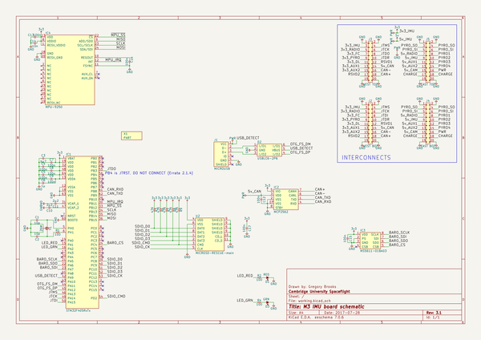
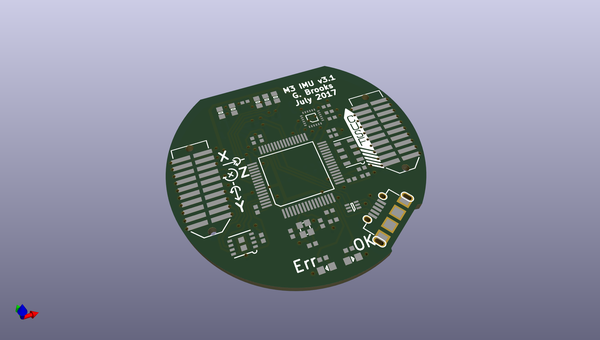
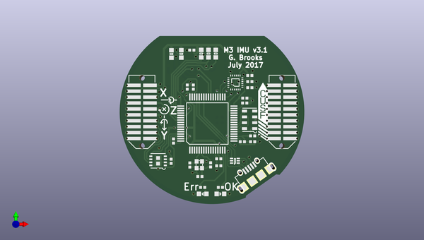
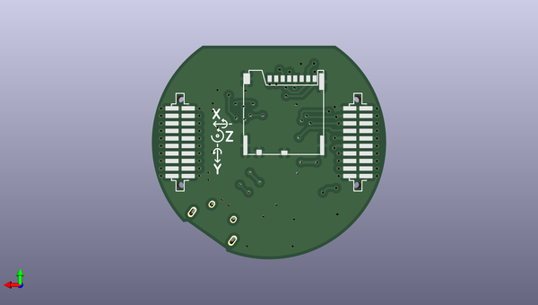

# m3_avionics
 
## summary 
* id: adamgreig_m3_avionics_m3imu
* user: adamgreig
* name: m3_avionics
* board: m3imu
* repo: https://github.com/adamgreig/m3-avionics
* src_file_repo_kicad_pcb: m3imu/pcb/m3imu.kicad_pcb
* src_file_repo_kicad_pcb_link: https://github.com/adamgreig/m3-avionics/tree/master/m3imu/pcb/m3imu.kicad_pcb

* src_file_repo_sch: m3imu/pcb/m3imu.sch
* src_file_repo_sch_link: https://github.com/adamgreig/m3-avionics/tree/master/m3imu/pcb/m3imu.sch
* full details link: https://github.com/oomlout/oomlout_oomp_project_bot_v_2/tree/main/projects/adamgreig_m3_avionics_m3imu/current_version/working  

## schematic  
  
[schematic (pdf)](working_schematic.pdf)  

## pcb  
 
  
  
  
[board (pdf)](working.pdf)  

## working_bom
| Id | Designator | Footprint | Quantity | Designation | Supplier and ref |  | None | 
| --- | --- | --- | --- | --- | --- | --- | --- | 
| 1 | C1,C2 | 0402 | 2 | 10p |  |  | [''] | 
| 2 | C3 | 0402 | 1 | 4µ7 |  |  | [''] | 
| 3 | C4,C5,C7,C8,C9,C12,C13,C15,C16,C17 | 0402 | 10 | 100n |  |  | [''] | 
| 4 | C6 | 0402 | 1 | 1µ |  |  | [''] | 
| 5 | C10,C11 | 0402 | 2 | 2µ2 |  |  | [''] | 
| 6 | C14 | 0402 | 1 | 10n |  |  | [''] | 
| 7 | D1 | 0603-LED | 1 | RED |  |  | [''] | 
| 8 | D3 | 0603-LED | 1 | GRN |  |  | [''] | 
| 9 | IC1 | LQFP-64 | 1 | STM32F405RxTx |  |  | [''] | 
| 10 | IC2 | DFN-8-EP-MICROCHIP | 1 | MCP2562 |  |  | [''] | 
| 11 | IC3 | MS5611 | 1 | MS5611-01BA03 |  |  | [''] | 
| 12 | IC4 | QFN-24-MPU9250 | 1 | MPU-9250 |  |  | [''] | 
| 13 | R1,R2,R4 | 0402 | 3 | 100 |  |  | [''] | 
| 14 | Y1 | XTAL-20x16 | 1 | 26M |  |  | [''] | 
| 15 | X1 | cusf_logo_small | 1 | PART |  |  | [''] | 
| 16 | J1 | MICROUSB_MOLEX_47589-0001 | 1 | MICROUSB |  |  | [''] | 
| 17 | D2 | SOT-666 | 1 | USBLC6-2P6 |  |  | [''] | 
| 18 | R3,R6,R7,R8,R9 | 0603 | 5 | 47K |  |  | [''] | 
| 19 | J3 | TFML-110-02-L-D | 1 | WEST TOP |  |  | [''] | 
| 20 | J5 | TFML-110-02-L-D | 1 | EAST TOP |  |  | [''] | 
| 21 | J2 | SFML-110-02-L-D-LC | 1 | WEST BOT |  |  | [''] | 
| 22 | J4 | SFML-110-02-L-D-LC | 1 | EAST BOT |  |  | [''] | 
| 23 | U2 | MICROSD_MOLEX_503398-1892 | 1 | MICROSD-RESCUE-main |  |  | [''] | 

## bom_schematic
| Ref | Qnty | Value | Cmp name | Footprint | Description | Vendor | DNP | 
| --- | --- | --- | --- | --- | --- | --- | --- | 
| C1, C2 | 2 | 10p | C | agg:0402 |  |  |  | 
| C3 | 1 | 4µ7 | C | agg:0402 |  |  |  | 
| C4, C5, C7, C8, C9, C12, C13, C15, C16, C17 | 10 | 100n | C | agg:0402 |  |  |  | 
| C6 | 1 | 1µ | C | agg:0402 |  |  |  | 
| C10, C11 | 2 | 2µ2 | C | agg:0402 |  |  |  | 
| C14 | 1 | 10n | C | agg:0402 |  |  |  | 
| D1 | 1 | RED | LED | agg:0603-LED |  |  |  | 
| D2 | 1 | USBLC6-2P6 | USBLC6-2P6 | agg:SOT-666 |  |  |  | 
| D3 | 1 | GRN | LED | agg:0603-LED |  |  |  | 
| IC1 | 1 | STM32F405RxTx | STM32F405RxTx | agg:LQFP-64 |  |  |  | 
| IC2 | 1 | MCP2562 | MCP2562 | agg:DFN-8-EP-MICROCHIP |  |  |  | 
| IC3 | 1 | MS5611-01BA03 | MS5611-01BA03 | agg:MS5611 |  |  |  | 
| IC4 | 1 | MPU-9250 | MPU-9250 | agg:QFN-24-MPU9250 |  |  |  | 
| J1 | 1 | MICROUSB | MICROUSB | agg:MICROUSB_MOLEX_47589-0001 |  |  |  | 
| J2 | 1 | WEST BOT | CONN_02x10 | agg:SFML-110-02-L-D-LC |  |  |  | 
| J3 | 1 | WEST TOP | CONN_02x10 | agg:TFML-110-02-L-D |  |  |  | 
| J4 | 1 | EAST BOT | CONN_02x10 | agg:SFML-110-02-L-D-LC |  |  |  | 
| J5 | 1 | EAST TOP | CONN_02x10 | agg:TFML-110-02-L-D |  |  |  | 
| R1, R2, R4 | 3 | 100 | R | agg:0402 |  |  |  | 
| R3, R6, R7, R8, R9 | 5 | 47K | R | agg:0603 |  |  |  | 
| U2 | 1 | MICROSD-RESCUE-main | MICROSD-RESCUE-main | agg:MICROSD_MOLEX_503398-1892 |  |  |  | 
| X1 | 1 | PART | PART | M3_IMU:cusf_logo_small |  |  |  | 
| Y1 | 1 | 26M | SMD_XTAL | agg:XTAL-20x16 |  |  |  | 

