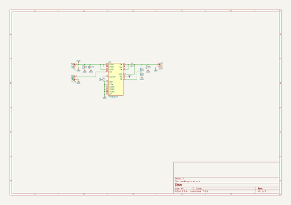

# m3_avionics
 
## summary 
* id: adamgreig_m3_avionics_m3pyro_prototype
* user: adamgreig
* name: m3_avionics
* board: m3pyro_prototype
* repo: https://github.com/adamgreig/m3-avionics
* src_file_repo_kicad_pcb: m3pyro/firing_prototype/m3pyro_prototype.kicad_pcb
* src_file_repo_kicad_pcb_link: https://github.com/adamgreig/m3-avionics/tree/master/m3pyro/firing_prototype/m3pyro_prototype.kicad_pcb

* src_file_repo_sch: m3pyro/firing_prototype/m3pyro_prototype.sch
* src_file_repo_sch_link: https://github.com/adamgreig/m3-avionics/tree/master/m3pyro/firing_prototype/m3pyro_prototype.sch
* full details link: https://github.com/oomlout/oomlout_oomp_project_bot_v_2/tree/main/projects/adamgreig_m3_avionics_m3pyro_prototype/current_version/working  

## schematic  
  
[schematic (pdf)](working_schematic.pdf) 

## pcb  
 
  
  
  
[board (pdf)](working.pdf)  

## working_bom
| Id | Designator | Footprint | Quantity | Designation | Supplier and ref |  | None | 
| --- | --- | --- | --- | --- | --- | --- | --- | 
| 1 | L1 | XFL4020 | 1 | 2µ2 |  |  | [''] | 
| 2 | TP1 | TESTPAD | 1 | TESTPAD |  |  | [''] | 
| 3 | J1 | SIL-254P-02 | 1 | INPUT |  |  | [''] | 
| 4 | J2 | SIL-254P-02 | 1 | ENABLE |  |  | [''] | 
| 5 | J3 | SIL-254P-02 | 1 | OUTPUT |  |  | [''] | 
| 6 | IC1 | QFN-16-EP-TI | 1 | TPS62130 |  |  | [''] | 
| 7 | C1,C4 | 0603 | 2 | 10µ |  |  | [''] | 
| 8 | C2 | 0603 | 1 | 100n |  |  | [''] | 
| 9 | C3,R1,R2 | 0603 | 3 | DNP |  |  | [''] | 
| 10 | REF**,REF**,REF**,REF** | M3_MOUNT | 4 | M3_MOUNT |  |  | [''] | 

## bom_schematic
| Ref | Qnty | Value | Cmp name | Footprint | Description | Vendor | DNP | 
| --- | --- | --- | --- | --- | --- | --- | --- | 
| C1, C4 | 2 | 10µ | C | agg:0603 |  |  |  | 
| C2 | 1 | 100n | C | agg:0603 |  |  |  | 
| C3 | 1 | DNP | C | agg:0603 |  |  |  | 
| IC1 | 1 | TPS62130 | TPS62130 | agg:QFN-16-EP-TI |  |  |  | 
| J1 | 1 | INPUT | CONN_01x02 | agg:SIL-254P-02 |  |  |  | 
| J2 | 1 | ENABLE | CONN_01x02 | agg:SIL-254P-02 |  |  |  | 
| J3 | 1 | OUTPUT | CONN_01x02 | agg:SIL-254P-02 |  |  |  | 
| L1 | 1 | 2µ2 | L | agg:XFL4020 |  |  |  | 
| R1, R2 | 2 | DNP | R | agg:0603 |  |  |  | 
| TP1 | 1 | TESTPAD | TESTPAD | agg:TESTPAD |  |  |  | 

