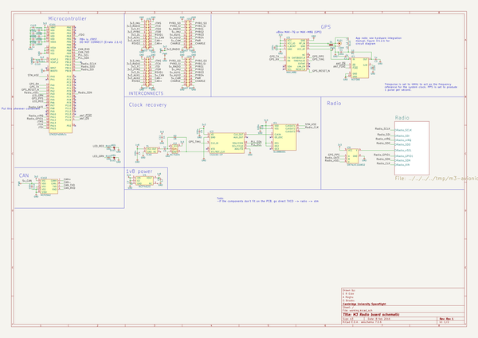
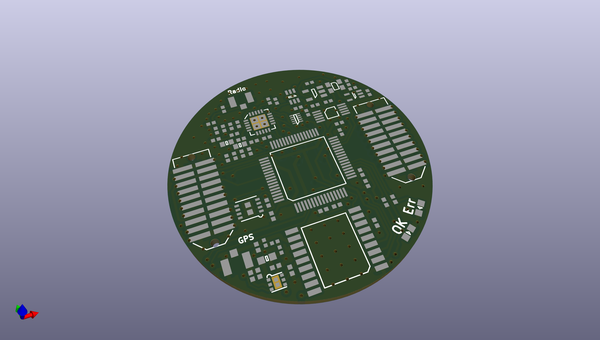
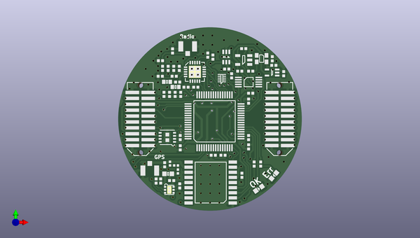
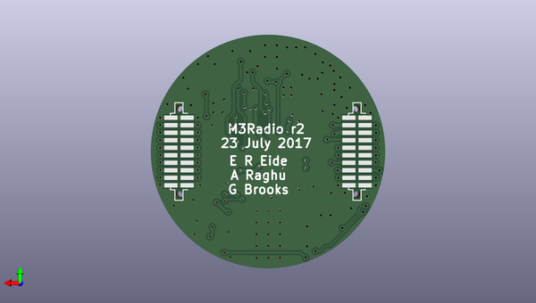

# m3_avionics
 
## summary 
* id: adamgreig_m3_avionics_m3radio
* user: adamgreig
* name: m3_avionics
* board: m3radio
* repo: https://github.com/adamgreig/m3-avionics
* src_file_repo_kicad_pcb: m3radio/pcb_r2/m3radio.kicad_pcb
* src_file_repo_kicad_pcb_link: https://github.com/adamgreig/m3-avionics/tree/master/m3radio/pcb_r2/m3radio.kicad_pcb

* src_file_repo_sch: m3radio/gps-preamp/gps-preamp.sch
* src_file_repo_sch_link: https://github.com/adamgreig/m3-avionics/tree/master/m3radio/gps-preamp/gps-preamp.sch
* full details link: https://github.com/oomlout/oomlout_oomp_project_bot_v_2/tree/main/projects/adamgreig_m3_avionics_m3radio/current_version/working  

## schematic  
  
[schematic (pdf)](working_schematic.pdf) 

## pcb  
 
  
  
  
[board (pdf)](working.pdf)  

## working_bom
| Id | Designator | Footprint | Quantity | Designation | Supplier and ref |  | None | 
| --- | --- | --- | --- | --- | --- | --- | --- | 
| 1 | C103 | 0402 | 1 | 4u7 |  |  | [''] | 
| 2 | C104,C105,C107,C108,C109,C112,C113,C202,C1,C4,C9,C10 | 0402 | 12 | 100n |  |  | [''] | 
| 3 | C106,C2,C3,C7,C8 | 0402 | 5 | 1u |  |  | [''] | 
| 4 | C110,C111 | 0402 | 2 | 2u2 |  |  | [''] | 
| 5 | D101 | 0603-LED | 1 | RED |  |  | [''] | 
| 6 | D102 | 0603-LED | 1 | GRN |  |  | [''] | 
| 7 | IC101 | LQFP-64 | 1 | STM32F405RxTx |  |  | [''] | 
| 8 | IC102 | DFN-8-EP-MICROCHIP | 1 | MCP2562 |  |  | [''] | 
| 9 | IC201 | QFN-20-EP-SI | 1 | Si4461 |  |  | [''] | 
| 10 | J101 | TFML-110-02-L-D | 1 | WEST TOP |  |  | [''] | 
| 11 | J103 | TFML-110-02-L-D | 1 | EAST TOP |  |  | [''] | 
| 12 | R102,R103 | 0402 | 2 | 100 |  |  | [''] | 
| 13 | C201 | 0402 | 1 | 100p |  |  | [''] | 
| 14 | C203 | 0402 | 1 | 3p |  |  | [''] | 
| 15 | C204 | 0402 | 1 | 22p |  |  | [''] | 
| 16 | C205 | 0402 | 1 | 1p |  |  | [''] | 
| 17 | C206,C207 | 0402 | 2 | 5.6p |  |  | [''] | 
| 18 | L201 | 0603-L | 1 | 120nH |  |  | [''] | 
| 19 | L204 | 0603-L | 1 | 8.2nH |  |  | [''] | 
| 20 | C5,C11 | 0402 | 2 | 1n |  |  | [''] | 
| 21 | D1,D2 | 0402 | 2 | ESD_DIODE |  |  | [''] | 
| 22 | IC1 | DFN-6-EP-ONSEMI | 1 | NCP380 |  |  | [''] | 
| 23 | L1,L2,L3 | 0402-L | 3 | 91nH |  |  | [''] | 
| 24 | R1 | 0603 | 1 | 10 |  |  | [''] | 
| 25 | R2 | 0402 | 1 | 110k |  |  | [''] | 
| 26 | P101,P201 | U.FL-R-SMT-1 | 2 | COAX |  |  | [''] | 
| 27 | U1 | SC-70-5 | 1 | NCP4620 |  |  | [''] | 
| 28 | IC2 | SOT-23-5 | 1 | NC7SZ04 |  |  | [''] | 
| 29 | IC3 | MSOP-10 | 1 | CS2100-CP |  |  | [''] | 
| 30 | IC4 | DFN-10-SL18860DC | 1 | SL18860DC |  |  | [''] | 
| 31 | IC5 | MAX-M8Q | 1 | MAX_M8Q |  |  | [''] | 
| 32 | IC6 | SC-70-6 | 1 | SN74LVC1G0832 |  |  | [''] | 
| 33 | R3 | 0402 | 1 | 1M |  |  | [''] | 
| 34 | Y1 | TG-5006CG | 1 | TCXO |  |  | [''] | 
| 35 | C12 | 0402 | 1 | 220p |  |  | [''] | 
| 36 | L202 | 0402 | 1 | 20nH |  |  | [''] | 
| 37 | L203 | 0402 | 1 | 24nH |  |  | [''] | 
| 38 | L205 | 0402 | 1 | 6.8nH |  |  | [''] | 
| 39 | R4,R5 | 0402 | 2 | 10k |  |  | [''] | 
| 40 | C13 | 0402 | 1 | 2.2u |  |  | [''] | 
| 41 | J102 | SFML-110-02-L-D-LC | 1 | WEST BOT |  |  | [''] | 
| 42 | J104 | SFML-110-02-L-D-LC | 1 | EAST BOT |  |  | [''] | 

## bom_schematic
| Ref | Qnty | Value | Cmp name | Footprint | Description | Vendor | DNP | 
| --- | --- | --- | --- | --- | --- | --- | --- | 
| C1, C4, C9, C10, C104, C105, C107, C108, C109, C112, C113 | 11 | 100n | C | agg:0402 |  |  |  | 
| C2, C3, C7, C8, C106 | 5 | 1u | C | agg:0402 |  |  |  | 
| C5, C11 | 2 | 1n | C | agg:0402 |  |  |  | 
| C103 | 1 | 4u7 | C | agg:0402 |  |  |  | 
| C110, C111 | 2 | 2u2 | C | agg:0402 |  |  |  | 
| D1 | 1 | ESD_DIODE | ESD_DIODE | agg:0402 |  |  |  | 
| D101 | 1 | RED | LED | agg:0603-LED |  |  |  | 
| D102 | 1 | GRN | LED | agg:0603-LED |  |  |  | 
| IC1 | 1 | NCP380 | NCP380 | agg:DFN-6-EP-ONSEMI |  |  |  | 
| IC2 | 1 | NC7SZ04 | NC7SZ04 | agg:SOT-23-5 |  |  |  | 
| IC3 | 1 | CS2100-CP | CS2100-CP | agg:MSOP-10 |  |  |  | 
| IC4 | 1 | SL18860DC | SL18860DC | agg:DFN-10-SL18860DC |  |  |  | 
| IC5 | 1 | MAX_M8Q | MAX_M8Q | agg:MAX-M8Q |  |  |  | 
| IC6 | 1 | SN74LVC1G0832 | SN74LVC1G0832 | agg:SC-70-6 |  |  |  | 
| IC101 | 1 | STM32F405RxTx | STM32F405RxTx | agg:LQFP-64 |  |  |  | 
| IC102 | 1 | MCP2562 | MCP2562 | agg:DFN-8-EP-MICROCHIP |  |  |  | 
| J101 | 1 | WEST TOP | CONN_02x10 | agg:TFML-110-02-L-D |  |  |  | 
| J102 | 1 | WEST BOT | CONN_02x10 | agg:SFML-110-02-L-D-LC |  |  |  | 
| J103 | 1 | EAST TOP | CONN_02x10 | agg:TFML-110-02-L-D |  |  |  | 
| J104 | 1 | EAST BOT | CONN_02x10 | agg:SFML-110-02-L-D-LC |  |  |  | 
| L1, L2, L3 | 3 | 91nH | L | agg:0402-L |  |  |  | 
| P101 | 1 | COAX | COAX | M3radio:U.FL-R-SMT-1 |  |  |  | 
| R1 | 1 | 10 | R | agg:0603 |  |  |  | 
| R2 | 1 | 110k | R | agg:0402 |  |  |  | 
| R3 | 1 | 1M | R | agg:0402 |  |  |  | 
| R102, R103 | 2 | 100 | R | agg:0402 |  |  |  | 
| U1 | 1 | NCP4620 | NCP4620 | agg:SC-70-5 |  |  |  | 
| Y1 | 1 | TCXO | TCXO | agg:TG-5006CG |  |  |  | 

