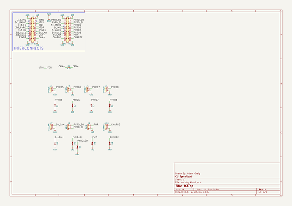
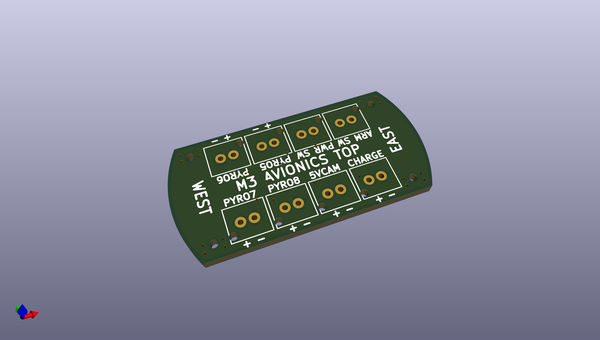
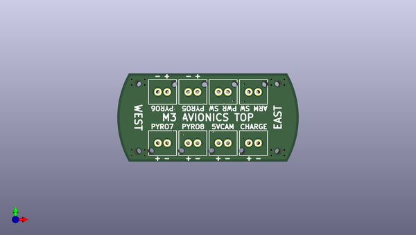
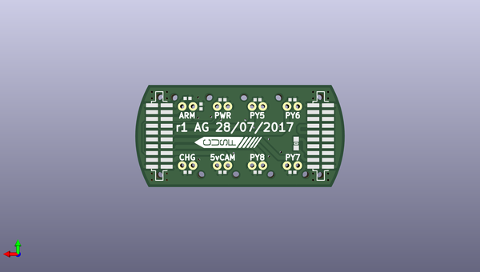

# m3_avionics
 
## summary 
* id: adamgreig_m3_avionics_m3top
* user: adamgreig
* name: m3_avionics
* board: m3top
* repo: https://github.com/adamgreig/m3-avionics
* src_file_repo_kicad_pcb: m3top/m3top.kicad_pcb
* src_file_repo_kicad_pcb_link: https://github.com/adamgreig/m3-avionics/tree/master/m3top/m3top.kicad_pcb

* src_file_repo_sch: m3top/m3top.sch
* src_file_repo_sch_link: https://github.com/adamgreig/m3-avionics/tree/master/m3top/m3top.sch
* full details link: https://github.com/oomlout/oomlout_oomp_project_bot_v_2/tree/main/projects/adamgreig_m3_avionics_m3top/current_version/working  

## schematic  
  
[schematic (pdf)](working_schematic.pdf)  

## pcb  
 
  
  
  
[board (pdf)](working.pdf)  

## working_bom
| Id | Designator | Footprint | Quantity | Designation | Supplier and ref |  | None | 
| --- | --- | --- | --- | --- | --- | --- | --- | 
| 1 | J1 | B02B-PASK | 1 | PYRO5 |  |  | [''] | 
| 2 | J3 | B02B-PASK | 1 | PYRO6 |  |  | [''] | 
| 3 | J5 | B02B-PASK | 1 | PYRO7 |  |  | [''] | 
| 4 | J6 | B02B-PASK | 1 | PYRO8 |  |  | [''] | 
| 5 | J7 | B02B-PASK | 1 | 5v_CAM |  |  | [''] | 
| 6 | J8 | B02B-PASK | 1 | ARM |  |  | [''] | 
| 7 | J9 | B02B-PASK | 1 | PWR |  |  | [''] | 
| 8 | J10 | B02B-PASK | 1 | CHARGE |  |  | [''] | 
| 9 | J2 | SFML-110-02-L-D-LC | 1 | WEST BOT |  |  | [''] | 
| 10 | J4 | SFML-110-02-L-D-LC | 1 | EAST BOT |  |  | [''] | 
| 11 | D1,D2,D3,D4,D5,D9,D8,D7,D6 | 0402 | 9 | ESD_DIODE |  |  | [''] | 
| 12 | R1 | 0603 | 1 | 120 |  |  | [''] | 
| 13 | G*** | cusf_logo_small | 1 | LOGO |  |  | [''] | 

## bom_schematic
| Ref | Qnty | Value | Cmp name | Footprint | Description | Vendor | DNP | 
| --- | --- | --- | --- | --- | --- | --- | --- | 
| D1, D2, D3, D4, D5, D6, D7, D8, D9 | 9 | ESD_DIODE | ESD_DIODE | agg:0402 |  |  |  | 
| J1 | 1 | PYRO5 | CONN_01x02 | agg:B02B-PASK |  |  |  | 
| J2 | 1 | WEST BOT | CONN_02x10 | agg:SFML-110-02-L-D-LC |  |  |  | 
| J3 | 1 | PYRO6 | CONN_01x02 | agg:B02B-PASK |  |  |  | 
| J4 | 1 | EAST BOT | CONN_02x10 | agg:SFML-110-02-L-D-LC |  |  |  | 
| J5 | 1 | PYRO7 | CONN_01x02 | agg:B02B-PASK |  |  |  | 
| J6 | 1 | PYRO8 | CONN_01x02 | agg:B02B-PASK |  |  |  | 
| J7 | 1 | 5v_CAM | CONN_01x02 | agg:B02B-PASK |  |  |  | 
| J8 | 1 | ARM | CONN_01x02 | agg:B02B-PASK |  |  |  | 
| J9 | 1 | PWR | CONN_01x02 | agg:B02B-PASK |  |  |  | 
| J10 | 1 | CHARGE | CONN_01x02 | agg:B02B-PASK |  |  |  | 
| R1 | 1 | 120 | R | agg:0603 |  |  |  | 

