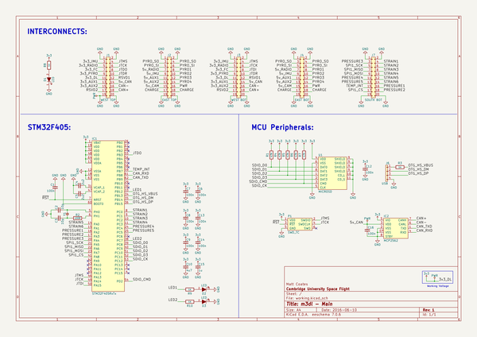
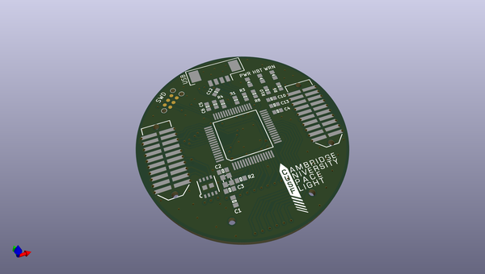
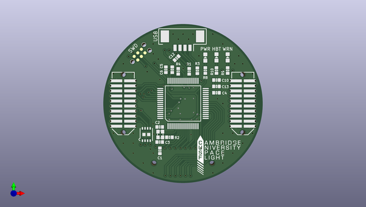
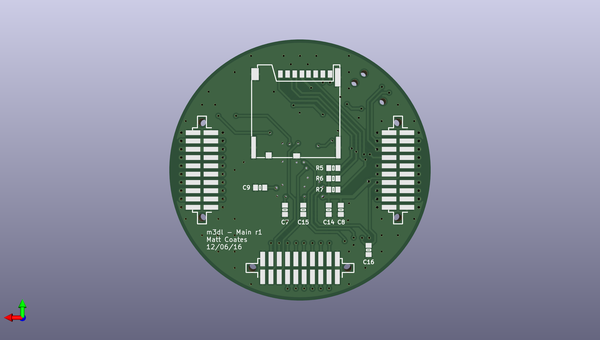

# m3_avionics
 
## summary 
* id: adamgreig_m3_avionics_main
* user: adamgreig
* name: m3_avionics
* board: main
* repo: https://github.com/adamgreig/m3-avionics
* src_file_repo_kicad_pcb: m3dl/main/main.kicad_pcb
* src_file_repo_kicad_pcb_link: https://github.com/adamgreig/m3-avionics/tree/master/m3dl/main/main.kicad_pcb

* src_file_repo_sch: m3dl/main/main.sch
* src_file_repo_sch_link: https://github.com/adamgreig/m3-avionics/tree/master/m3dl/main/main.sch
* full details link: https://github.com/oomlout/oomlout_oomp_project_bot_v_2/tree/main/projects/adamgreig_m3_avionics_main/current_version/working  

## schematic  
  
[schematic (pdf)](working_schematic.pdf) 

## pcb  
 
  
  
  
[board (pdf)](working.pdf)  

## working_bom
| Id | Designator | Footprint | Quantity | Designation | Supplier and ref |  | None | 
| --- | --- | --- | --- | --- | --- | --- | --- | 
| 1 | C1,C6,C12,C13,C7,C8,C9,C14,C16 | 0603-L | 9 | 100n |  |  | [''] | 
| 2 | C2,C3 | 0603-L | 2 | 10p |  |  | [''] | 
| 3 | C4,C5 | 0603-L | 2 | 2u2 |  |  | [''] | 
| 4 | C10 | 0603-L | 1 | 4u7 |  |  | [''] | 
| 5 | IC1 | LQFP-64 | 1 | STM32F405RxTx |  |  | [''] | 
| 6 | IC2 | DFN-8-EP-MICROCHIP | 1 | MCP2562 |  |  | [''] | 
| 7 | J1 | TFML-110-02-L-D | 1 | WEST TOP |  |  | [''] | 
| 8 | J2 | TFML-110-02-L-D | 1 | EAST TOP |  |  | [''] | 
| 9 | P1 | TC2030-NL | 1 | SWD_TC |  |  | [''] | 
| 10 | R1,R4,R5,R6,R7 | 0603-L | 5 | 47K |  |  | [''] | 
| 11 | R2 | 0603-L | 1 | 100R |  |  | [''] | 
| 12 | Y1 | XTAL-20x16 | 1 | 26MHz |  |  | [''] | 
| 13 | R3,R9,R10,R8 | 0603-L | 4 | 1k |  |  | [''] | 
| 14 | J6 | Connector_Molex_PicoBlade_53261-0471 | 1 | USB |  |  | [''] | 
| 15 | G*** | cusf_logo_full | 1 | LOGO |  |  | [''] | 
| 16 | D1,D2,D3 | 0603-LED | 3 | LED |  |  | [''] | 
| 17 | C15 | 0603-L | 1 | 1u |  |  | [''] | 
| 18 | J3 | SFML-110-02-L-D-LC | 1 | WEST BOT |  |  | [''] | 
| 19 | J4 | SFML-110-02-L-D-LC | 1 | EAST BOT |  |  | [''] | 
| 20 | J7 | SFML-110-02-L-D-LC | 1 | SOUTH BOT |  |  | [''] | 
| 21 | U1 | MICROSD_MOLEX_503398-1892 | 1 | MICROSD |  |  | [''] | 

## bom_schematic
| Ref | Qnty | Value | Cmp name | Footprint | Description | Vendor | DNP | 
| --- | --- | --- | --- | --- | --- | --- | --- | 
| C1, C6, C7, C8, C9, C12, C13, C14, C16 | 9 | 100n | C_Small | Capacitors_SMD:C_0603 |  |  |  | 
| C2, C3 | 2 | 10p | C_Small | Capacitors_SMD:C_0603 |  |  |  | 
| C4, C5 | 2 | 2u2 | C_Small | Capacitors_SMD:C_0603 |  |  |  | 
| C10 | 1 | 4u7 | C_Small | Capacitors_SMD:C_0603 |  |  |  | 
| C15 | 1 | 1u | C_Small | Capacitors_SMD:C_0603 |  |  |  | 
| D1, D2, D3 | 3 | LED | LED | agg:0603-LED |  |  |  | 
| IC1 | 1 | STM32F405RxTx | STM32F405RxTx | agg:LQFP-64 |  |  |  | 
| IC2 | 1 | MCP2562 | MCP2562 | agg:DFN-8-EP-MICROCHIP |  |  |  | 
| J1 | 1 | WEST TOP | CONN_02x10 | agg:TFML-110-02-L-D |  |  |  | 
| J2 | 1 | EAST TOP | CONN_02x10 | agg:TFML-110-02-L-D |  |  |  | 
| J3 | 1 | WEST BOT | CONN_02x10 | agg:SFML-110-02-L-D-LC |  |  |  | 
| J4 | 1 | EAST BOT | CONN_02x10 | agg:SFML-110-02-L-D-LC |  |  |  | 
| J6 | 1 | USB | CONN_01x04 | Connectors_Molex:Connector_Molex_PicoBlade_53261-0471 |  |  |  | 
| J7 | 1 | SOUTH BOT | CONN_02x10 | agg:SFML-110-02-L-D-LC |  |  |  | 
| P1 | 1 | SWD_TC | SWD_TC | agg:TC2030-NL |  |  |  | 
| R1, R4, R5, R6, R7 | 5 | 47K | R | Resistors_SMD:R_0603 |  |  |  | 
| R2 | 1 | 100R | R | Resistors_SMD:R_0603 |  |  |  | 
| R3, R8, R9, R10 | 4 | 1k | R | agg:0603-L |  |  |  | 
| U1 | 1 | MICROSD | MICROSD-RESCUE-main | agg:MICROSD_MOLEX_503398-1892 |  |  |  | 
| Y1 | 1 | 26MHz | XTAL | agg:XTAL-20x16 |  |  |  | 

