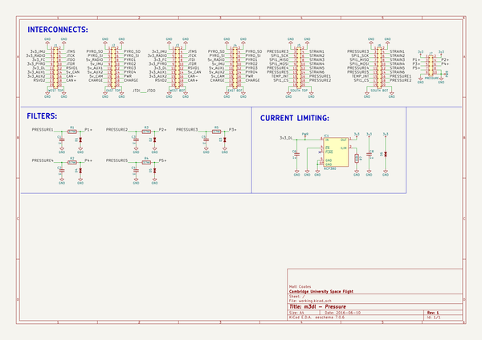
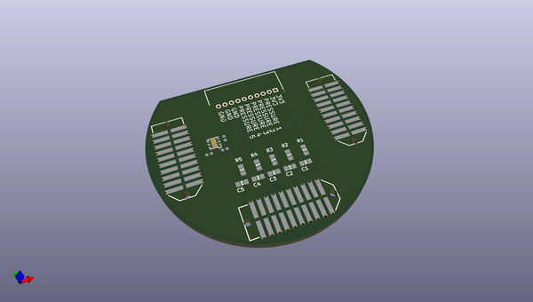
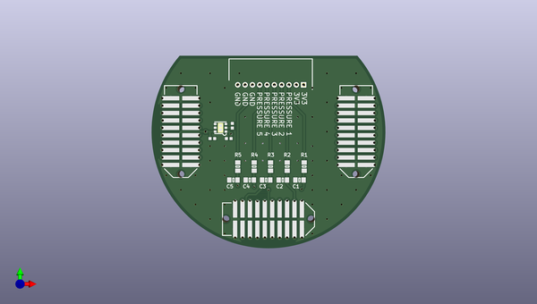
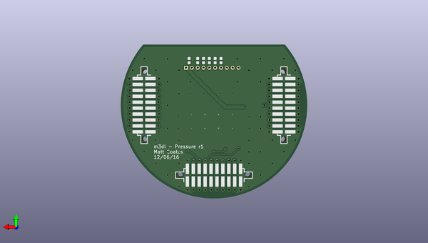

# m3_avionics
 
## summary 
* id: adamgreig_m3_avionics_pressure
* user: adamgreig
* name: m3_avionics
* board: pressure
* repo: https://github.com/adamgreig/m3-avionics
* src_file_repo_kicad_pcb: m3dl/pressure/pressure.kicad_pcb
* src_file_repo_kicad_pcb_link: https://github.com/adamgreig/m3-avionics/tree/master/m3dl/pressure/pressure.kicad_pcb

* src_file_repo_sch: m3dl/pressure/pressure.sch
* src_file_repo_sch_link: https://github.com/adamgreig/m3-avionics/tree/master/m3dl/pressure/pressure.sch
* full details link: https://github.com/oomlout/oomlout_oomp_project_bot_v_2/tree/main/projects/adamgreig_m3_avionics_pressure/current_version/working  

## schematic  
  
[schematic (pdf)](working_schematic.pdf)  

## pcb  
 
  
  
  
[board (pdf)](working.pdf)  

## working_bom
| Id | Designator | Footprint | Quantity | Designation | Supplier and ref |  | None | 
| --- | --- | --- | --- | --- | --- | --- | --- | 
| 1 | C1,C2,C3,C4,C5 | 0603-L | 5 | 1n |  |  | [''] | 
| 2 | J1 | TFML-110-02-L-D | 1 | WEST TOP |  |  | [''] | 
| 3 | J2 | TFML-110-02-L-D | 1 | EAST TOP |  |  | [''] | 
| 4 | J5 | TFML-110-02-L-D | 1 | SOUTH TOP |  |  | [''] | 
| 5 | J7 | Connector_Molex_PicoBlade_53048-1010 | 1 | PRESSURE |  |  | [''] | 
| 6 | R1,R2,R3,R4,R5 | 0603-L | 5 | 3.74K |  |  | [''] | 
| 7 | C6,C8 | 0402-L | 2 | 1u |  |  | [''] | 
| 8 | IC1 | DFN-6-EP-ONSEMI | 1 | NCP380 |  |  | [''] | 
| 9 | R7 | 0402-L | 1 | 110k |  |  | [''] | 
| 10 | J3 | SFML-110-02-L-D-LC | 1 | WEST BOT |  |  | [''] | 
| 11 | J4 | SFML-110-02-L-D-LC | 1 | EAST BOT |  |  | [''] | 
| 12 | J6 | SFML-110-02-L-D-LC | 1 | SOUTH BOT |  |  | [''] | 
| 13 | D1,D2,D3,D4,D5,D6 | 0402 | 6 | ESD_DIODE |  |  | [''] | 

## bom_schematic
| Ref | Qnty | Value | Cmp name | Footprint | Description | Vendor | DNP | 
| --- | --- | --- | --- | --- | --- | --- | --- | 
| C1, C2, C3, C4, C5 | 5 | 1n | C_Small | Capacitors_SMD:C_0603 |  |  |  | 
| C6, C8 | 2 | 1u | C_Small | agg:0402-L |  |  |  | 
| D1, D2, D3, D4, D5, D6 | 6 | ESD_DIODE | ESD_DIODE | agg:0402 |  |  |  | 
| IC1 | 1 | NCP380 | NCP380 | agg:DFN-6-EP-ONSEMI |  |  |  | 
| J1 | 1 | WEST TOP | CONN_02x10 | agg:TFML-110-02-L-D |  |  |  | 
| J2 | 1 | EAST TOP | CONN_02x10 | agg:TFML-110-02-L-D |  |  |  | 
| J3 | 1 | WEST BOT | CONN_02x10 | agg:SFML-110-02-L-D-LC |  |  |  | 
| J4 | 1 | EAST BOT | CONN_02x10 | agg:SFML-110-02-L-D-LC |  |  |  | 
| J5 | 1 | SOUTH TOP | CONN_02x10 | agg:TFML-110-02-L-D |  |  |  | 
| J6 | 1 | SOUTH BOT | CONN_02x10 | agg:SFML-110-02-L-D-LC |  |  |  | 
| J7 | 1 | PRESSURE | CONN_02x05 | Connectors_Molex:Connector_Molex_PicoBlade_53048-1010 |  |  |  | 
| R1, R2, R3, R4, R5 | 5 | 3.74K | R | Resistors_SMD:R_0603 |  |  |  | 
| R7 | 1 | 110k | R | agg:0402-L |  |  |  | 

