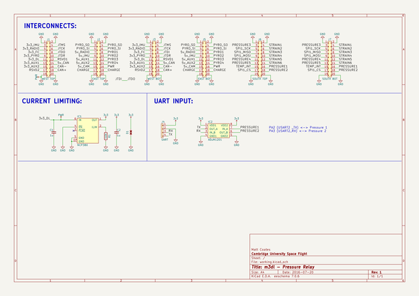

# m3_avionics
 
## summary 
* id: adamgreig_m3_avionics_pressure_relay
* user: adamgreig
* name: m3_avionics
* board: pressure_relay
* repo: https://github.com/adamgreig/m3-avionics
* src_file_repo_kicad_pcb: m3dl/pressure_relay/pressure_relay.kicad_pcb
* src_file_repo_kicad_pcb_link: https://github.com/adamgreig/m3-avionics/tree/master/m3dl/pressure_relay/pressure_relay.kicad_pcb

* src_file_repo_sch: m3dl/pressure_relay/pressure_relay.sch
* src_file_repo_sch_link: https://github.com/adamgreig/m3-avionics/tree/master/m3dl/pressure_relay/pressure_relay.sch
* full details link: https://github.com/oomlout/oomlout_oomp_project_bot_v_2/tree/main/projects/adamgreig_m3_avionics_pressure_relay/current_version/working  

## schematic  
  
[schematic (pdf)](working_schematic.pdf) 

## pcb  
 
  
  
  
[board (pdf)](working.pdf)  

## working_bom
| Id | Designator | Footprint | Quantity | Designation | Supplier and ref |  | None | 
| --- | --- | --- | --- | --- | --- | --- | --- | 
| 1 | C1,C2 | 0402-L | 2 | 1u |  |  | [''] | 
| 2 | D1 | 0402 | 1 | ESD_DIODE |  |  | [''] | 
| 3 | IC1 | DFN-6-EP-ONSEMI | 1 | NCP380 |  |  | [''] | 
| 4 | IC2 | SOIC-8 | 1 | ADuM1201 |  |  | [''] | 
| 5 | J1 | TFML-110-02-L-D | 1 | WEST TOP |  |  | [''] | 
| 6 | J2 | TFML-110-02-L-D | 1 | EAST TOP |  |  | [''] | 
| 7 | J4 | S04B-PASK-2 | 1 | UART |  |  | [''] | 
| 8 | J6 | TFML-110-02-L-D | 1 | SOUTH TOP |  |  | [''] | 
| 9 | R1 | 0402-L | 1 | 110k |  |  | [''] | 
| 10 | J3 | SFML-110-02-L-D-LC | 1 | WEST BOT |  |  | [''] | 
| 11 | J5 | SFML-110-02-L-D-LC | 1 | EAST BOT |  |  | [''] | 
| 12 | J7 | SFML-110-02-L-D-LC | 1 | SOUTH BOT |  |  | [''] | 

## bom_schematic
| Ref | Qnty | Value | Cmp name | Footprint | Description | Vendor | DNP | 
| --- | --- | --- | --- | --- | --- | --- | --- | 
| C1, C2 | 2 | 1u | C_Small | agg:0402-L |  |  |  | 
| D1 | 1 | ESD_DIODE | ESD_DIODE | agg:0402 |  |  |  | 
| IC1 | 1 | NCP380 | NCP380 | agg:DFN-6-EP-ONSEMI |  |  |  | 
| IC2 | 1 | ADuM1201 | ADuM1201 | agg:SOIC-8 |  |  |  | 
| J1 | 1 | WEST TOP | CONN_02x10 | agg:TFML-110-02-L-D |  |  |  | 
| J2 | 1 | EAST TOP | CONN_02x10 | agg:TFML-110-02-L-D |  |  |  | 
| J3 | 1 | WEST BOT | CONN_02x10 | agg:SFML-110-02-L-D-LC |  |  |  | 
| J4 | 1 | UART | CONN_01x04 | agg:S04B-PASK-2 |  |  |  | 
| J5 | 1 | EAST BOT | CONN_02x10 | agg:SFML-110-02-L-D-LC |  |  |  | 
| J6 | 1 | SOUTH TOP | CONN_02x10 | agg:TFML-110-02-L-D |  |  |  | 
| J7 | 1 | SOUTH BOT | CONN_02x10 | agg:SFML-110-02-L-D-LC |  |  |  | 
| R1 | 1 | 110k | R | agg:0402-L |  |  |  | 

