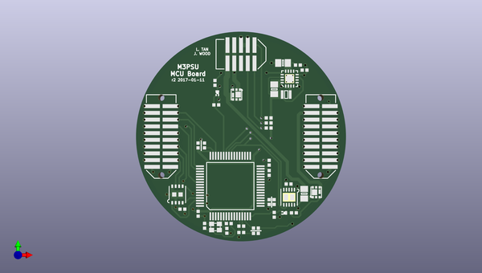

# m3_avionics
 
## summary 
* id: adamgreig_m3_avionics_psu_mc_board
* user: adamgreig
* name: m3_avionics
* board: psu_mc_board
* repo: https://github.com/adamgreig/m3-avionics
* src_file_repo_kicad_pcb: m3psu/pcb/PSU-MC-Board/PSU-MC-Board.kicad_pcb
* src_file_repo_kicad_pcb_link: https://github.com/adamgreig/m3-avionics/tree/master/m3psu/pcb/PSU-MC-Board/PSU-MC-Board.kicad_pcb

* src_file_repo_sch: m3psu/pcb/PSU-MC-Board/PSU-MC-Board.sch
* src_file_repo_sch_link: https://github.com/adamgreig/m3-avionics/tree/master/m3psu/pcb/PSU-MC-Board/PSU-MC-Board.sch
* full details link: https://github.com/oomlout/oomlout_oomp_project_bot_v_2/tree/main/projects/adamgreig_m3_avionics_psu_mc_board/current_version/working  

## schematic  
  
[schematic (pdf)](working_schematic.pdf) 

## pcb  
 
  
  
  
[board (pdf)](working.pdf)  

## working_bom
| Id | Designator | Footprint | Quantity | Designation | Supplier and ref |  | None | 
| --- | --- | --- | --- | --- | --- | --- | --- | 
| 1 | C1,C2 | 0402 | 2 | 10p |  |  | [''] | 
| 2 | C3 | 0402 | 1 | 4µ7 |  |  | [''] | 
| 3 | C4,C5,C7,C8,C9,C16,C19,C20 | 0402 | 8 | 100n |  |  | [''] | 
| 4 | C6 | 0402 | 1 | 1µ |  |  | [''] | 
| 5 | C10,C11 | 0402 | 2 | 2µ2 |  |  | [''] | 
| 6 | C12,C14 | 0805 | 2 | 22µ |  |  | [''] | 
| 7 | C13 | 0402 | 1 | 3n3 |  |  | [''] | 
| 8 | IC1 | LQFP-64 | 1 | STM32F405RxTx |  |  | [''] | 
| 9 | IC2 | QFN-16-EP-TI | 1 | TPS62152 |  |  | [''] | 
| 10 | IC3 | DFN-8-EP-MICROCHIP | 1 | MCP2562 |  |  | [''] | 
| 11 | IC5 | DFN-10-EP-LT | 1 | LTC4151 |  |  | [''] | 
| 12 | J1 | TFML-110-02-L-D | 1 | WEST TOP |  |  | [''] | 
| 13 | J3 | TFML-105-02-L-D | 1 | NORTH TOP |  |  | [''] | 
| 14 | J4 | TFML-110-02-L-D | 1 | EAST TOP |  |  | [''] | 
| 15 | L1 | VLS201610HBX-1 | 1 | 3µ3 |  |  | [''] | 
| 16 | Q9,Q2 | SOT-883-B | 2 | NFET |  |  | [''] | 
| 17 | R3 | 0402 | 1 | 100 |  |  | [''] | 
| 18 | R7,R8,R10 | 0402 | 3 | 4k7 |  |  | [''] | 
| 19 | R15 | 0805 | 1 | 10m |  |  | [''] | 
| 20 | R16,R23,R4,R5 | 0402 | 4 | 33k |  |  | [''] | 
| 21 | Y1 | XTAL-20x16 | 1 | 26M |  |  | [''] | 
| 22 | Q8,Q1 | SON2x2 | 2 | PFET |  |  | [''] | 
| 23 | R1,R2 | 0402 | 2 | 100k |  |  | [''] | 
| 24 | J2 | SFML-110-02-L-D-LC | 1 | WEST BOT |  |  | [''] | 
| 25 | J5 | SFML-110-02-L-D-LC | 1 | EAST BOT |  |  | [''] | 
| 26 | G*** | cusf_logo_full | 1 | LOGO |  |  | [''] | 

## bom_schematic
| Ref | Qnty | Value | Cmp name | Footprint | Description | Vendor | DNP | 
| --- | --- | --- | --- | --- | --- | --- | --- | 
| C1, C2 | 2 | 10p | C | agg:0402 |  |  |  | 
| C3 | 1 | 4µ7 | C | agg:0402 |  |  |  | 
| C4, C5, C7, C8, C9, C16, C19, C20 | 8 | 100n | C | agg:0402 |  |  |  | 
| C6 | 1 | 1µ | C | agg:0402 |  |  |  | 
| C10, C11 | 2 | 2µ2 | C | agg:0402 |  |  |  | 
| C12, C14 | 2 | 22µ | C | agg:0805 |  |  |  | 
| C13 | 1 | 3n3 | C | agg:0402 |  |  |  | 
| IC1 | 1 | STM32F405RxTx | STM32F405RxTx | agg:LQFP-64 |  |  |  | 
| IC2 | 1 | TPS62152 | TPS62152 | agg:QFN-16-EP-TI |  |  |  | 
| IC3 | 1 | MCP2562 | MCP2562 | agg:DFN-8-EP-MICROCHIP |  |  |  | 
| IC5 | 1 | LTC4151 | LTC4151 | agg:DFN-10-EP-LT |  |  |  | 
| J1 | 1 | WEST TOP | CONN_02x10 | agg:TFML-110-02-L-D |  |  |  | 
| J2 | 1 | WEST BOT | CONN_02x10 | agg:SFML-110-02-L-D-LC |  |  |  | 
| J3 | 1 | NORTH TOP | CONN_02x05 | agg:TFML-105-02-L-D |  |  |  | 
| J4 | 1 | EAST TOP | CONN_02x10 | agg:TFML-110-02-L-D |  |  |  | 
| J5 | 1 | EAST BOT | CONN_02x10 | agg:SFML-110-02-L-D-LC |  |  |  | 
| L1 | 1 | 3µ3 | L | agg:VLS201610HBX-1 |  |  |  | 
| Q1, Q8 | 2 | PFET | PFET_GDS | agg:SON2x2 |  |  |  | 
| Q2, Q9 | 2 | NFET | NFET_GDS | agg:SOT-883-B |  |  |  | 
| R1, R2 | 2 | 100k | R | agg:0402 |  |  |  | 
| R3 | 1 | 100 | R | agg:0402 |  |  |  | 
| R4, R5, R16, R23 | 4 | 33k | R | agg:0402 |  |  |  | 
| R7, R8, R10 | 3 | 4k7 | R | agg:0402 |  |  |  | 
| R15 | 1 | 10m | R | agg:0805 |  |  |  | 
| Y1 | 1 | 26M | SMD_XTAL | agg:XTAL-20x16 |  |  |  | 

