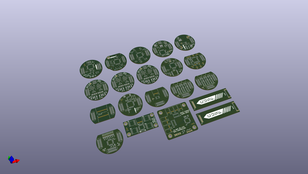
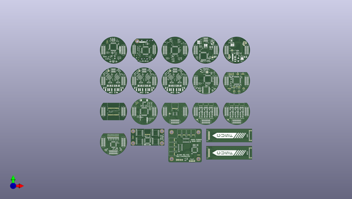
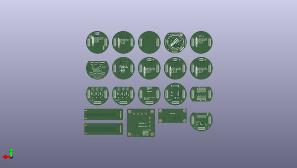

# m3_avionics
 
## summary 
* id: adamgreig_m3_avionics_r1_panel
* user: adamgreig
* name: m3_avionics
* board: r1_panel
* repo: https://github.com/adamgreig/m3-avionics
* src_file_repo_kicad_pcb: artifacts/r1_panel/r1_panel.kicad_pcb
* src_file_repo_kicad_pcb_link: https://github.com/adamgreig/m3-avionics/tree/master/artifacts/r1_panel/r1_panel.kicad_pcb

* src_file_repo_sch: 
* src_file_repo_sch_link: https://github.com/adamgreig/m3-avionics/tree/master/
* full details link: https://github.com/oomlout/oomlout_oomp_project_bot_v_2/tree/main/projects/adamgreig_m3_avionics_r1_panel/current_version/working  

## pcb  
 
  
  
  
[board (pdf)](working.pdf)  

## working_bom
| Id | Designator | Footprint | Quantity | Designation | Supplier and ref |  | None | 
| --- | --- | --- | --- | --- | --- | --- | --- | 
| 1 | C15,C14,C16,C17,C3,C4,C7,C8,C9,C8,C9,C11,C12,C13,C16,C1,C2,C3,C4,C104,C105,C107,C108,C109,C112,C202,C2,C11,C13,C17,C26,C28,C4,C5,C7,C8,C9,C12,C13,C15,C16,C4,C5,C7,C8,C9,C15,C16,C6,C31,C32,C19,C20,C10,C3,C4,C1,C6,C7,C2,C28,C17,C11,C13,C26,C2,C28,C32,C31,C17,C13,C26,C32,C2,C11,C31 | 0402 | 76 | 100n |  |  | [''] | 
| 2 | C13 | 0603 | 1 | 10µ |  |  | [''] | 
| 3 | D1,D101,D1,D1 | 0603-LED | 4 | RED |  |  | [''] | 
| 4 | D2 | 0603-LED | 1 | YLW |  |  | [''] | 
| 5 | D3,D102,D3,D2 | 0603-LED | 4 | GRN |  |  | [''] | 
| 6 | IC3,IC2,IC2,IC102,IC2,IC2,IC3 | DFN-8-EP-MICROCHIP | 7 | MCP2562 |  |  | [''] | 
| 7 | IC4 | ADXL3x5 | 1 | ADXL345 |  |  | [''] | 
| 8 | IC2,IC3 | MS5611 | 2 | MS5611-01BA03 |  |  | [''] | 
| 9 | P1,P1,P1,P1,P1 | TC2030-NL | 5 | SWD_TC |  |  | [''] | 
| 10 | Q1 | SOT-23 | 1 | NFET |  |  | [''] | 
| 11 | R1,R2,R3,R4,R5,R25,R6,R18,R19,R20,R101,R102,R103,R3,R6,R9,R11,R16,R19,R22,R24,R1,R2,R4,R3,R6,R3,R9,R22,R19,R16,R11,R16,R22,R19,R24,R11,R24,R9,R6,R3 | 0402 | 41 | 100 |  |  | [''] | 
| 12 | J3,J11,J2,J103,J2,J2,J2,J2,J4,J4,J4,J2,J4,J4,J2 | TFML-110-02-L-D | 15 | EAST TOP |  |  | [''] | 
| 13 | C1,C6,C5,C6,C101,C102,C1,C2,C1,C2 | 0402 | 10 | 10p |  |  | [''] | 
| 14 | C5,C10,C106,C10,C14,C25,C29,C6,C6,C1,C2,C3,C8,C8,C14,C25,C10,C29,C29,C25,C14,C10 | 0402 | 22 | 1µ |  |  | [''] | 
| 15 | IC1,IC1,IC1,IC101,IC1,IC1,IC1 | LQFP-64 | 7 | STM32F405RxTx |  |  | [''] | 
| 16 | J1,J9,J1,J101,J1,J1,J1,J1,J1,J1,J1,J1,J1,J1,J1 | TFML-110-02-L-D | 15 | WEST TOP |  |  | [''] | 
| 17 | Y1,Y1,Y101,Y1,Y1 | XTAL-20x16 | 5 | 26M |  |  | [''] | 
| 18 | LS1 | KSSG13J12-N | 1 | SOUNDER |  |  | [''] | 
| 19 | C2,C7,C103,C3,C3,C5,C19,C4,C4,C19,C4,C19 | 0402 | 12 | 4µ7 |  |  | [''] | 
| 20 | C10,C11,C14,C15,C110,C111,C10,C11,C10,C11 | 0402 | 10 | 2µ2 |  |  | [''] | 
| 21 | D4 | SOD-323 | 1 | D |  |  | [''] | 
| 22 | Q1,Q2,Q3,Q4 | PowerPAK-SC-70-6-DUAL | 4 | 2FET3 |  |  | [''] | 
| 23 | C1,C6,C12,C13,C2,C7,C8,C11,C12,C13,C16,C7,C8,C9,C14,C16,C1,C22,C23,C24,C25,C26,C27,C28,C29,C30,C31,C32,C33,C24,C31,C26,C27,C32,C22,C23,C25,C30,C33,C28,C29 | 0603-L | 41 | 100n |  |  | [''] | 
| 24 | C2,C3,C2,C3 | 0603-L | 4 | 10p |  |  | [''] | 
| 25 | C4,C5,C4,C5 | 0603-L | 4 | 2u2 |  |  | [''] | 
| 26 | C10,C15 | 0603-L | 2 | 4u7 |  |  | [''] | 
| 27 | R1,R4,R5,R6,R7 | 0603-L | 5 | 47K |  |  | [''] | 
| 28 | R2,R1 | 0603-L | 2 | 100R |  |  | [''] | 
| 29 | Y1,Y1 | XTAL-20x16 | 2 | 26MHz |  |  | [''] | 
| 30 | R3,R9,R10,R8 | 0603-L | 4 | 1k |  |  | [''] | 
| 31 | D2,D1,D3,D4 | 0402 | 4 | D |  |  | [''] | 
| 32 | R1,R5,R8,R9,R10,R11,R12,R13,R14,R15,R16,R17,R2,R15,R4,R2,R3,R5,R8,R18,R19,R20,R18,R20,R15,R15,R20,R18,R20,R2,R2,R18 | 0402 | 32 | 10k |  |  | [''] | 
| 33 | R2,R3,R4,R7,R15,R1,R2 | 0402 | 7 | 1k |  |  | [''] | 
| 34 | IC103 | MAX-7Q | 1 | MAX-7Q |  |  | [''] | 
| 35 | IC201 | QFN-20-EP-SI | 1 | Si4460 |  |  | [''] | 
| 36 | C1,C3,C4,C6,C15,C17,C6,C7,C8,C9,C10,C11,C12,C13,C14,C4,C6,C1,C17,C15,C3 | 0603-L | 21 | 1n |  |  | [''] | 
| 37 | C2,C5,C16,C16,C5,C2 | 0603-L | 6 | 10n |  |  | [''] | 
| 38 | C7,C8,C11,C12,C18,C20,C8,C12,C18,C7,C20,C11 | 0603-L | 12 | 8.2n |  |  | [''] | 
| 39 | C9,C10,C13,C14,C19,C21,C19,C9,C21,C13,C14,C10 | 0603-L | 12 | 82n |  |  | [''] | 
| 40 | IC1,IC3,IC6,IC3,IC6,IC1 | MSOP-8 | 6 | AD8226 |  |  | [''] | 
| 41 | IC2,IC4,IC7,IC7,IC2,IC4 | SC-70-5 | 6 | AD8541 |  |  | [''] | 
| 42 | IC5,IC8,IC9,IC5,IC9,IC8 | MSOP-8 | 6 | AD8656 |  |  | [''] | 
| 43 | J5,J5,J6,J5 | TFML-110-02-L-D | 4 | SOUTH TOP |  |  | [''] | 
| 44 | R1,R2,R3,R4,R19,R20,R2,R3,R4,R5,R6,R7,R8,R9,R10,R11,R12,R13,R14,R15,R16,R17,R18,R19,R1,R20,R19,R2,R3,R4 | 0603-L | 30 | 3.74K |  |  | [''] | 
| 45 | R5,R6,R7,R8,R21,R22,R3,R6,R7,R21,R5,R8,R22,R1 | 0603-L | 14 | 10K |  |  | [''] | 
| 46 | R11,R12,R24,R24,R12,R11 | 0603-L | 6 | 1.69K |  |  | [''] | 
| 47 | R13,R14,R25,R14,R13,R25 | 0603-L | 6 | 6.04K |  |  | [''] | 
| 48 | R15,R16,R26,R15,R26,R16 | 0603-L | 6 | 562R |  |  | [''] | 
| 49 | R17,R18,R27,R27,R18,R17 | 0603-L | 6 | 17.8K |  |  | [''] | 
| 50 | J7,J7 | Connector_Molex_PicoBlade_53048-0410 | 2 | S1 |  |  | [''] | 
| 51 | J8,J8 | Connector_Molex_PicoBlade_53048-0410 | 2 | S3 |  |  | [''] | 
| 52 | J9,J9 | Connector_Molex_PicoBlade_53048-0410 | 2 | S2 |  |  | [''] | 
| 53 | IC1 | LQFP-48 | 1 | LTC2983 |  |  | [''] | 
| 54 | C1,C6,C15 | 0603-L | 3 | 1u |  |  | [''] | 
| 55 | C3,C5,C34,C34 | 0603-L | 4 | 10u |  |  | [''] | 
| 56 | C4 | 0805 | 1 | 10u |  |  | [''] | 
| 57 | R2 | 0603-L | 1 | 4K7 |  |  | [''] | 
| 58 | R5 | 0603-L | 1 | 120R |  |  | [''] | 
| 59 | C113,C1 | 0402 | 2 | 100nF |  |  | [''] | 
| 60 | C201 | 0402 | 1 | 100p |  |  | [''] | 
| 61 | C203 | 0402 | 1 | 3pF |  |  | [''] | 
| 62 | C204 | 0402 | 1 | 36pF |  |  | [''] | 
| 63 | C205 | 0402 | 1 | 1.2pF |  |  | [''] | 
| 64 | C206 | 0402 | 1 | 3.3pF |  |  | [''] | 
| 65 | C207 | 0402 | 1 | 10pF |  |  | [''] | 
| 66 | C208 | 0402 | 1 | 4.7pF |  |  | [''] | 
| 67 | L201 | 0603-L | 1 | 120nH |  |  | [''] | 
| 68 | L202 | 0603-L | 1 | 18nH |  |  | [''] | 
| 69 | L203 | 0603-L | 1 | 22nH |  |  | [''] | 
| 70 | L204,L205,L206 | 0603-L | 3 | 6.8nH |  |  | [''] | 
| 71 | J6 | Connector_Molex_PicoBlade_53261-0471 | 1 | USB |  |  | [''] | 
| 72 | C1,C7,C15,C16,C22,C30,C12,C14,C22,C15,C1,C7,C15,C16,C1,C7,C30,C22,C16,C30 | 0805 | 20 | 22µ |  |  | [''] | 
| 73 | C3,C12,C18,C27,C27,C18,C18,C12,C3,C12,C27,C3 | 0402 | 12 | 4n7 |  |  | [''] | 
| 74 | C5,C9,C20,C24,C20,C24,C5,C24,C20,C5,C9,C9 | 0402 | 12 | 220p |  |  | [''] | 
| 75 | C6,C8,C21,C23,C6,C23,C6,C21,C21,C23,C8,C8 | 0402 | 12 | 47p |  |  | [''] | 
| 76 | D1,D2,D3,D4,D3,D4,D3,D1,D2,D1,D2,D4 | 0603-LED | 12 | SCHOTTKY |  |  | [''] | 
| 77 | IC1,IC2,IC1,IC2,IC1,IC2 | QFN-40-EP-LTC-UJ | 6 | LTC3887 |  |  | [''] | 
| 78 | L1,L2,L3,L4,L3,L2,L1,L3,L1,L4,L4,L2 | TYS5040 | 12 | 10µ |  |  | [''] | 
| 79 | Q1,Q2,Q3,Q4,Q4,Q2,Q3,Q1,Q1,Q4,Q3,Q2 | PowerPair3x3 | 12 | SiZ340DT |  |  | [''] | 
| 80 | R1,R13,R14,R26,R13,R26,R13,R1,R14,R26,R1,R14 | 0603 | 12 | 50m |  |  | [''] | 
| 81 | R4,R12,R17,R25,R7,R5,R5,R7,R17,R17,R25,R25,R4,R7,R12,R12,R4,R5 | 0402 | 18 | 4k99 |  |  | [''] | 
| 82 | R8 | 0402 | 1 | 30k1 |  |  | [''] | 
| 83 | R10 | 0402 | 1 | 3k57 |  |  | [''] | 
| 84 | R21,R8,R8,R21,R21 | 0402 | 5 | 24k9 |  |  | [''] | 
| 85 | R23 | 0402 | 1 | 4k32 |  |  | [''] | 
| 86 | C14,C4,C5,C9 | 0402 | 4 | 10n |  |  | [''] | 
| 87 | IC4 | QFN-24-MPU9250 | 1 | MPU-9250 |  |  | [''] | 
| 88 | J2,J2,J10,J3,J102,J3,J3,J3,J2,J2,J2,J3,J2,J2,J3 | SFML-110-02-L-D-LC | 15 | WEST BOT |  |  | [''] | 
| 89 | G*** | cusf_logo_full | 1 | LOGO |  |  | [''] | 
| 90 | X1 | cusf_logo_small | 1 | PART |  |  | [''] | 
| 91 | C13 | 0402 | 1 | 3n3 |  |  | [''] | 
| 92 | C17,C18 | 0402 | 2 | 47n |  |  | [''] | 
| 93 | IC2 | QFN-16-EP-TI | 1 | TPS62152 |  |  | [''] | 
| 94 | IC4 | DFN-16-EP-LTC-DE | 1 | LTC4353 |  |  | [''] | 
| 95 | IC5 | DFN-10-EP-LT | 1 | LTC4151 |  |  | [''] | 
| 96 | J3,J3,J3,J3 | TFML-105-02-L-D | 4 | NORTH TOP |  |  | [''] | 
| 97 | L1 | VLS201610HBX-1 | 1 | 3µ3 |  |  | [''] | 
| 98 | Q1,Q3,Q7,Q9,Q1,Q3 | SOT-883-B | 6 | NFET |  |  | [''] | 
| 99 | Q2,Q6 | SOT-883-B | 2 | PFET |  |  | [''] | 
| 100 | R1,R2,R5,R6,R9,R11,R12,R16,R6,R9,R12,R21,R22,R23 | 0402 | 14 | 33k |  |  | [''] | 
| 101 | R7,R8,R10 | 0402 | 3 | 4k7 |  |  | [''] | 
| 102 | Q4,Q5,Q4 | PowerFLAT-5x6 | 3 | NFET2 |  |  | [''] | 
| 103 | R13,R14 | 0805 | 2 | 47 |  |  | [''] | 
| 104 | R15 | 0805 | 1 | 10m |  |  | [''] | 
| 105 | J4,J4,J12,J4,J104,J4,J4,J4,J5,J5,J5,J5,J5,J5,J4 | SFML-110-02-L-D-LC | 15 | EAST BOT |  |  | [''] | 
| 106 | X2,X4,X3,X2,X1 | M3_MOUNT | 5 | PART |  |  | [''] | 
| 107 | P5 | Pin_Header_Straight_1x04 | 1 | SHIFT |  |  | [''] | 
| 108 | P6 | S02B-PASK-2 | 1 | BUS1 |  |  | [''] | 
| 109 | P7 | S02B-PASK-2 | 1 | BUS2 |  |  | [''] | 
| 110 | P8 | S02B-PASK-2 | 1 | BUS3 |  |  | [''] | 
| 111 | P9 | S02B-PASK-2 | 1 | BUS4 |  |  | [''] | 
| 112 | P10 | S02B-PASK-2 | 1 | BUS5 |  |  | [''] | 
| 113 | P11 | S02B-PASK-2 | 1 | BUS6 |  |  | [''] | 
| 114 | P12 | S02B-PASK-2 | 1 | BUS7 |  |  | [''] | 
| 115 | P13 | S02B-PASK-2 | 1 | BUS8 |  |  | [''] | 
| 116 | C1,C2,C8,C6,C3,C15 | 0603 | 6 | 100n |  |  | [''] | 
| 117 | G*** | cusf_logo_small | 1 | LOGO |  |  | [''] | 
| 118 | C7,C9 | 1210 | 2 | 47µ |  |  | [''] | 
| 119 | IC1 | QFN-24-EP-MAX | 1 | MAX17435 |  |  | [''] | 
| 120 | L1 | SRP5030T | 1 | 4µ7 |  |  | [''] | 
| 121 | Q2 | PowerPAK-1212-8 | 1 | PFET |  |  | [''] | 
| 122 | Q5 | PowerPAK-SO-8 | 1 | PFET |  |  | [''] | 
| 123 | R1,R16 | 0402 | 2 | 10 |  |  | [''] | 
| 124 | R4 | 0402 | 1 | 6k2 |  |  | [''] | 
| 125 | R7 | 0402 | 1 | 56k |  |  | [''] | 
| 126 | R10 | 0402 | 1 | 2M |  |  | [''] | 
| 127 | R11 | 0402 | 1 | 150k |  |  | [''] | 
| 128 | R13 | 0402 | 1 | 5k1 |  |  | [''] | 
| 129 | R14,R17 | 0603 | 2 | 10m |  |  | [''] | 
| 130 | Q6 | PowerPair-3x3 | 1 | SiZ340DT |  |  | [''] | 
| 131 | IC2 | QFN-16-EP-NXP | 1 | PCAL9538A |  |  | [''] | 
| 132 | R17 | 0402 | 1 | 30k |  |  | [''] | 
| 133 | R26 | 0402 | 1 | 11 |  |  | [''] | 
| 134 | R27 | 0402 | 1 | 8 |  |  | [''] | 
| 135 | J1 | TFML-110-01-L-D-RA | 1 | WEST TOP |  |  | [''] | 
| 136 | J2 | SFM-110-02-L-DH | 1 | WEST BOT |  |  | [''] | 
| 137 | J1 | TFML-110-01-L-D-RA | 1 | EAST TOP |  |  | [''] | 
| 138 | J2 | SFM-110-02-L-DH | 1 | EAST BOT |  |  | [''] | 
| 139 | R5 | 0402 | 1 | 120 |  |  | [''] | 
| 140 | D2 | SOT-666 | 1 | USBLC6-2P6 |  |  | [''] | 
| 141 | D1,D2,D3,D4,D5,D6,D7,D8,D9,D10,D11,D12,D1,D2,D4,D5,D3,D1,D1,D2,D3,D4,D5,D6,D7,D8,D9,D1,D2,D3,D4,D5,D6,D7,D8,D9,D6,D4,D1,D9,D5,D8,D3,D7,D2 | 0402 | 45 | ESD_DIODE |  |  | [''] | 
| 142 | J5 | S08B-PASK-2 | 1 | North |  |  | [''] | 
| 143 | J6 | S08B-PASK-2 | 1 | South |  |  | [''] | 
| 144 | C35,C37,C1,C2,C35,C37 | 0402-L | 6 | 1u |  |  | [''] | 
| 145 | R32,R1,R32 | 0402-L | 3 | 110k |  |  | [''] | 
| 146 | IC10,IC1,IC1,IC10 | DFN-6-EP-ONSEMI | 4 | NCP380 |  |  | [''] | 
| 147 | D1,D2,D3 | 0603-LED | 3 | LED |  |  | [''] | 
| 148 | C2,C3,C7,C8 | 0402 | 4 | 1uF |  |  | [''] | 
| 149 | C4 | 0402 | 1 | 10nF |  |  | [''] | 
| 150 | C5 | 0402 | 1 | 100pF |  |  | [''] | 
| 151 | C6 | 0402 | 1 | 1u |  |  | [''] | 
| 152 | L1,L2,L3 | 0402-L | 3 | 91nH |  |  | [''] | 
| 153 | R1 | 0603 | 1 | 10 |  |  | [''] | 
| 154 | R2 | 0402 | 1 | 110k |  |  | [''] | 
| 155 | P101,P201 | U.FL-R-SMT-1 | 2 | COAX |  |  | [''] | 
| 156 | U1 | SC-70-5 | 1 | NCP4620 |  |  | [''] | 
| 157 | Y201 | TG-5006CG | 1 | TCXO |  |  | [''] | 
| 158 | G***,G*** | cusf_logo_large | 2 | LOGO |  |  | [''] | 
| 159 | G*** | cusf_logo_small | 1 | LOGO |  |  | [''] | 
| 160 | J3 | SIL-254P-01 | 1 | TAP |  |  | [''] | 
| 161 | J7 | SIL-254P-01 | 1 | BAT+ |  |  | [''] | 
| 162 | J8 | SIL-254P-01 | 1 | BAT- |  |  | [''] | 
| 163 | Q8 | SON2x2 | 1 | PFET |  |  | [''] | 
| 164 | IC1,IC4,IC3,IC2 | SP100 | 4 | SP100 |  |  | [''] | 
| 165 | J1 | S04B-PASK-2 | 1 | SERIAL |  |  | [''] | 
| 166 | IC5,IC1 | LQFP-32 | 2 | STM32F0xxKxTx |  |  | [''] | 
| 167 | REF**,REF**,REF**,REF** | M3_MOUNT | 4 | M3_MOUNT |  |  | [''] | 
| 168 | IC2 | SOIC-8 | 1 | ADuM1201 |  |  | [''] | 
| 169 | J4 | S04B-PASK-2 | 1 | UART |  |  | [''] | 
| 170 | IC2 | SOT-23 | 1 | MCP1700 |  |  | [''] | 
| 171 | IC3,IC4 | SOIC-16 | 2 | AM26C31 |  |  | [''] | 
| 172 | J1,J1 | MICROUSB_MOLEX_47589-0001 | 2 | MICROUSB |  |  | [''] | 
| 173 | C10,C9,C7 | 0603 | 3 | 1u |  |  | [''] | 
| 174 | C5 | 0603 | 1 | C |  |  | [''] | 
| 175 | C4 | 0603 | 1 | 10u |  |  | [''] | 
| 176 | REF**,REF**,REF** | SIL-254P-01 | 3 | SIL-254P-01 |  |  | [''] | 
| 177 | R10 | 0402 | 1 | 9k09 |  |  | [''] | 
| 178 | R23 | 0402 | 1 | 11k3 |  |  | [''] | 
| 179 | R23 | 0402 | 1 | 7k32 |  |  | [''] | 
| 180 | R10 | 0402 | 1 | 5k76 |  |  | [''] | 
| 181 | J7,J6,J6,J7,J6 | SFML-110-02-L-D-LC | 5 | SOUTH BOT |  |  | [''] | 
| 182 | U1 | MICROSD_MOLEX_503398-1892 | 1 | MICROSD |  |  | [''] | 
| 183 | R9,R10,R23,R9,R10,R23 | 0603-L | 6 | 330 |  |  | [''] | 
| 184 | D1 | SOD-123 | 1 | D |  |  | [''] | 
| 185 | J7 | Connector_Molex_PicoBlade_53048-0210 | 1 | TEMP1 |  |  | [''] | 
| 186 | J8 | Connector_Molex_PicoBlade_53048-0210 | 1 | TEMP9 |  |  | [''] | 
| 187 | J9 | Connector_Molex_PicoBlade_53048-1410 | 1 | TEMP2-8 |  |  | [''] | 
| 188 | J5 | B02B-PASK | 1 | PYRO1 |  |  | [''] | 
| 189 | J6 | B02B-PASK | 1 | PYRO3 |  |  | [''] | 
| 190 | J7 | B02B-PASK | 1 | ARM |  |  | [''] | 
| 191 | J8 | B02B-PASK | 1 | PYRO2 |  |  | [''] | 
| 192 | J9 | B02B-PASK | 1 | PYRO4 |  |  | [''] | 
| 193 | J10 | B02B-PASK | 1 | PWR |  |  | [''] | 
| 194 | J11 | B02B-PASK | 1 | CHG |  |  | [''] | 
| 195 | J12 | B02B-PASK | 1 | CAM |  |  | [''] | 
| 196 | J13 | B04B-PASK | 1 | USB |  |  | [''] | 
| 197 | R4 | 0603-L | 1 | 1K |  |  | [''] | 
| 198 | J6,J6,J6,J6 | SFML-105-02-L-D-LC | 4 | NORTH BOT |  |  | [''] | 
| 199 | G*** | cusf_logo_full | 1 | LOGO |  |  | [''] | 
| 200 | U1 | ADIS16405BMLZ | 1 | ADIS16405BMLZ |  |  | [''] | 
| 201 | R28,R29,R30,R30,R28,R29 | 0603 | 6 | 0R |  |  | [''] | 
| 202 | G*** | m3logo | 1 | LOGO |  |  | [''] | 
| 203 | G***,G***,G***,G***,G*** | cusf_logo_full | 5 | LOGO |  |  | [''] | 

