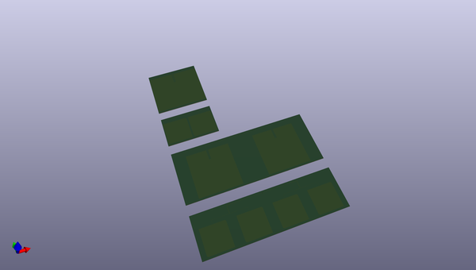
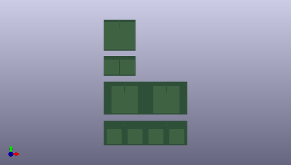

# m3_avionics
 
## summary 
* id: adamgreig_m3_avionics_release1
* user: adamgreig
* name: m3_avionics
* board: release1
* repo: https://github.com/adamgreig/m3-avionics
* src_file_repo_kicad_pcb: m3radio/antennas/antennas.kicad_pcb
* src_file_repo_kicad_pcb_link: https://github.com/adamgreig/m3-avionics/tree/master/m3radio/antennas/antennas.kicad_pcb

* src_file_repo_sch: m3pyro/pcb_r2/m3pyro.sch
* src_file_repo_sch_link: https://github.com/adamgreig/m3-avionics/tree/master/m3pyro/pcb_r2/m3pyro.sch
* full details link: https://github.com/oomlout/oomlout_oomp_project_bot_v_2/tree/main/projects/adamgreig_m3_avionics_release1/current_version/working  

## pcb  
 
  
  
  
[board (pdf)](working.pdf)  

## working_bom
| Id | Designator | Footprint | Quantity | Designation | Supplier and ref |  | None | 
| --- | --- | --- | --- | --- | --- | --- | --- | 
| 1 |  | X2 | 1 |  |  |  | [''] | 
| 2 |  | X3 | 1 |  |  |  | [''] | 
| 3 |  | X0 | 1 |  |  |  | [''] | 
| 4 |  | X1 | 1 |  |  |  | [''] | 

