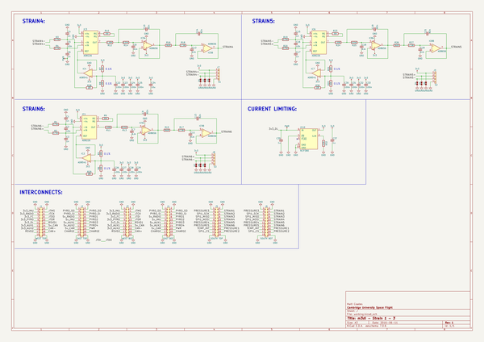
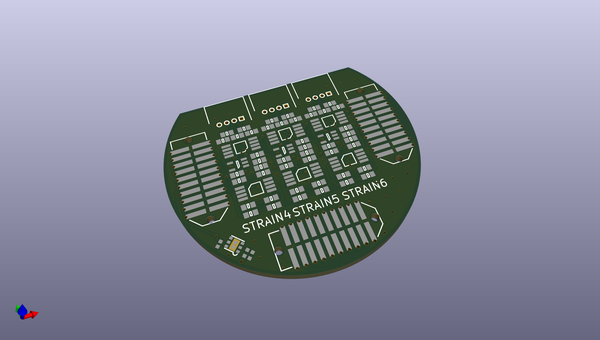
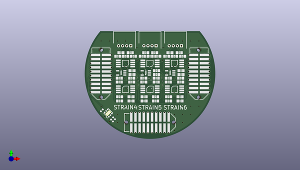
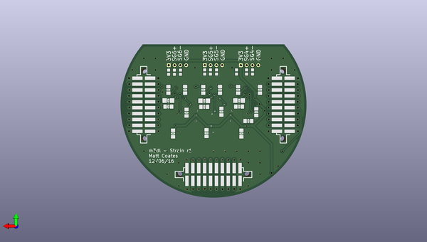

# m3_avionics
 
## summary 
* id: adamgreig_m3_avionics_strain_4_6
* user: adamgreig
* name: m3_avionics
* board: strain_4_6
* repo: https://github.com/adamgreig/m3-avionics
* src_file_repo_kicad_pcb: m3dl/strain_4-6/strain_4-6.kicad_pcb
* src_file_repo_kicad_pcb_link: https://github.com/adamgreig/m3-avionics/tree/master/m3dl/strain_4-6/strain_4-6.kicad_pcb

* src_file_repo_sch: m3dl/strain_4-6/strain_4-6.sch
* src_file_repo_sch_link: https://github.com/adamgreig/m3-avionics/tree/master/m3dl/strain_4-6/strain_4-6.sch
* full details link: https://github.com/oomlout/oomlout_oomp_project_bot_v_2/tree/main/projects/adamgreig_m3_avionics_strain_4_6/current_version/working  

## schematic  
  
[schematic (pdf)](working_schematic.pdf)  

## pcb  
 
  
  
  
[board (pdf)](working.pdf)  

## working_bom
| Id | Designator | Footprint | Quantity | Designation | Supplier and ref |  | None | 
| --- | --- | --- | --- | --- | --- | --- | --- | 
| 1 | C1,C3,C4,C6,C15,C17 | 0603-L | 6 | 1n |  |  | [''] | 
| 2 | C2,C5,C16 | 0603-L | 3 | 10n |  |  | [''] | 
| 3 | C7,C8,C11,C12,C18,C20 | 0603-L | 6 | 8.2n |  |  | [''] | 
| 4 | C9,C10,C13,C14,C19,C21 | 0603-L | 6 | 82n |  |  | [''] | 
| 5 | IC1,IC3,IC6 | MSOP-8 | 3 | AD8226 |  |  | [''] | 
| 6 | IC2,IC4,IC7 | SC-70-5 | 3 | AD8541 |  |  | [''] | 
| 7 | IC5,IC8,IC9 | MSOP-8 | 3 | AD8656 |  |  | [''] | 
| 8 | J1 | TFML-110-02-L-D | 1 | WEST TOP |  |  | [''] | 
| 9 | J2 | TFML-110-02-L-D | 1 | EAST TOP |  |  | [''] | 
| 10 | J5 | TFML-110-02-L-D | 1 | SOUTH TOP |  |  | [''] | 
| 11 | R1,R2,R3,R4,R19,R20 | 0603-L | 6 | 3.74K |  |  | [''] | 
| 12 | R5,R6,R7,R8,R21,R22 | 0603-L | 6 | 10K |  |  | [''] | 
| 13 | R11,R12,R24 | 0603-L | 3 | 1.69K |  |  | [''] | 
| 14 | R13,R14,R25 | 0603-L | 3 | 6.04K |  |  | [''] | 
| 15 | R15,R16,R26 | 0603-L | 3 | 562R |  |  | [''] | 
| 16 | R17,R18,R27 | 0603-L | 3 | 17.8K |  |  | [''] | 
| 17 | J7 | Connector_Molex_PicoBlade_53048-0410 | 1 | S1 |  |  | [''] | 
| 18 | J8 | Connector_Molex_PicoBlade_53048-0410 | 1 | S3 |  |  | [''] | 
| 19 | J9 | Connector_Molex_PicoBlade_53048-0410 | 1 | S2 |  |  | [''] | 
| 20 | C35,C37 | 0402-L | 2 | 1u |  |  | [''] | 
| 21 | R32 | 0402-L | 1 | 110k |  |  | [''] | 
| 22 | IC10 | DFN-6-EP-ONSEMI | 1 | NCP380 |  |  | [''] | 
| 23 | J3 | SFML-110-02-L-D-LC | 1 | WEST BOT |  |  | [''] | 
| 24 | J4 | SFML-110-02-L-D-LC | 1 | EAST BOT |  |  | [''] | 
| 25 | J6 | SFML-110-02-L-D-LC | 1 | SOUTH BOT |  |  | [''] | 
| 26 | R9,R10,R23 | 0603-L | 3 | 330 |  |  | [''] | 
| 27 | C22,C23,C24,C25,C26,C27,C28,C29,C30,C31,C32,C33 | 0603-L | 12 | 100n |  |  | [''] | 
| 28 | C34 | 0603-L | 1 | 10u |  |  | [''] | 
| 29 | R28,R29,R30 | 0603 | 3 | 0R |  |  | [''] | 
| 30 | D1,D2,D3,D4,D5,D6,D7,D8,D9 | 0402 | 9 | ESD_DIODE |  |  | [''] | 

## bom_schematic
| Ref | Qnty | Value | Cmp name | Footprint | Description | Vendor | DNP | 
| --- | --- | --- | --- | --- | --- | --- | --- | 
| C1, C3, C4, C6, C15, C17 | 6 | 1n | C_Small | Capacitors_SMD:C_0603 |  |  |  | 
| C2, C5, C16 | 3 | 10n | C_Small | Capacitors_SMD:C_0603 |  |  |  | 
| C7, C8, C11, C12, C18, C20 | 6 | 8.2n | C_Small | Capacitors_SMD:C_0603 |  |  |  | 
| C9, C10, C13, C14, C19, C21 | 6 | 82n | C_Small | Capacitors_SMD:C_0603 |  |  |  | 
| C22, C23, C24, C25, C26, C27, C28, C29, C30, C31, C32, C33 | 12 | 100n | C_Small | agg:0603-L |  |  |  | 
| C34 | 1 | 10u | C_Small | agg:0603-L |  |  |  | 
| C35, C37 | 2 | 1u | C_Small | agg:0402-L |  |  |  | 
| D1, D2, D3, D4, D5, D6, D7, D8, D9 | 9 | ESD_DIODE | ESD_DIODE | agg:0402 |  |  |  | 
| IC1, IC3, IC6 | 3 | AD8226 | AD8226 | agg:MSOP-8 |  |  |  | 
| IC2, IC4, IC7 | 3 | AD8541 | AD8541 | agg:SC-70-5 |  |  |  | 
| IC5, IC8, IC9 | 3 | AD8656 | AD8656 | agg:MSOP-8 |  |  |  | 
| IC10 | 1 | NCP380 | NCP380 | agg:DFN-6-EP-ONSEMI |  |  |  | 
| J1 | 1 | WEST TOP | CONN_02x10 | agg:TFML-110-02-L-D |  |  |  | 
| J2 | 1 | EAST TOP | CONN_02x10 | agg:TFML-110-02-L-D |  |  |  | 
| J3 | 1 | WEST BOT | CONN_02x10 | agg:SFML-110-02-L-D-LC |  |  |  | 
| J4 | 1 | EAST BOT | CONN_02x10 | agg:SFML-110-02-L-D-LC |  |  |  | 
| J5 | 1 | SOUTH TOP | CONN_02x10 | agg:TFML-110-02-L-D |  |  |  | 
| J6 | 1 | SOUTH BOT | CONN_02x10 | agg:SFML-110-02-L-D-LC |  |  |  | 
| J7 | 1 | S1 | CONN_01x04 | Connectors_Molex:Connector_Molex_PicoBlade_53048-0410 |  |  |  | 
| J8 | 1 | S3 | CONN_01x04 | Connectors_Molex:Connector_Molex_PicoBlade_53048-0410 |  |  |  | 
| J9 | 1 | S2 | CONN_01x04 | Connectors_Molex:Connector_Molex_PicoBlade_53048-0410 |  |  |  | 
| R1, R2, R3, R4, R19, R20 | 6 | 3.74K | R | Resistors_SMD:R_0603 |  |  |  | 
| R5, R6, R7, R8, R21, R22 | 6 | 10K | R | Resistors_SMD:R_0603 |  |  |  | 
| R9, R10, R23 | 3 | 330 | R | Resistors_SMD:R_0603 |  |  |  | 
| R11, R12, R24 | 3 | 1.69K | R | Resistors_SMD:R_0603 |  |  |  | 
| R13, R14, R25 | 3 | 6.04K | R | Resistors_SMD:R_0603 |  |  |  | 
| R15, R16, R26 | 3 | 562R | R | Resistors_SMD:R_0603 |  |  |  | 
| R17, R18, R27 | 3 | 17.8K | R | Resistors_SMD:R_0603 |  |  |  | 
| R28, R29, R30 | 3 | 0R | R | agg:0603 |  |  |  | 
| R32 | 1 | 110k | R | agg:0402-L |  |  |  | 

