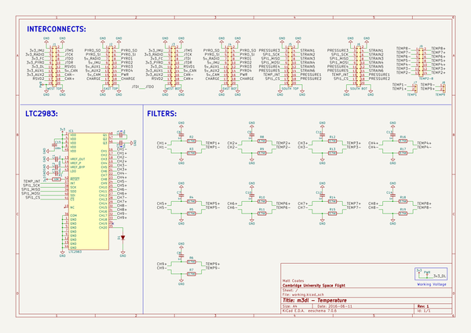

# m3_avionics
 
## summary 
* id: adamgreig_m3_avionics_temperature
* user: adamgreig
* name: m3_avionics
* board: temperature
* repo: https://github.com/adamgreig/m3-avionics
* src_file_repo_kicad_pcb: m3dl/temperature/temperature.kicad_pcb
* src_file_repo_kicad_pcb_link: https://github.com/adamgreig/m3-avionics/tree/master/m3dl/temperature/temperature.kicad_pcb

* src_file_repo_sch: m3dl/temperature/temperature.sch
* src_file_repo_sch_link: https://github.com/adamgreig/m3-avionics/tree/master/m3dl/temperature/temperature.sch
* full details link: https://github.com/oomlout/oomlout_oomp_project_bot_v_2/tree/main/projects/adamgreig_m3_avionics_temperature/current_version/working  

## schematic  
  
[schematic (pdf)](working_schematic.pdf)  

## pcb  
 
  
  
  
[board (pdf)](working.pdf)  

## working_bom
| Id | Designator | Footprint | Quantity | Designation | Supplier and ref |  | None | 
| --- | --- | --- | --- | --- | --- | --- | --- | 
| 1 | IC1 | LQFP-48 | 1 | LTC2983 |  |  | [''] | 
| 2 | J1 | TFML-110-02-L-D | 1 | WEST TOP |  |  | [''] | 
| 3 | J2 | TFML-110-02-L-D | 1 | EAST TOP |  |  | [''] | 
| 4 | J5 | TFML-110-02-L-D | 1 | SOUTH TOP |  |  | [''] | 
| 5 | C1 | 0603-L | 1 | 1u |  |  | [''] | 
| 6 | C2 | 0603-L | 1 | 100n |  |  | [''] | 
| 7 | C3,C5 | 0603-L | 2 | 10u |  |  | [''] | 
| 8 | C4 | 0805 | 1 | 10u |  |  | [''] | 
| 9 | C6,C7,C8,C9,C10,C11,C12,C13,C14 | 0603-L | 9 | 1n |  |  | [''] | 
| 10 | R2,R3,R4,R5,R6,R7,R8,R9,R10,R11,R12,R13,R14,R15,R16,R17,R18,R19 | 0603-L | 18 | 3.74K |  |  | [''] | 
| 11 | J3 | SFML-110-02-L-D-LC | 1 | WEST BOT |  |  | [''] | 
| 12 | J4 | SFML-110-02-L-D-LC | 1 | EAST BOT |  |  | [''] | 
| 13 | J6 | SFML-110-02-L-D-LC | 1 | SOUTH BOT |  |  | [''] | 
| 14 | D1 | SOD-123 | 1 | D |  |  | [''] | 
| 15 | R1 | 0603-L | 1 | 10K |  |  | [''] | 
| 16 | J7 | Connector_Molex_PicoBlade_53048-0210 | 1 | TEMP1 |  |  | [''] | 
| 17 | J8 | Connector_Molex_PicoBlade_53048-0210 | 1 | TEMP9 |  |  | [''] | 
| 18 | J9 | Connector_Molex_PicoBlade_53048-1410 | 1 | TEMP2-8 |  |  | [''] | 
| 19 | C15 | 0603 | 1 | 100n |  |  | [''] | 

## bom_schematic
| Ref | Qnty | Value | Cmp name | Footprint | Description | Vendor | DNP | 
| --- | --- | --- | --- | --- | --- | --- | --- | 
| C1 | 1 | 1u | C_Small | Capacitors_SMD:C_0603 |  |  |  | 
| C2, C15 | 2 | 100n | C_Small | Capacitors_SMD:C_0603 |  |  |  | 
| C3, C5 | 2 | 10u | C_Small | Capacitors_SMD:C_0603 |  |  |  | 
| C4 | 1 | 10u | C_Small | agg:0805 |  |  |  | 
| C6, C7, C8, C9, C10, C11, C12, C13, C14 | 9 | 1n | C_Small | Capacitors_SMD:C_0603 |  |  |  | 
| D1 | 1 | D | D | Diodes_SMD:SOD-123 |  |  |  | 
| IC1 | 1 | LTC2983 | LTC2983 | agg:LQFP-48 |  |  |  | 
| J1 | 1 | WEST TOP | CONN_02x10 | agg:TFML-110-02-L-D |  |  |  | 
| J2 | 1 | EAST TOP | CONN_02x10 | agg:TFML-110-02-L-D |  |  |  | 
| J3 | 1 | WEST BOT | CONN_02x10 | agg:SFML-110-02-L-D-LC |  |  |  | 
| J4 | 1 | EAST BOT | CONN_02x10 | agg:SFML-110-02-L-D-LC |  |  |  | 
| J5 | 1 | SOUTH TOP | CONN_02x10 | agg:TFML-110-02-L-D |  |  |  | 
| J6 | 1 | SOUTH BOT | CONN_02x10 | agg:SFML-110-02-L-D-LC |  |  |  | 
| J7 | 1 | TEMP1 | CONN_01x02 | Connectors_Molex:Connector_Molex_PicoBlade_53048-0210 |  |  |  | 
| J8 | 1 | TEMP9 | CONN_01x02 | Connectors_Molex:Connector_Molex_PicoBlade_53048-0210 |  |  |  | 
| J9 | 1 | TEMP2-8 | CONN_02x07 | Connectors_Molex:Connector_Molex_PicoBlade_53048-1410 |  |  |  | 
| R1 | 1 | 10K | R | Resistors_SMD:R_0603 |  |  |  | 
| R2, R3, R4, R5, R6, R7, R8, R9, R10, R11, R12, R13, R14, R15, R16, R17, R18, R19 | 18 | 3.74K | R | Resistors_SMD:R_0603 |  |  |  | 

