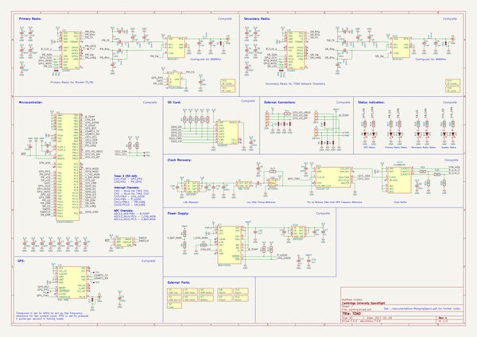
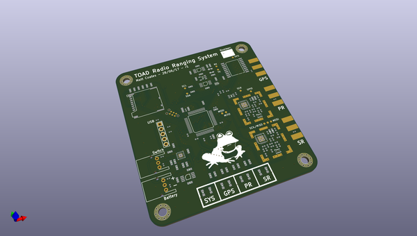
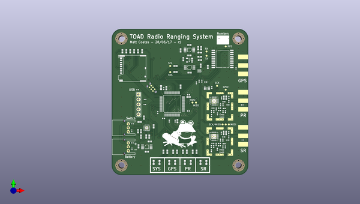
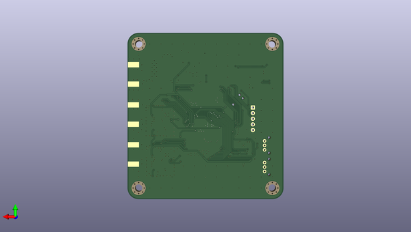

# m3_avionics
 
## summary 
* id: adamgreig_m3_avionics_toad
* user: adamgreig
* name: m3_avionics
* board: toad
* repo: https://github.com/adamgreig/m3-avionics
* src_file_repo_kicad_pcb: TOAD/pcb/TOAD.kicad_pcb
* src_file_repo_kicad_pcb_link: https://github.com/adamgreig/m3-avionics/tree/master/TOAD/pcb/TOAD.kicad_pcb

* src_file_repo_sch: TOAD/pcb/TOAD.sch
* src_file_repo_sch_link: https://github.com/adamgreig/m3-avionics/tree/master/TOAD/pcb/TOAD.sch
* full details link: https://github.com/oomlout/oomlout_oomp_project_bot_v_2/tree/main/projects/adamgreig_m3_avionics_toad/current_version/working  

## schematic  
  
[schematic (pdf)](working_schematic.pdf)  

## pcb  
 
  
  
  
[board (pdf)](working.pdf)  

## working_bom
| Id | Designator | Footprint | Quantity | Designation | Supplier and ref |  | None | 
| --- | --- | --- | --- | --- | --- | --- | --- | 
| 1 | C1,C33 | 0603-L | 2 | 2.2uF |  |  | [''] | 
| 2 | C2,C34 | 0402 | 2 | 100nF |  |  | [''] | 
| 3 | C3,C35 | 0402 | 2 | 220pF |  |  | [''] | 
| 4 | C4,C7,C8,C9,C12,C13,C14,C60 | 0402 | 8 | 100n |  |  | [''] | 
| 5 | C5,C37 | 0603-L | 2 | 1uF |  |  | [''] | 
| 6 | C6,C38 | 0402 | 2 | 100pF |  |  | [''] | 
| 7 | C10,C11 | 0603-L | 2 | 2u2 |  |  | [''] | 
| 8 | C15 | 0603 | 1 | 4u7 |  |  | [''] | 
| 9 | C16,C26,C31,C42,C43,C47 | 0603-L | 6 | 1u |  |  | [''] | 
| 10 | C17,C48 | 0402 | 2 | 3pF |  |  | [''] | 
| 11 | C18,C49 | 0402 | 2 | 33pF |  |  | [''] | 
| 12 | C19,C50 | 0402 | 2 | 3.9pF |  |  | [''] | 
| 13 | C20,C51 | 0402 | 2 | 1pF |  |  | [''] | 
| 14 | C21,C32,C36,C44,C58 | 0603-L | 5 | 100n |  |  | [''] | 
| 15 | C22,C52 | 0402 | 2 | 5.1pF |  |  | [''] | 
| 16 | C23,C53 | 0402 | 2 | 2.7pF |  |  | [''] | 
| 17 | C28,C30,C57,C59 | 0402 | 4 | 4.7pF |  |  | [''] | 
| 18 | C29,C46 | 0603-L | 2 | 10n |  |  | [''] | 
| 19 | C39,C45 | 0603-L | 2 | 4u7 |  |  | [''] | 
| 20 | C40,C41 | 0603-L | 2 | 1n |  |  | [''] | 
| 21 | D1,D2,D3,D4,D5,D6,D7,D15,D17,D18 | 0402-L | 10 | ESD_DIODE |  |  | [''] | 
| 22 | D8,D9,D10,D11,D12,D13,D14,D16 | 0603-LED | 8 | LED |  |  | [''] | 
| 23 | IC1 | LQFP-64 | 1 | STM32F405RxTx |  |  | [''] | 
| 24 | IC2,IC9 | QFN-20-EP-SI | 2 | Si4463 |  |  | [''] | 
| 25 | IC3 | MAX-M8Q | 1 | MAX-M8Q |  |  | [''] | 
| 26 | IC4 | SC-70-6 | 1 | SN74LVC1G0832 |  |  | [''] | 
| 27 | IC5,IC12 | TSLP7-4 | 2 | BGS12AL7 |  |  | [''] | 
| 28 | IC6,IC10 | MSOP-8 | 2 | ADP3335 |  |  | [''] | 
| 29 | IC7 | QFN-16-EP-TI | 1 | BQ24232HA |  |  | [''] | 
| 30 | IC8 | SOT-23-5 | 1 | NC7SZ04 |  |  | [''] | 
| 31 | IC11 | MSOP-10 | 1 | CS2100-CP |  |  | [''] | 
| 32 | IC13 | DFN-10-SL18860DC | 1 | SL18860DC |  |  | [''] | 
| 33 | J1 | SIL-254P-05 | 1 | USB |  |  | [''] | 
| 34 | J2 | S03B-PASK-2 | 1 | BATT |  |  | [''] | 
| 35 | J3 | S03B-PASK-2 | 1 | SWITCH |  |  | [''] | 
| 36 | L2,L9 | 0402 | 2 | 20nH |  |  | [''] | 
| 37 | L3,L10 | 0402 | 2 | 24nH |  |  | [''] | 
| 38 | L4,L11 | 0402 | 2 | 15nH |  |  | [''] | 
| 39 | L5,L6,L12,L13 | 0402 | 4 | 11nH |  |  | [''] | 
| 40 | L7,L14 | 0402 | 2 | 9.1nH |  |  | [''] | 
| 41 | P1,P3,P4 | SMA-EDGE | 3 | SMA |  |  | [''] | 
| 42 | P2 | TC2030-NL | 1 | SWD_TC |  |  | [''] | 
| 43 | R1,R2,R11,R12 | 0603-L | 4 | 10K |  |  | [''] | 
| 44 | R3,R6,R7,R8,R10 | 0603-L | 5 | 47K |  |  | [''] | 
| 45 | R4,R5 | 0603-L | 2 | 110k |  |  | [''] | 
| 46 | R9 | 0603-L | 1 | 4k32 |  |  | [''] | 
| 47 | R13 | 0603-L | 1 | 1M |  |  | [''] | 
| 48 | R14 | 0603-L | 1 | 1k |  |  | [''] | 
| 49 | R15,R16,R17,R18,R19,R20,R21,R22 | 0603-L | 8 | 120R |  |  | [''] | 
| 50 | U1 | MICROSD_MOLEX_503398-1892 | 1 | MICROSD |  |  | [''] | 
| 51 | X8,X9,X12,X13 | M3_MOUNT | 4 | Mount |  |  | [''] | 
| 52 | X10,X14 | BMI-S-201-F | 2 | RF Frame |  |  | [''] | 
| 53 | Y1 | XTAL-25x20 | 1 | 26M TCXO |  |  | [''] | 
| 54 | L1,L8 | 0402 | 2 | 120nH |  |  | [''] | 
| 55 | G*** | toad | 1 | LOGO |  |  | [''] | 
| 56 | TP1,TP2,TP3,TP4,TP5,TP6,TP7,TP8,TP9,TP10,TP11,TP12 | TESTPAD | 12 | TESTPAD |  |  | [''] | 
| 57 | R23,R24,R25,R26 | 0402 | 4 | 10K |  |  | [''] | 

## bom_schematic
| Ref | Qnty | Value | Cmp name | Footprint | Description | Vendor | DNP | 
| --- | --- | --- | --- | --- | --- | --- | --- | 
| C1, C33 | 2 | 2.2uF | C_Small | agg:0603-L |  |  |  | 
| C2, C34 | 2 | 100nF | C_Small | agg:0402 |  |  |  | 
| C3, C35 | 2 | 220pF | C_Small | agg:0402 |  |  |  | 
| C4, C7, C8, C9, C12, C13, C14, C60 | 8 | 100n | C_Small | agg:0402 |  |  |  | 
| C5, C37 | 2 | 1uF | C_Small | agg:0603-L |  |  |  | 
| C6, C38 | 2 | 100pF | C_Small | agg:0402 |  |  |  | 
| C10, C11 | 2 | 2u2 | C_Small | agg:0603-L |  |  |  | 
| C15 | 1 | 4u7 | C_Small | agg:0603 |  |  |  | 
| C16, C26, C31, C42, C43, C47 | 6 | 1u | C_Small | agg:0603-L |  |  |  | 
| C17, C48 | 2 | 3pF | C_Small | agg:0402 |  |  |  | 
| C18, C49 | 2 | 33pF | C_Small | agg:0402 |  |  |  | 
| C19, C50 | 2 | 3.9pF | C_Small | agg:0402 |  |  |  | 
| C20, C51 | 2 | 1pF | C_Small | agg:0402 |  |  |  | 
| C21, C32, C36, C44, C58 | 5 | 100n | C_Small | agg:0603-L |  |  |  | 
| C22, C52 | 2 | 5.1pF | C_Small | agg:0402 |  |  |  | 
| C23, C53 | 2 | 2.7pF | C_Small | agg:0402 |  |  |  | 
| C28, C30, C57, C59 | 4 | 4.7pF | C_Small | agg:0402 |  |  |  | 
| C29, C46 | 2 | 10n | C_Small | agg:0603-L |  |  |  | 
| C39, C45 | 2 | 4u7 | C_Small | agg:0603-L |  |  |  | 
| C40, C41 | 2 | 1n | C_Small | agg:0603-L |  |  |  | 
| D1, D2, D3, D4, D5, D6, D7, D15, D17, D18 | 10 | ESD_DIODE | ESD_DIODE | agg:0402-L |  |  |  | 
| D8, D9, D10, D11, D12, D13, D14, D16 | 8 | LED | LED-RESCUE-TOAD | agg:0603-LED |  |  |  | 
| IC1 | 1 | STM32F405RxTx | STM32F405RxTx | agg:LQFP-64 |  |  |  | 
| IC2, IC9 | 2 | Si4463 | Si4460 | agg:QFN-20-EP-SI |  |  |  | 
| IC3 | 1 | MAX-M8Q | MAX-M8Q | agg:MAX-M8Q |  |  |  | 
| IC4 | 1 | SN74LVC1G0832 | SN74LVC1G0832 | agg:SC-70-6 |  |  |  | 
| IC5, IC12 | 2 | BGS12AL7 | BGS12AL7 | agg:TSLP7-4 |  |  |  | 
| IC6, IC10 | 2 | ADP3335 | ADP3335 | agg:MSOP-8 |  |  |  | 
| IC7 | 1 | BQ24232HA | BQ24232HA | agg:QFN-16-EP-TI |  |  |  | 
| IC8 | 1 | NC7SZ04 | NC7SZ04 | agg:SOT-23-5 |  |  |  | 
| IC11 | 1 | CS2100-CP | CS2100-CP | agg:MSOP-10 |  |  |  | 
| IC13 | 1 | SL18860DC | SL18860DC | agg:DFN-10-SL18860DC |  |  |  | 
| J1 | 1 | USB | CONN_01x05 | agg:SIL-254P-05 |  |  |  | 
| J2 | 1 | BATT | CONN_01x03 | agg:S03B-PASK-2 |  |  |  | 
| J3 | 1 | SWITCH | CONN_01x03 | agg:S03B-PASK-2 |  |  |  | 
| L1, L8 | 2 | 120nH | L_Small | agg:0402 |  |  |  | 
| L2, L9 | 2 | 20nH | L_Small | agg:0402 |  |  |  | 
| L3, L10 | 2 | 24nH | L_Small | agg:0402 |  |  |  | 
| L4, L11 | 2 | 15nH | L_Small | agg:0402 |  |  |  | 
| L5, L6, L12, L13 | 4 | 11nH | L_Small | agg:0402 |  |  |  | 
| L7, L14 | 2 | 9.1nH | L_Small | agg:0402 |  |  |  | 
| P1, P3, P4 | 3 | SMA | COAX | agg:SMA-EDGE |  |  |  | 
| P2 | 1 | SWD_TC | SWD_TC | agg:TC2030-NL |  |  |  | 
| R1, R2, R11, R12 | 4 | 10K | R-RESCUE-TOAD | agg:0603-L |  |  |  | 
| R3, R6, R7, R8, R10 | 5 | 47K | R-RESCUE-TOAD | agg:0603-L |  |  |  | 
| R4, R5 | 2 | 110k | R-RESCUE-TOAD | agg:0603-L |  |  |  | 
| R9 | 1 | 4k32 | R-RESCUE-TOAD | agg:0603-L |  |  |  | 
| R13 | 1 | 1M | R-RESCUE-TOAD | agg:0603-L |  |  |  | 
| R14 | 1 | 1k | R-RESCUE-TOAD | agg:0603-L |  |  |  | 
| R15, R16, R17, R18, R19, R20, R21, R22 | 8 | 120R | R-RESCUE-TOAD | agg:0603-L |  |  |  | 
| R23, R24, R25, R26 | 4 | 10K | R-RESCUE-TOAD | agg:0402 |  |  |  | 
| TP1, TP2, TP3, TP4, TP5, TP6, TP7, TP8, TP9, TP10, TP11, TP12 | 12 | TESTPAD | TESTPAD | agg:TESTPAD |  |  |  | 
| U1 | 1 | MICROSD | MICROSD | agg:MICROSD_MOLEX_503398-1892 |  |  |  | 
| X1 | 1 | USB Cap | PART |  |  |  |  | 
| X2 | 1 | USB Mini-B | PART |  |  |  |  | 
| X3 | 1 | Case | PART |  |  |  |  | 
| X4, X5 | 2 | SMA Panel | PART |  |  |  |  | 
| X6 | 1 | PWR Switch | PART |  |  |  |  | 
| X7 | 1 | Battery | PART |  |  |  |  | 
| X8, X9, X12, X13 | 4 | Mount | PART | agg:M3_MOUNT |  |  |  | 
| X10, X14 | 2 | RF Frame | PART | Library:BMI-S-201-F |  |  |  | 
| X11, X15 | 2 | RF Cover | PART |  |  |  |  | 
| Y1 | 1 | 26M TCXO | TCXO | agg:XTAL-25x20 |  |  |  | 

