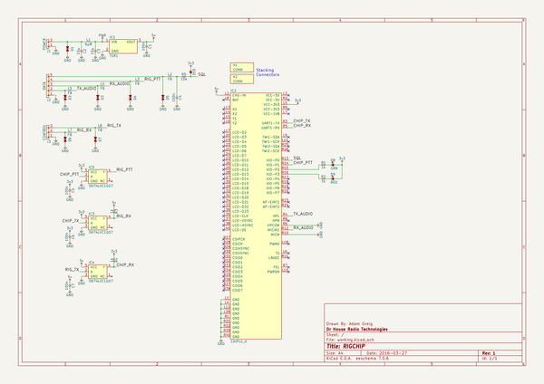

# rigchip
 
## summary 
* id: adamgreig_rigchip_rigchip
* user: adamgreig
* name: rigchip
* board: rigchip
* repo: https://github.com/adamgreig/rigchip
* src_file_repo_kicad_pcb: pcb/rigchip.kicad_pcb
* src_file_repo_kicad_pcb_link: https://github.com/adamgreig/rigchip/tree/master/pcb/rigchip.kicad_pcb

* src_file_repo_sch: pcb/rigchip.sch
* src_file_repo_sch_link: https://github.com/adamgreig/rigchip/tree/master/pcb/rigchip.sch
* full details link: https://github.com/oomlout/oomlout_oomp_project_bot_v_2/tree/main/projects/adamgreig_rigchip_rigchip/current_version/working  

## schematic  
  
[schematic (pdf)](working_schematic.pdf)  

## pcb  
 
  
  
  
[board (pdf)](working.pdf)  

## working_bom
| Id | Designator | Footprint | Quantity | Designation | Supplier and ref |  | None | 
| --- | --- | --- | --- | --- | --- | --- | --- | 
| 1 | C1,C4,C5,C6,C7 | 0603 | 5 | 100n |  |  | [''] | 
| 2 | C2,C3 | 1206 | 2 | 10µ |  |  | [''] | 
| 3 | D1,D2,D3,D4,D5,D6,D7 | 0402 | 7 | ESD_DIODE |  |  | [''] | 
| 4 | D8 | 0603-LED | 1 | GRN |  |  | [''] | 
| 5 | D9 | 0603-LED | 1 | RED |  |  | [''] | 
| 6 | IC1 | TSR1 | 1 | TSR1 |  |  | [''] | 
| 7 | IC2 | CHIPv1_0 | 1 | CHIPv1_0 |  |  | [''] | 
| 8 | J1 | S02B-PASK-2 | 1 | POWER |  |  | [''] | 
| 9 | J2 | S05B-PASK-2 | 1 | DATA |  |  | [''] | 
| 10 | J3 | S03B-PASK-2 | 1 | CONTROL |  |  | [''] | 
| 11 | L1 | TYS5040 | 1 | 6µ8 |  |  | [''] | 
| 12 | L2,L3,L4,L5,L6,L7 | 0603 | 6 | FB |  |  | [''] | 
| 13 | R1,R2,R3,R4 | 0603 | 4 | 1k |  |  | [''] | 
| 14 | IC3,IC4,IC5 | SOT-23-5 | 3 | SN74LVC1G07 |  |  | [''] | 
| 15 | R5 | 0603 | 1 | 10k |  |  | [''] | 
| 16 | D10 | 0603-LED | 1 | ~ |  |  | [''] | 

## bom_schematic
| Ref | Qnty | Value | Cmp name | Footprint | Description | Vendor | DNP | 
| --- | --- | --- | --- | --- | --- | --- | --- | 
| C1, C4, C5, C6, C7 | 5 | 100n | C | agg:0603 |  |  |  | 
| C2, C3 | 2 | 10µ | C | agg:1206 |  |  |  | 
| D1, D2, D3, D4, D5, D6, D7 | 7 | ESD_DIODE | ESD_DIODE | agg:0402 |  |  |  | 
| D8 | 1 | GRN | LED | agg:0603-LED |  |  |  | 
| D9 | 1 | RED | LED | agg:0603-LED |  |  |  | 
| D10 | 1 | ~ | SCHOTTKY | agg:0603-LED |  |  |  | 
| IC1 | 1 | TSR1 | TSR1 | agg:TSR1 |  |  |  | 
| IC2 | 1 | CHIPv1_0 | CHIPv1_0 | agg:CHIPv1_0 |  |  |  | 
| IC3, IC4, IC5 | 3 | SN74LVC1G07 | SN74LVC1G07 | agg:SOT-23-5 |  |  |  | 
| J1 | 1 | POWER | CONN_01x02 | agg:S02B-PASK-2 |  |  |  | 
| J2 | 1 | DATA | CONN_01x05 | agg:S05B-PASK-2 |  |  |  | 
| J3 | 1 | CONTROL | CONN_01x03 | agg:S03B-PASK-2 |  |  |  | 
| L1 | 1 | 6µ8 | L | agg:TYS5040 |  |  |  | 
| L2, L3, L4, L5, L6, L7 | 6 | FB | L | agg:0603 |  |  |  | 
| R1, R2, R3, R4 | 4 | 1k | R | agg:0603 |  |  |  | 
| R5 | 1 | 10k | R | agg:0603 |  |  |  | 
| X1, X2 | 2 | CONN | PART |  |  |  |  | 

