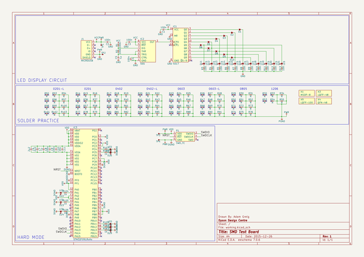
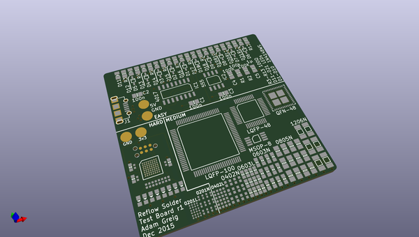
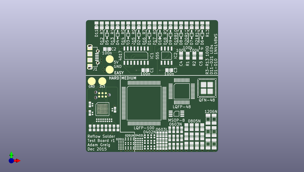
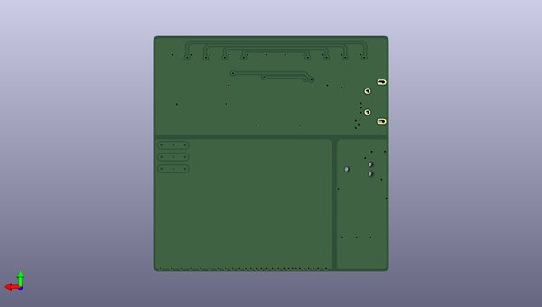

# smdboard
 
## summary 
* id: adamgreig_smdboard_smdboard
* user: adamgreig
* name: smdboard
* board: smdboard
* repo: https://github.com/adamgreig/smdboard
* src_file_repo_kicad_pcb: smdboard.kicad_pcb
* src_file_repo_kicad_pcb_link: https://github.com/adamgreig/smdboard/tree/master/smdboard.kicad_pcb

* src_file_repo_sch: smdboard.sch
* src_file_repo_sch_link: https://github.com/adamgreig/smdboard/tree/master/smdboard.sch
* full details link: https://github.com/oomlout/oomlout_oomp_project_bot_v_2/tree/main/projects/adamgreig_smdboard_smdboard/current_version/working  

## schematic  
  
[schematic (pdf)](working_schematic.pdf)  

## pcb  
 
  
  
  
[board (pdf)](working.pdf)  

## working_bom
| Id | Designator | Footprint | Quantity | Designation | Supplier and ref |  | None | 
| --- | --- | --- | --- | --- | --- | --- | --- | 
| 1 | C1,C2,C3,C4 | 0805 | 4 | 100n |  |  | [''] | 
| 2 | C5 | 0805 | 1 | 1µ |  |  | [''] | 
| 3 | D11,D12,D13,D14,D15,D16,D17,D18,D19,D20,D21 | 0805-LED | 11 | LED |  |  | [''] | 
| 4 | IC1 | SOIC-16 | 1 | 4017 |  |  | [''] | 
| 5 | IC2 | SOIC-8 | 1 | 555 |  |  | [''] | 
| 6 | J1 | MICROUSB_MOLEX_47589-0001 | 1 | MICROUSB |  |  | [''] | 
| 7 | R1,R2 | 0805 | 2 | 100k |  |  | [''] | 
| 8 | R3,R4,R5,R6,R7,R8,R9,R10,R11,R12,R13 | 0805 | 11 | 100 |  |  | [''] | 
| 9 | R14,R15,R16,R35,R36,R37,R56,R57,R58,R77,R78,R79 | 0201 | 12 | R |  |  | [''] | 
| 10 | R17,R18,R19,R38,R39,R40,R59,R60,R61,R80,R81,R82 | 0402 | 12 | R |  |  | [''] | 
| 11 | R20,R21,R22,R41,R42,R43,R62,R63,R64,R83,R84,R85 | 0402-L | 12 | R |  |  | [''] | 
| 12 | R23,R24,R25,R44,R45,R46,R65,R66,R67,R86,R87,R88 | 0603 | 12 | R |  |  | [''] | 
| 13 | R26,R27,R28,R47,R48,R49,R68,R69,R70,R89,R90,R91 | 0603-L | 12 | R |  |  | [''] | 
| 14 | R29,R30,R31,R50,R51,R52,R71,R72,R73,R74,R75,R76 | 0805 | 12 | R |  |  | [''] | 
| 15 | R32,R33,R34,R53,R54,R55 | 1206 | 6 | R |  |  | [''] | 
| 16 | X1 | MSOP-8 | 1 | MSOP-8 |  |  | [''] | 
| 17 | X3 | LQFP-48 | 1 | LQFP-48 |  |  | [''] | 
| 18 | X4 | QFN-48-EP-ST | 1 | QFN-48 |  |  | [''] | 
| 19 | X9 | LQFP-100 | 1 | LQFP-100 |  |  | [''] | 
| 20 | D2,D3,D4,D5,D7,D8,D9,D10,D1,D6 | SOD-323 | 10 | ~ |  |  | [''] | 
| 21 | C6,C7 | 0603-L | 2 | 2µ2 |  |  | [''] | 
| 22 | C8 | 0603-L | 1 | 1µ |  |  | [''] | 
| 23 | C9,C10 | 0402-L | 2 | 100n |  |  | [''] | 
| 24 | C11 | 0402-L | 1 | 10n |  |  | [''] | 
| 25 | D22,D23,D24,D25,D26,D27,D28,D29 | 0603-LED | 8 | LED |  |  | [''] | 
| 26 | IC3 | UFBGA-64 | 1 | STM32F091RxHx |  |  | [''] | 
| 27 | P1 | TC2030-NL | 1 | SWD_TC |  |  | [''] | 
| 28 | R104,R105,R106,R110,R107,R108,R109,R111 | 0402-L | 8 | 1k |  |  | [''] | 
| 29 | R92,R93,R94,R95,R96,R97,R98,R99,R100,R101,R102,R103 | 0201-L | 12 | R |  |  | [''] | 
| 30 | TP1,TP2,TP3,TP4 | WIREPAD | 4 | TESTPAD |  |  | [''] | 

## bom_schematic
| Ref | Qnty | Value | Cmp name | Footprint | Description | Vendor | DNP | 
| --- | --- | --- | --- | --- | --- | --- | --- | 
| C1, C2, C3, C4 | 4 | 100n | C | agg:0805 |  |  |  | 
| C5 | 1 | 1µ | C | agg:0805 |  |  |  | 
| C6, C7 | 2 | 2µ2 | C | agg:0603-L |  |  |  | 
| C8 | 1 | 1µ | C | agg:0603-L |  |  |  | 
| C9, C10 | 2 | 100n | C | agg:0402-L |  |  |  | 
| C11 | 1 | 10n | C | agg:0402-L |  |  |  | 
| D1, D2, D3, D4, D5, D6, D7, D8, D9, D10 | 10 | ~ | D | agg:SOD-323 |  |  |  | 
| D11, D12, D13, D14, D15, D16, D17, D18, D19, D20, D21 | 11 | LED | LED | agg:0805-LED |  |  |  | 
| D22, D23, D24, D25, D26, D27, D28, D29 | 8 | LED | LED | agg:0603-LED |  |  |  | 
| IC1 | 1 | 4017 | 4017 | agg:SOIC-16 |  |  |  | 
| IC2 | 1 | 555 | 555 | agg:SOIC-8 |  |  |  | 
| IC3 | 1 | STM32F091RxHx | STM32F091RxHx | agg:UFBGA-64 |  |  |  | 
| J1 | 1 | MICROUSB | MICROUSB | agg:MICROUSB_MOLEX_47589-0001 |  |  |  | 
| P1 | 1 | SWD_TC | SWD_TC | agg:TC2030-NL |  |  |  | 
| R1, R2 | 2 | 100k | R | agg:0805 |  |  |  | 
| R3, R4, R5, R6, R7, R8, R9, R10, R11, R12, R13 | 11 | 100 | R | agg:0805 |  |  |  | 
| R14, R15, R16, R35, R36, R37, R56, R57, R58, R77, R78, R79 | 12 | R | R | agg:0201 |  |  |  | 
| R17, R18, R19, R38, R39, R40, R59, R60, R61, R80, R81, R82 | 12 | R | R | agg:0402 |  |  |  | 
| R20, R21, R22, R41, R42, R43, R62, R63, R64, R83, R84, R85 | 12 | R | R | agg:0402-L |  |  |  | 
| R23, R24, R25, R44, R45, R46, R65, R66, R67, R86, R87, R88 | 12 | R | R | agg:0603 |  |  |  | 
| R26, R27, R28, R47, R48, R49, R68, R69, R70, R89, R90, R91 | 12 | R | R | agg:0603-L |  |  |  | 
| R29, R30, R31, R50, R51, R52, R71, R72, R73, R74, R75, R76 | 12 | R | R | agg:0805 |  |  |  | 
| R32, R33, R34, R53, R54, R55 | 6 | R | R | agg:1206 |  |  |  | 
| R92, R93, R94, R95, R96, R97, R98, R99, R100, R101, R102, R103 | 12 | R | R | agg:0201-L |  |  |  | 
| R104, R105, R106, R107, R108, R109, R110, R111 | 8 | 1k | R | agg:0402-L |  |  |  | 
| TP1, TP2, TP3, TP4 | 4 | TESTPAD | TESTPAD | agg:WIREPAD |  |  |  | 
| X1 | 1 | MSOP-8 | PART | agg:MSOP-8 |  |  |  | 
| X3 | 1 | LQFP-48 | PART | agg:LQFP-48 |  |  |  | 
| X4 | 1 | QFN-48 | PART | agg:QFN-48-EP-ST |  |  |  | 
| X9 | 1 | LQFP-100 | PART | agg:LQFP-100 |  |  |  | 

