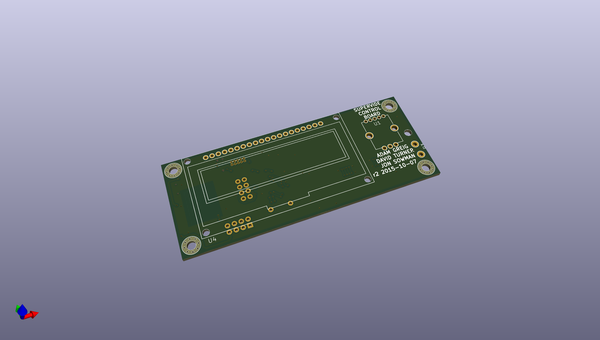
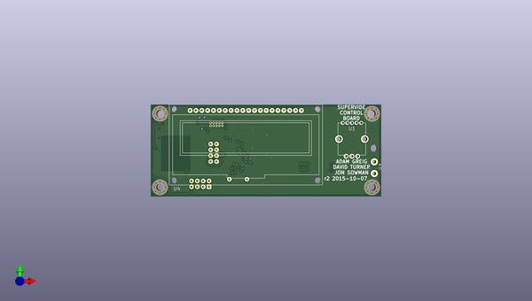
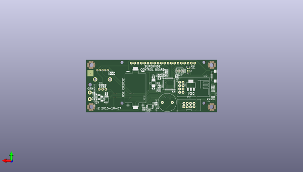

# supervide
 
## summary 
* id: adamgreig_supervide_control
* user: adamgreig
* name: supervide
* board: control
* repo: https://github.com/adamgreig/supervide
* src_file_repo_kicad_pcb: control/control.kicad_pcb
* src_file_repo_kicad_pcb_link: https://github.com/adamgreig/supervide/tree/master/control/control.kicad_pcb

* src_file_repo_sch: control/control.sch
* src_file_repo_sch_link: https://github.com/adamgreig/supervide/tree/master/control/control.sch
* full details link: https://github.com/oomlout/oomlout_oomp_project_bot_v_2/tree/main/projects/adamgreig_supervide_control/current_version/working  

## pcb  
 
  
  
  
[board (pdf)](working.pdf)  

## working_bom
| Id | Designator | Footprint | Quantity | Designation | Supplier and ref |  | None | 
| --- | --- | --- | --- | --- | --- | --- | --- | 
| 1 | U1 | SF_ROTENC | 1 | ROTENC |  |  | [''] | 
| 2 | U4 | ER-OLEDM023-1 | 1 | ER-OLEDM023-1 |  |  | [''] | 
| 3 | U5,U6,U7,U8 | M3_MOUNT | 4 | M3_HOLE |  |  | [''] | 
| 4 | P3 | TC_K_PM | 1 | CONN_01X02 |  |  | [''] | 
| 5 | REF** | HOLE | 1 | HOLE |  |  | [''] | 
| 6 | C1,C2,C16,C13,C10,C7,C6,C26,C8 | C0603 | 9 | 100n |  |  | [''] | 
| 7 | C17,C4,C21,C3,C27,C28 | C0603 | 6 | 10µ |  |  | [''] | 
| 8 | C22,C25 | C1206 | 2 | 100n |  |  | [''] | 
| 9 | C23,C24,C5 | C0603 | 3 | 1µ |  |  | [''] | 
| 10 | CON1 | USB3065 | 1 | USB-MICRO-B |  |  | [''] | 
| 11 | D1,D2,D5 | R0402 | 3 | CGA0402MLC-12G |  |  | [''] | 
| 12 | IC4 | MSOP8 | 1 | AD8495 |  |  | [''] | 
| 13 | P2 | 2x4_100 | 1 | CONN_02X04 |  |  | [''] | 
| 14 | R2,R4,R9,R3,R6 | R0603 | 5 | 10k |  |  | [''] | 
| 15 | R8,R10,R13,R14 | R0603 | 4 | 1k |  |  | [''] | 
| 16 | R11 | R0603 | 1 | 1M |  |  | [''] | 
| 17 | X2 | XTAL50x32 | 1 | 8MHz |  |  | [''] | 
| 18 | R7 | R0603 | 1 | 100 |  |  | [''] | 
| 19 | P1 | FTSH-105-01-F-D-K | 1 | SWD |  |  | [''] | 
| 20 | IC2 | LQFP48 | 1 | STM32F072CBT6 |  |  | [''] | 
| 21 | C12,C11,C15,C14 | C0603 | 4 | 15p |  |  | [''] | 
| 22 | C9 | C0603 | 1 | 10n |  |  | [''] | 
| 23 | IC3 | MSOP8 | 1 | ADP3335 |  |  | [''] | 
| 24 | C20,C18 | C0603 | 2 | 2µ2 |  |  | [''] | 
| 25 | C19 | C0603 | 1 | 1n |  |  | [''] | 
| 26 | R1,R5 | R0603 | 2 | 4k7 |  |  | [''] | 
| 27 | IC1 | MSOP8 | 1 | AD8542 |  |  | [''] | 
| 28 | SP1 | ABT-402-RC | 1 | SPEAKER |  |  | [''] | 
| 29 | U2 | ESP8266-ESP01 | 1 | ESP8266-ESP01 |  |  | [''] | 
| 30 | BT1 | 2032HOLDER_KS1060 | 1 | BATTERY |  |  | [''] | 
| 31 | R12,R15,R16 | R0603 | 3 | 50R |  |  | [''] | 
| 32 | IC5 | SOT223 | 1 | NCP1117 |  |  | [''] | 
| 33 | X1 | R0805 | 1 | 32k768 |  |  | [''] | 
| 34 | D3 | LED0603 | 1 | GRN |  |  | [''] | 
| 35 | D4 | LED0603 | 1 | BLU |  |  | [''] | 
| 36 | P4 | TC2030-NL | 1 | CONN_02X03 |  |  | [''] | 

