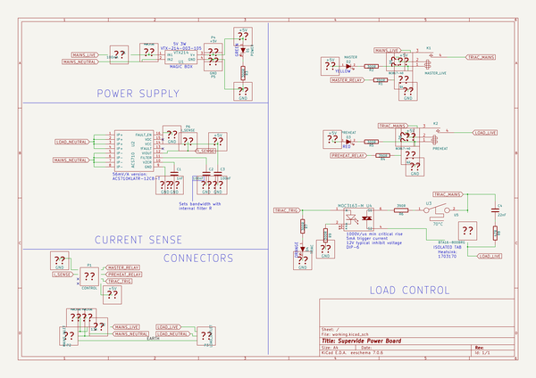
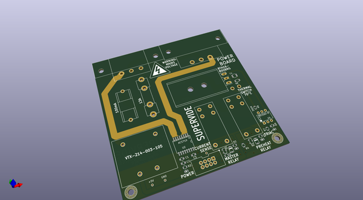
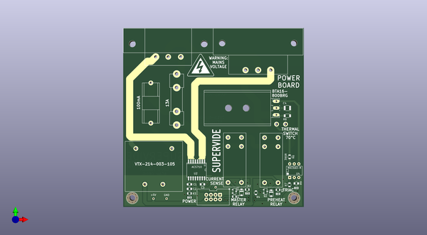
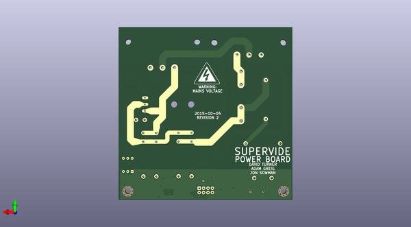

# supervide
 
## summary 
* id: adamgreig_supervide_power
* user: adamgreig
* name: supervide
* board: power
* repo: https://github.com/adamgreig/supervide
* src_file_repo_kicad_pcb: power/power.kicad_pcb
* src_file_repo_kicad_pcb_link: https://github.com/adamgreig/supervide/tree/master/power/power.kicad_pcb

* src_file_repo_sch: power/power.sch
* src_file_repo_sch_link: https://github.com/adamgreig/supervide/tree/master/power/power.sch
* full details link: https://github.com/oomlout/oomlout_oomp_project_bot_v_2/tree/main/projects/adamgreig_supervide_power/current_version/working  

## schematic  
  
[schematic (pdf)](working_schematic.pdf) 

## pcb  
 
  
  
  
[board (pdf)](working.pdf)  

## working_bom
| Id | Designator | Footprint | Quantity | Designation | Supplier and ref |  | None | 
| --- | --- | --- | --- | --- | --- | --- | --- | 
| 1 | C1 | C_0805 | 1 | 1nF |  |  | [''] | 
| 2 | C2,C3 | C_0805 | 2 | 100nF |  |  | [''] | 
| 3 | C4 | C_1210 | 1 | 22nF |  |  | [''] | 
| 4 | Q1,Q2 | SOT23 | 2 | BC817-40 |  |  | [''] | 
| 5 | R1,R4,R6 | R_0805 | 3 | 390R |  |  | [''] | 
| 6 | R8 | C_1206 | 1 | 47R |  |  | [''] | 
| 7 | R9 | C_0805 | 1 | 300R |  |  | [''] | 
| 8 | U1 | VTX214 | 1 | VTX214 |  |  | [''] | 
| 9 | U4 | DIP-6__300_ELL | 1 | MOC3163-M |  |  | [''] | 
| 10 | U5 | TO-220_Neutral123_Vertical_LargePads | 1 | BTA16-800BRG |  |  | [''] | 
| 11 | F1 | 5x20_clip | 1 | 100mA |  |  | [''] | 
| 12 | F2 | BS1362_clip | 1 | 13A |  |  | [''] | 
| 13 | P1 | 2x4_100 | 1 | CONTROL |  |  | [''] | 
| 14 | D1,D1 | LED-0805 | 2 | POWER |  |  | [''] | 
| 15 | D3 | LED-0805 | 1 | PREHEAT |  |  | [''] | 
| 16 | D4 | LED-0805 | 1 | TRIAC |  |  | [''] | 
| 17 | R3,R5,R7,R2 | R_0805 | 4 | 300R |  |  | [''] | 
| 18 | D2 | LED-0805 | 1 | MASTER |  |  | [''] | 
| 19 | REF** | TO220_hs | 1 | TO220_hs |  |  | [''] | 
| 20 | M3_MOUNT,M3_MOUNT | M3_MOUNT | 2 | VAL** |  |  | [''] | 
| 21 | P2 | GSP1_9103_no_protrude | 1 | MAINS_INLET |  |  | [''] | 
| 22 | P3 | 5001_no_protrude | 1 | LOAD_OUTLET |  |  | [''] | 
| 23 | P4 | 1pin | 1 | +5V |  |  | [''] | 
| 24 | P5 | 1pin | 1 | GND |  |  | [''] | 
| 25 | P6 | 1pin | 1 | I_SENSE |  |  | [''] | 
| 26 | K2 | RZ03-1A4 | 1 | PREHEAT |  |  | [''] | 
| 27 | K1 | RZ03-1A4 | 1 | MASTER_LIVE |  |  | [''] | 
| 28 | U2 | SOIC16W-chunky | 1 | ACS710 |  |  | [''] | 
| 29 | U3 | WireConnection_1mmDrill | 1 | 70°C |  |  | [''] | 
| 30 | D5,D6 | SOD-123FL | 2 | MBR2H200SFT1G |  |  | [''] | 
| 31 | G***,G*** | voltage_warn | 2 | LOGO |  |  | [''] | 

## bom_schematic
| Ref | Qnty | Value | Cmp name | Footprint | Description | Vendor | DNP | 
| --- | --- | --- | --- | --- | --- | --- | --- | 
| C1 | 1 | 1nF | C-RESCUE-power | Capacitors_SMD:C_0805 |  |  |  | 
| C2, C3 | 2 | 100nF | C-RESCUE-power | Capacitors_SMD:C_0805 |  |  |  | 
| C4 | 1 | 22nF | C-RESCUE-power | Capacitors_SMD:C_1210 |  |  |  | 
| D1 | 1 | POWER | LED-RESCUE-power | power:LED-0805 |  |  |  | 
| D2 | 1 | MASTER | LED-RESCUE-power | power:LED-0805 |  |  |  | 
| D3 | 1 | PREHEAT | LED-RESCUE-power | power:LED-0805 |  |  |  | 
| D4 | 1 | TRIAC | LED-RESCUE-power | power:LED-0805 |  |  |  | 
| K1 | 1 | MASTER_LIVE | RELAY_SPST | power:RZ03-1A4 |  |  |  | 
| K2 | 1 | PREHEAT | RELAY_SPST | power:RZ03-1A4 |  |  |  | 
| R1, R4, R6 | 3 | 390R | R-RESCUE-power | Resistors_SMD:R_0805 |  |  |  | 
| R2, R3, R5, R7 | 4 | 300R | R-RESCUE-power | Resistors_SMD:R_0805 |  |  |  | 
| R8 | 1 | 47R | R-RESCUE-power | Capacitors_SMD:C_1206 |  |  |  | 
| R9 | 1 | 300R | R-RESCUE-power | Capacitors_SMD:C_0805 |  |  |  | 
| U1 | 1 | VTX214 | VTX214 | power:VTX214 |  |  |  | 
| U2 | 1 | ACS710 | ACS710 | power:SOIC16W-chunky |  |  |  | 
| U3 | 1 | 70°C | thermal_switch | Wire_Connections_Bridges:WireConnection_1mmDrill |  |  |  | 
| U4 | 1 | MOC3163-M | OPTO-TRIAC-RESCUE-power | Sockets_DIP:DIP-6__300_ELL |  |  |  | 

