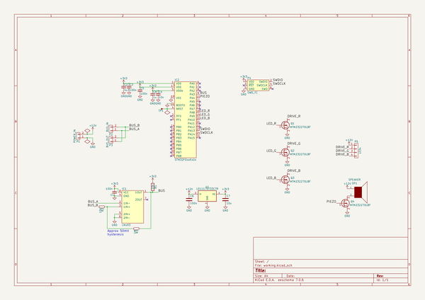
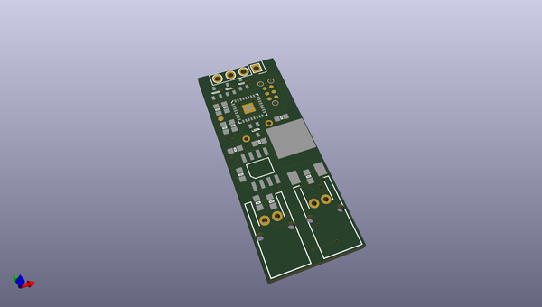
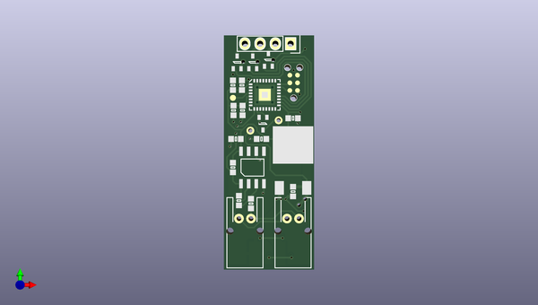
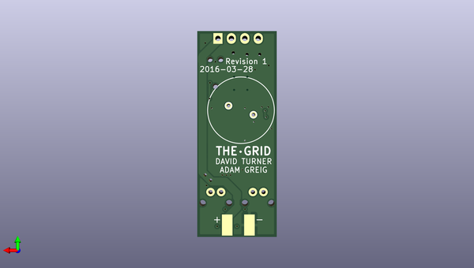

# thegrid
 
## summary 
* id: adamgreig_thegrid_pole
* user: adamgreig
* name: thegrid
* board: pole
* repo: https://github.com/adamgreig/thegrid
* src_file_repo_kicad_pcb: hardware/pole/pole.kicad_pcb
* src_file_repo_kicad_pcb_link: https://github.com/adamgreig/thegrid/tree/master/hardware/pole/pole.kicad_pcb

* src_file_repo_sch: hardware/pole/pole.sch
* src_file_repo_sch_link: https://github.com/adamgreig/thegrid/tree/master/hardware/pole/pole.sch
* full details link: https://github.com/oomlout/oomlout_oomp_project_bot_v_2/tree/main/projects/adamgreig_thegrid_pole/current_version/working  

## schematic  
  
[schematic (pdf)](working_schematic.pdf) 

## pcb  
 
  
  
  
[board (pdf)](working.pdf)  

## working_bom
| Id | Designator | Footprint | Quantity | Designation | Supplier and ref |  | None | 
| --- | --- | --- | --- | --- | --- | --- | --- | 
| 1 | C1,C3,C5,C6 | 0603 | 4 | 100n |  |  | [''] | 
| 2 | C2 | 0603 | 1 | 4u7 |  |  | [''] | 
| 3 | C4 | 0603 | 1 | 10n |  |  | [''] | 
| 4 | C7 | 0603 | 1 | 10u |  |  | [''] | 
| 5 | IC1 | SOIC-8 | 1 | LMx93 |  |  | [''] | 
| 6 | P2 | S02B-PASK-2 | 1 | BUS_IN |  |  | [''] | 
| 7 | P3 | S02B-PASK-2 | 1 | BUS_OUT |  |  | [''] | 
| 8 | P4 | TC2030-NL | 1 | SWD_TC |  |  | [''] | 
| 9 | P5 | Pin_Header_Straight_1x04 | 1 | LEDs |  |  | [''] | 
| 10 | R1,R2 | 0603 | 2 | 10k |  |  | [''] | 
| 11 | U1 | TO-252-3 | 1 | LD1117S33TR |  |  | [''] | 
| 12 | IC2 | QFN-32-EP-ST | 1 | STM32F0xxKxUx |  |  | [''] | 
| 13 | Q1,Q2,Q3,Q4 | SOT-323 | 4 | MTM232270LBF |  |  | [''] | 
| 14 | C8 | 0603 | 1 | 1u |  |  | [''] | 
| 15 | TP1 | TESTPAD | 1 | RST |  |  | [''] | 
| 16 | R3 | 0603 | 1 | 1M |  |  | [''] | 
| 17 | P1 | minipow_edge | 1 | POWER_IN |  |  | [''] | 
| 18 | SP1 | piezo | 1 | SPEAKER |  |  | [''] | 

## bom_schematic
| Ref | Qnty | Value | Cmp name | Footprint | Description | Vendor | DNP | 
| --- | --- | --- | --- | --- | --- | --- | --- | 
| C1, C3, C5, C6 | 4 | 100n | C | agg:0603 |  |  |  | 
| C2 | 1 | 4u7 | C_Small | agg:0603 |  |  |  | 
| C4 | 1 | 10n | C_Small | agg:0603 |  |  |  | 
| C7 | 1 | 10u | C | agg:0603 |  |  |  | 
| C8 | 1 | 1u | C_Small | agg:0603 |  |  |  | 
| IC1 | 1 | LMx93 | LMx93 | agg:SOIC-8 |  |  |  | 
| IC2 | 1 | STM32F0xxKxUx | STM32F0xxKxUx | agg:QFN-32-EP-ST |  |  |  | 
| P1 | 1 | POWER_IN | CONN_01X02 | thegrid:minipow_edge |  |  |  | 
| P2 | 1 | BUS_IN | CONN_01X02 | agg:S02B-PASK-2 |  |  |  | 
| P3 | 1 | BUS_OUT | CONN_01X02 | agg:S02B-PASK-2 |  |  |  | 
| P4 | 1 | SWD_TC | SWD_TC | agg:TC2030-NL |  |  |  | 
| P5 | 1 | LEDs | CONN_01X04 | Pin_Headers:Pin_Header_Straight_1x04 |  |  |  | 
| Q1, Q2, Q3, Q4 | 4 | MTM232270LBF | Q_NMOS_GSD | agg:SOT-323 |  |  |  | 
| R1, R2 | 2 | 10k | R_Small | agg:0603 |  |  |  | 
| R3 | 1 | 1M | R_Small | agg:0603 |  |  |  | 
| SP1 | 1 | SPEAKER | SPEAKER | thegrid:piezo |  |  |  | 
| TP1 | 1 | RST | TESTPAD | agg:TESTPAD |  |  |  | 
| U1 | 1 | LD1117DT33CTR | LD1117S33TR | thegrid:TO-252-3 |  |  |  | 

