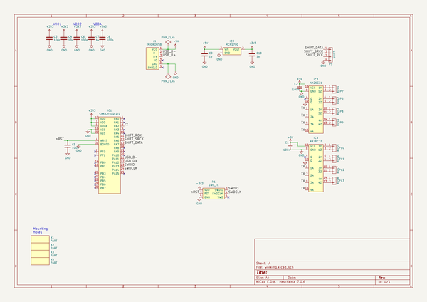
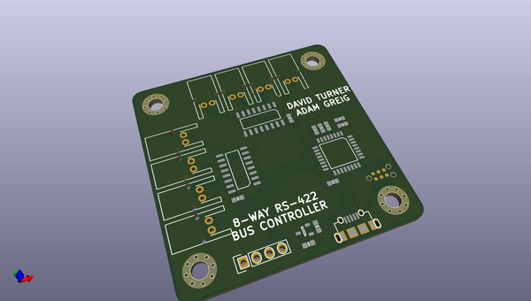
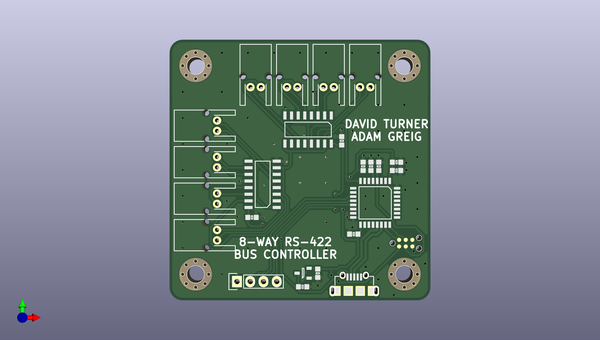
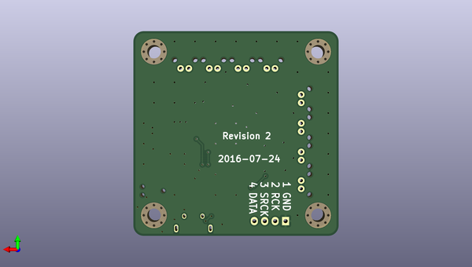

# thegrid
 
## summary 
* id: adamgreig_thegrid_shield
* user: adamgreig
* name: thegrid
* board: shield
* repo: https://github.com/adamgreig/thegrid
* src_file_repo_kicad_pcb: hardware/driver/shield.kicad_pcb
* src_file_repo_kicad_pcb_link: https://github.com/adamgreig/thegrid/tree/master/hardware/driver/shield.kicad_pcb

* src_file_repo_sch: hardware/driver/shield.sch
* src_file_repo_sch_link: https://github.com/adamgreig/thegrid/tree/master/hardware/driver/shield.sch
* full details link: https://github.com/oomlout/oomlout_oomp_project_bot_v_2/tree/main/projects/adamgreig_thegrid_shield/current_version/working  

## schematic  
  
[schematic (pdf)](working_schematic.pdf)  

## pcb  
 
  
  
  
[board (pdf)](working.pdf)  

## working_bom
| Id | Designator | Footprint | Quantity | Designation | Supplier and ref |  | None | 
| --- | --- | --- | --- | --- | --- | --- | --- | 
| 1 | P5 | Pin_Header_Straight_1x04 | 1 | SHIFT |  |  | [''] | 
| 2 | P6 | S02B-PASK-2 | 1 | BUS1 |  |  | [''] | 
| 3 | P7 | S02B-PASK-2 | 1 | BUS2 |  |  | [''] | 
| 4 | P8 | S02B-PASK-2 | 1 | BUS3 |  |  | [''] | 
| 5 | P9 | S02B-PASK-2 | 1 | BUS4 |  |  | [''] | 
| 6 | P10 | S02B-PASK-2 | 1 | BUS5 |  |  | [''] | 
| 7 | P11 | S02B-PASK-2 | 1 | BUS6 |  |  | [''] | 
| 8 | P12 | S02B-PASK-2 | 1 | BUS7 |  |  | [''] | 
| 9 | P13 | S02B-PASK-2 | 1 | BUS8 |  |  | [''] | 
| 10 | C1,C2,C8,C6,C3 | 0603 | 5 | 100n |  |  | [''] | 
| 11 | IC1 | LQFP-32 | 1 | STM32F0xxKxTx |  |  | [''] | 
| 12 | IC2 | SOT-23 | 1 | MCP1700 |  |  | [''] | 
| 13 | IC3,IC4 | SOIC-16 | 2 | AM26C31 |  |  | [''] | 
| 14 | J1 | MICROUSB_MOLEX_47589-0001 | 1 | MICROUSB |  |  | [''] | 
| 15 | C10,C9,C7 | 0603 | 3 | 1u |  |  | [''] | 
| 16 | C5 | 0603 | 1 | C |  |  | [''] | 
| 17 | C4 | 0603 | 1 | 10u |  |  | [''] | 
| 18 | P1 | TC2030-NL | 1 | SWD_TC |  |  | [''] | 
| 19 | X4,X3,X2,X1 | M3_MOUNT | 4 | PART |  |  | [''] | 

## bom_schematic
| Ref | Qnty | Value | Cmp name | Footprint | Description | Vendor | DNP | 
| --- | --- | --- | --- | --- | --- | --- | --- | 
| C1, C2, C3, C5, C6, C8 | 6 | 100n | C | agg:0603 |  |  |  | 
| C4 | 1 | 10u | C | agg:0603 |  |  |  | 
| C7, C9, C10 | 3 | 1u | C | agg:0603 |  |  |  | 
| IC1 | 1 | STM32F0xxKxTx | STM32F0xxKxTx | agg:LQFP-32 |  |  |  | 
| IC2 | 1 | MCP1700 | MCP1700 | agg:SOT-23 |  |  |  | 
| IC3, IC4 | 2 | AM26C31 | AM26C31 | agg:SOIC-16 |  |  |  | 
| J1 | 1 | MICROUSB | MICROUSB | agg:MICROUSB_MOLEX_47589-0001 |  |  |  | 
| P1 | 1 | SWD_TC | SWD_TC | agg:TC2030-NL |  |  |  | 
| P5 | 1 | SHIFT | CONN_01X04 | Pin_Headers:Pin_Header_Straight_1x04 |  |  |  | 
| P6 | 1 | BUS1 | CONN_01X02 | agg:S02B-PASK-2 |  |  |  | 
| P7 | 1 | BUS2 | CONN_01X02 | agg:S02B-PASK-2 |  |  |  | 
| P8 | 1 | BUS3 | CONN_01X02 | agg:S02B-PASK-2 |  |  |  | 
| P9 | 1 | BUS4 | CONN_01X02 | agg:S02B-PASK-2 |  |  |  | 
| P10 | 1 | BUS5 | CONN_01X02 | agg:S02B-PASK-2 |  |  |  | 
| P11 | 1 | BUS6 | CONN_01X02 | agg:S02B-PASK-2 |  |  |  | 
| P12 | 1 | BUS7 | CONN_01X02 | agg:S02B-PASK-2 |  |  |  | 
| P13 | 1 | BUS8 | CONN_01X02 | agg:S02B-PASK-2 |  |  |  | 
| X1, X2, X3, X4 | 4 | PART | PART | agg:M3_MOUNT |  |  |  | 

