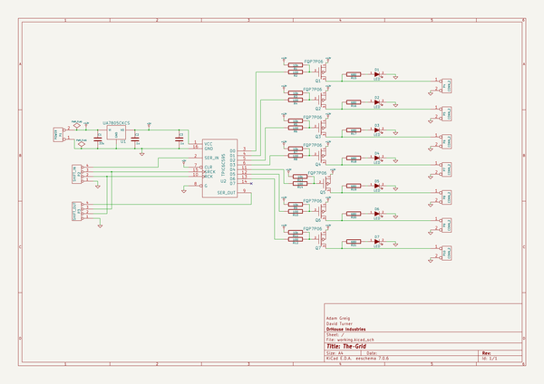
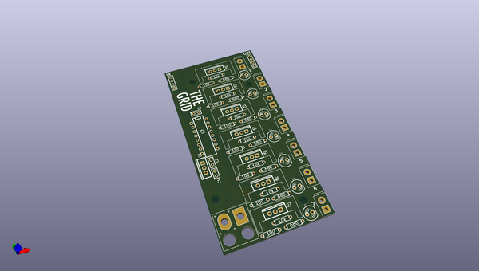
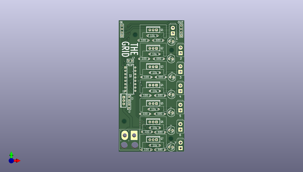
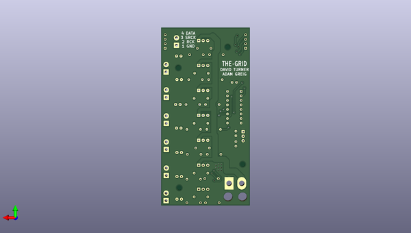

# thegrid
 
## summary 
* id: adamgreig_thegrid_thegrid
* user: adamgreig
* name: thegrid
* board: thegrid
* repo: https://github.com/adamgreig/thegrid
* src_file_repo_kicad_pcb: hardware/power/thegrid.kicad_pcb
* src_file_repo_kicad_pcb_link: https://github.com/adamgreig/thegrid/tree/master/hardware/power/thegrid.kicad_pcb

* src_file_repo_sch: hardware/power/thegrid.sch
* src_file_repo_sch_link: https://github.com/adamgreig/thegrid/tree/master/hardware/power/thegrid.sch
* full details link: https://github.com/oomlout/oomlout_oomp_project_bot_v_2/tree/main/projects/adamgreig_thegrid_thegrid/current_version/working  

## schematic  
  
[schematic (pdf)](working_schematic.pdf)  

## pcb  
 
  
  
  
[board (pdf)](working.pdf)  

## working_bom
| Id | Designator | Footprint | Quantity | Designation | Supplier and ref |  | None | 
| --- | --- | --- | --- | --- | --- | --- | --- | 
| 1 | U1 | TO220_VERT | 1 | UA7805CKCS |  |  | [''] | 
| 2 | U2 | DIP-16__300 | 1 | TPIC6C595 |  |  | [''] | 
| 3 | D1,D2,D3,D4,D5,D6,D7 | LED-5MM | 7 | LED |  |  | [''] | 
| 4 | C3 | C1 | 1 | 100n |  |  | [''] | 
| 5 | P1 | SIL-2 | 1 | POWER |  |  | [''] | 
| 6 | P2 | SIL-4 | 1 | SHIFT_IN |  |  | [''] | 
| 7 | P3 | SIL-4 | 1 | SHIFT_OUT |  |  | [''] | 
| 8 | Q1,Q2,Q3,Q4,Q5,Q6,Q7 | TO220_VERT | 7 | FQP7P06 |  |  | [''] | 
| 9 | R1,R3,R5,R7,R9,R13,R11 | R3 | 7 | 10k |  |  | [''] | 
| 10 | R2,R4,R6,R8,R10,R12,R14 | R3 | 7 | 100 |  |  | [''] | 
| 11 | R15,R16,R17,R18,R19,R20,R21 | R3 | 7 | 680 |  |  | [''] | 
| 12 | P4,P6,P7,P8,P9,P10,P5 | SIL-2 | 7 | CONN_2 |  |  | [''] | 
| 13 | MH,MH,MH,MH | MountingHole_3mm | 4 | MountingHole_3mm_RevA_Date21Jun2010 |  |  | [''] | 
| 14 | C2 | C1 | 1 | .1u |  |  | [''] | 
| 15 | C1 | C1 | 1 | .33u |  |  | [''] | 

## bom_schematic
| Ref | Qnty | Value | Cmp name | Footprint | Description | Vendor | DNP | 
| --- | --- | --- | --- | --- | --- | --- | --- | 
| C1 | 1 | .33u | C |  |  |  |  | 
| C2, C3 | 2 | .1u | C |  |  |  |  | 
| D1, D2, D3, D4, D5, D6, D7 | 7 | LED | LED |  |  |  |  | 
| P1 | 1 | POWER | CONN_2 |  |  |  |  | 
| P2 | 1 | SHIFT_IN | CONN_4 |  |  |  |  | 
| P3 | 1 | SHIFT_OUT | CONN_4 |  |  |  |  | 
| P4, P5, P6, P7, P8, P9, P10 | 7 | CONN_2 | CONN_2 |  |  |  |  | 
| Q1, Q2, Q3, Q4, Q5, Q6, Q7 | 7 | FQP7P06 | FQP7P06 |  |  |  |  | 
| R1, R3, R5, R7, R9, R11, R13 | 7 | 10k | R |  |  |  |  | 
| R2, R4, R6, R8, R10, R12, R14 | 7 | 100 | R |  |  |  |  | 
| R15, R16, R17, R18, R19, R20, R21 | 7 | 680 | R |  |  |  |  | 
| U1 | 1 | UA7805CKCS | 7805 |  |  |  |  | 
| U2 | 1 | TPIC6C595 | TPIC6C595 |  |  |  |  | 

## mounting_holes
| x | y | package | value | ref | size | 
| --- | --- | --- | --- | --- | --- | 
| 0.0 | 13.207999999999998 | MountingHole_3mm | MountingHole_3mm_RevA_Date21Jun2010 | MH | m3 | 
| 36.06800000000001 | 67.31 | MountingHole_3mm | MountingHole_3mm_RevA_Date21Jun2010 | MH | m3 | 
| 8.382000000000005 | 78.994 | MountingHole_3mm | MountingHole_3mm_RevA_Date21Jun2010 | MH | m3 | 
| 35.56 | 0.0 | MountingHole_3mm | MountingHole_3mm_RevA_Date21Jun2010 | MH | m3 | 

