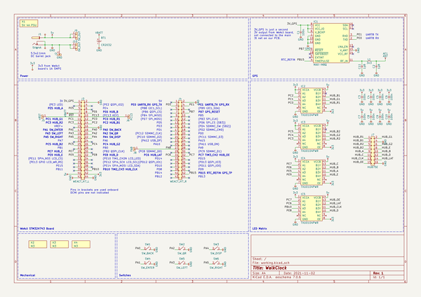
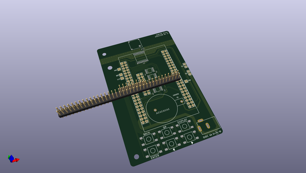
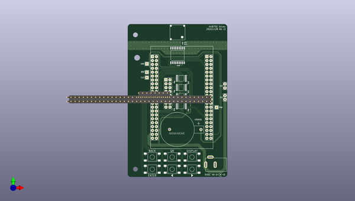
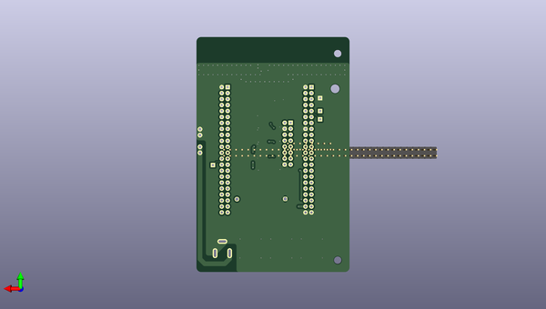

# walkclock_public
 
## summary 
* id: adamgreig_walkclock_public_walkclock
* user: adamgreig
* name: walkclock_public
* board: walkclock
* repo: https://github.com/adamgreig/walkclock-public
* src_file_repo_kicad_pcb: pcb/walkclock.kicad_pcb
* src_file_repo_kicad_pcb_link: https://github.com/adamgreig/walkclock-public/tree/master/pcb/walkclock.kicad_pcb
* src_file_repo_kicad_sch: pcb/walkclock.kicad_sch
* src_file_repo_kicad_sch_link: https://github.com/adamgreig/walkclock-public/tree/master/pcb/walkclock.kicad_sch

* src_file_repo_sch: 
* src_file_repo_sch_link: https://github.com/adamgreig/walkclock-public/tree/master/
* full details link: https://github.com/oomlout/oomlout_oomp_project_bot_v_2/tree/main/projects/adamgreig_walkclock_public_walkclock/current_version/working  

## schematic  
  
[schematic (pdf)](working_schematic.pdf)  

## pcb  
 
  
  
  
[board (pdf)](working.pdf)  

## working_bom
| Id | Designator | Footprint | Quantity | Designation | Supplier and ref |  | None | 
| --- | --- | --- | --- | --- | --- | --- | --- | 
| 1 | J9 | SIL-254P-02 | 1 | 5V_OUT |  |  | [''] | 
| 2 | IC4,IC5,IC3,IC2 | TSSOP-14 | 4 | TXU0104PWR |  |  | [''] | 
| 3 | SW1 | SW_MOM_6X6 | 1 | SW_BACK |  |  | [''] | 
| 4 | C5,C9,C6,C4,C1,C10,C8,C7,C3 | 0402 | 9 | 100n |  |  | [''] | 
| 5 | L1 | 0402 | 1 | 3n3 |  |  | [''] | 
| 6 | SW3 | SW_MOM_6X6 | 1 | SW_DISP |  |  | [''] | 
| 7 | J2 | SIL-254P-01 | 1 | GND |  |  | [''] | 
| 8 | J4 | DIL-254P-44 | 1 | WEACT_H7_R |  |  | [''] | 
| 9 | X3,X4,X2 | M3_HOLE | 3 | M3 |  |  | [''] | 
| 10 | J6 | SIL-254P-01 | 1 | PC13 |  |  | [''] | 
| 11 | SW5 | SW_MOM_6X6 | 1 | SW_LEFT |  |  | [''] | 
| 12 | C2,C11 | 0402 | 2 | 1p8 |  |  | [''] | 
| 13 | J3 | DIL-254P-44 | 1 | WEACT_H7_L |  |  | [''] | 
| 14 | J7 | DIL-254P-16 | 1 | HUB75E |  |  | [''] | 
| 15 | SW2 | SW_MOM_6X6 | 1 | SW_QR |  |  | [''] | 
| 16 | J1 | BARRELJACK | 1 | 5V@4A |  |  | [''] | 
| 17 | IC1 | MAX-M8Q | 1 | MAX-M8Q |  |  | [''] | 
| 18 | AE1 | NN01-103 | 1 | ANT |  |  | [''] | 
| 19 | SW4 | SW_MOM_6X6 | 1 | SW_ENTER |  |  | [''] | 
| 20 | J10 | SIL-254P-02 | 1 | 0V_OUT |  |  | [''] | 
| 21 | J8 | SIL-254P-01 | 1 | PA8 |  |  | [''] | 
| 22 | BT1 | KEYSTONE_103 | 1 | CR2032 |  |  | [''] | 
| 23 | SW6 | SW_MOM_6X6 | 1 | SW_RIGHT |  |  | [''] | 
| 24 | J5 | SIL-254P-01 | 1 | nRST |  |  | [''] | 

## bom_schematic
| Ref | Qnty | Value | Cmp name | Footprint | Description | Vendor | DNP | 
| --- | --- | --- | --- | --- | --- | --- | --- | 
| AE1 | 1 | ANT | ANT | agg:NN01-103 | Generic antenna |  |  | 
| BT1 | 1 | CR2032 | CELL | agg:KEYSTONE_103 |  |  |  | 
| C1, C3, C4, C5, C6, C7, C8, C9, C10 | 9 | 100n | C | ael:0402 |  |  |  | 
| C2, C11 | 2 | 1p8 | C | agg:0402 |  |  |  | 
| IC1 | 1 | MAX-M8Q | MAX-M8Q | agg:MAX-M8Q | uBlox MAX-M8Q GPS Receiver |  |  | 
| IC2, IC3, IC4, IC5 | 4 | TXU0104PWR | TXU0104PWR | agg:TSSOP-14 | 4-bit fixed direction voltage-level translator |  |  | 
| J1 | 1 | 5V@4A | BarrelJack | agg:BARRELJACK |  |  |  | 
| J2 | 1 | GND | CONN_01x01 | agg:SIL-254P-01 |  |  |  | 
| J3 | 1 | WEACT_H7_L | CONN_02x22 | agg:DIL-254P-44 |  |  |  | 
| J4 | 1 | WEACT_H7_R | CONN_02x22 | agg:DIL-254P-44 |  |  |  | 
| J5 | 1 | nRST | CONN_01x01 | agg:SIL-254P-01 |  |  |  | 
| J6 | 1 | PC13 | CONN_01x01 | agg:SIL-254P-01 |  |  |  | 
| J7 | 1 | HUB75E | CONN_02x08 | agg:DIL-254P-16 |  |  |  | 
| J8 | 1 | PA8 | CONN_01x01 | agg:SIL-254P-01 |  |  |  | 
| J9 | 1 | 5V_OUT | CONN_01x02 | agg:SIL-254P-02 |  |  |  | 
| J10 | 1 | 0V_OUT | CONN_01x02 | agg:SIL-254P-02 |  |  |  | 
| L1 | 1 | 3n3 | L | agg:0402 |  |  |  | 
| SW1 | 1 | SW_BACK | SWITCH_SPST | agg:SW_MOM_6X6 |  |  |  | 
| SW2 | 1 | SW_QR | SWITCH_SPST | agg:SW_MOM_6X6 |  |  |  | 
| SW3 | 1 | SW_DISP | SWITCH_SPST | agg:SW_MOM_6X6 |  |  |  | 
| SW4 | 1 | SW_ENTER | SWITCH_SPST | agg:SW_MOM_6X6 |  |  |  | 
| SW5 | 1 | SW_LEFT | SWITCH_SPST | agg:SW_MOM_6X6 |  |  |  | 
| SW6 | 1 | SW_RIGHT | SWITCH_SPST | agg:SW_MOM_6X6 |  |  |  | 
| X1 | 1 | 5V 4A PSU | PART |  | Generic placeholder part |  |  | 
| X2, X3, X4 | 3 | M3 | PART | agg:M3_HOLE | Generic placeholder part |  |  | 

