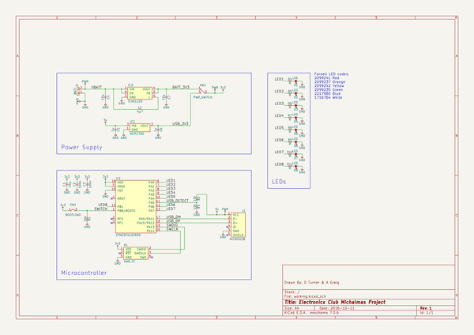

# yuletronics
 
## summary 
* id: adamgreig_yuletronics_yuletronics
* user: adamgreig
* name: yuletronics
* board: yuletronics
* repo: https://github.com/adamgreig/yuletronics
* src_file_repo_kicad_pcb: pcb/yuletronics.kicad_pcb
* src_file_repo_kicad_pcb_link: https://github.com/adamgreig/yuletronics/tree/master/pcb/yuletronics.kicad_pcb

* src_file_repo_sch: pcb/yuletronics.sch
* src_file_repo_sch_link: https://github.com/adamgreig/yuletronics/tree/master/pcb/yuletronics.sch
* full details link: https://github.com/oomlout/oomlout_oomp_project_bot_v_2/tree/main/projects/adamgreig_yuletronics_yuletronics/current_version/working  

## schematic  
  
[schematic (pdf)](working_schematic.pdf) 

## pcb  
 
  
  
  
[board (pdf)](working.pdf)  

## working_bom
| Id | Designator | Footprint | Quantity | Designation | Supplier and ref |  | None | 
| --- | --- | --- | --- | --- | --- | --- | --- | 
| 1 | IC1 | TSSOP-20 | 1 | STM32F042F6P6 |  |  | [''] | 
| 2 | P1 | TC2030-NL | 1 | SWD_TC |  |  | [''] | 
| 3 | IC2 | SOT-23 | 1 | MCP1700 |  |  | [''] | 
| 4 | IC3 | SC-70-6 | 1 | TLV61225 |  |  | [''] | 
| 5 | J2 | MICROUSB_MOLEX_47589-0001 | 1 | MICROUSB |  |  | [''] | 
| 6 | L1 | 2016M | 1 | 4µ7 |  |  | [''] | 
| 7 | D4,D1,D2,D5,D6,D7,D8,D3 | 0805-LED | 8 | LED |  |  | [''] | 
| 8 | C2,C3 | 0805 | 2 | 100n |  |  | [''] | 
| 9 | C1,C4,C7 | 0805 | 3 | 10µ |  |  | [''] | 
| 10 | C5,C6 | 0805 | 2 | 1µ |  |  | [''] | 
| 11 | R1,R2,R3 | 0805 | 3 | 10k |  |  | [''] | 
| 12 | R11,R10,R9,R8,R7,R6,R4,R5 | 0805 | 8 | R |  |  | [''] | 
| 13 | SW2 | SPDT_SWITCH | 1 | PWR_SWITCH |  |  | [''] | 
| 14 | SW1 | MOM_SWITCH | 1 | BOOTLOAD |  |  | [''] | 
| 15 | J1 | AAA_HOLDER | 1 | BATT |  |  | [''] | 

## bom_schematic
| Ref | Qnty | Value | Cmp name | Footprint | Description | Vendor | DNP | 
| --- | --- | --- | --- | --- | --- | --- | --- | 
| C1, C4, C7 | 3 | 10µ | C | agg:0805 |  |  |  | 
| C2, C3 | 2 | 100n | C | agg:0805 |  |  |  | 
| C5, C6 | 2 | 1µ | C | agg:0805 |  |  |  | 
| D1, D2, D3, D4, D5, D6, D7, D8 | 8 | LED | LED | agg:0805-LED |  |  |  | 
| IC1 | 1 | STM32F042F6P6 | STM32F0xxFxPx | agg:TSSOP-20 |  |  |  | 
| IC2 | 1 | MCP1700 | MCP1700 | agg:SOT-23 |  |  |  | 
| IC3 | 1 | TLV61225 | TLV61225 | agg:SC-70-6 |  |  |  | 
| J1 | 1 | BATT | CONN_01x02 | agg:AAA_HOLDER |  |  |  | 
| J2 | 1 | MICROUSB | MICROUSB | agg:MICROUSB_MOLEX_47589-0001 |  |  |  | 
| L1 | 1 | 4µ7 | L | agg:2016M |  |  |  | 
| P1 | 1 | SWD_TC | SWD_TC | agg:TC2030-NL |  |  |  | 
| R1, R2, R3 | 3 | 10k | R | agg:0805 |  |  |  | 
| R4, R5, R6, R7, R8, R9, R10, R11 | 8 | R | R | agg:0805 |  |  |  | 
| SW1 | 1 | BOOTLOAD | SWITCH_MOM | agg:MOM_SWITCH |  |  |  | 
| SW2 | 1 | PWR_SWITCH | SWITCH_SPDT | agg:SPDT_SWITCH |  |  |  | 

