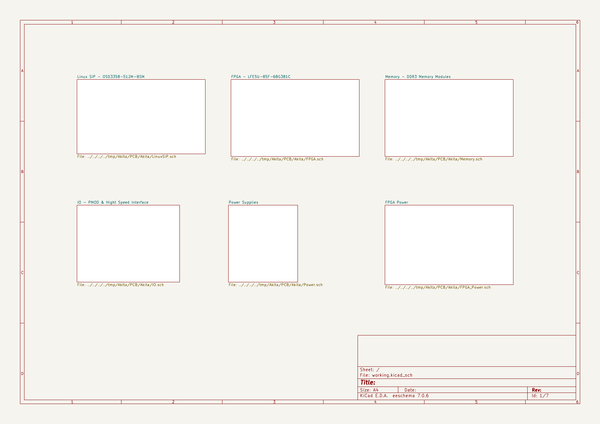

# akita
 
## summary 
* id: adamjvr_akita_akita
* user: adamjvr
* name: akita
* board: akita
* repo: https://github.com/adamjvr/Akita
* src_file_repo_kicad_pcb: PCB/Akita.kicad_pcb
* src_file_repo_kicad_pcb_link: https://github.com/adamjvr/Akita/tree/master/PCB/Akita.kicad_pcb

* src_file_repo_sch: PCB/Akita.sch
* src_file_repo_sch_link: https://github.com/adamjvr/Akita/tree/master/PCB/Akita.sch
* full details link: https://github.com/oomlout/oomlout_oomp_project_bot_v_2/tree/main/projects/adamjvr_akita_akita/current_version/working  

## schematic  
  
[schematic (pdf)](working_schematic.pdf)  

## pcb  
 
  
  
  
[board (pdf)](working.pdf)  

## bom_schematic
no data

