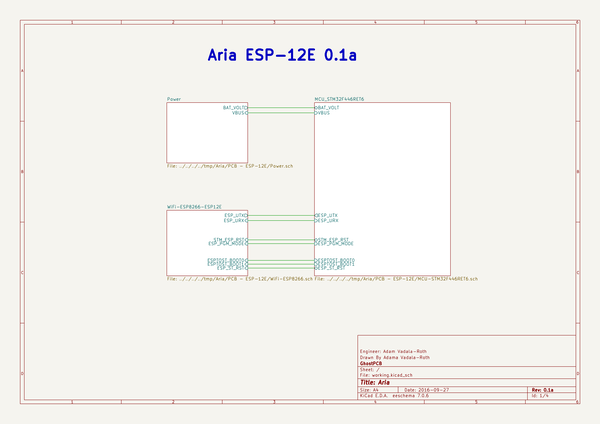

# aria
 
## summary 
* id: adamjvr_aria_aria
* user: adamjvr
* name: aria
* board: aria
* repo: https://github.com/adamjvr/Aria
* src_file_repo_kicad_pcb: PCB - ESP-12E/Aria.kicad_pcb
* src_file_repo_kicad_pcb_link: https://github.com/adamjvr/Aria/tree/master/PCB - ESP-12E/Aria.kicad_pcb

* src_file_repo_sch: PCB - ESP-12E/Aria.sch
* src_file_repo_sch_link: https://github.com/adamjvr/Aria/tree/master/PCB - ESP-12E/Aria.sch
* full details link: https://github.com/oomlout/oomlout_oomp_project_bot_v_2/tree/main/projects/adamjvr_aria_aria/current_version/working  

## schematic  
  
[schematic (pdf)](working_schematic.pdf)  

## pcb  
 
  
  
  
[board (pdf)](working.pdf)  

## working_bom
| Id | Designator | Footprint | Quantity | Designation | Supplier and ref |  | None | 
| --- | --- | --- | --- | --- | --- | --- | --- | 
| 1 | C1,C2 | C0402 | 2 | CL05A105KA5NQNC |  |  | [''] | 
| 2 | C3,C20 | C0603 | 2 | CL10A106KQ8NNNC |  |  | [''] | 
| 3 | C4,C6,C7,C9,C10,C11,C12,C13,C17,C18,C19 | C0402 | 11 | CL05B104JP5NNNC |  |  | [''] | 
| 4 | C5,C8 | C0402 | 2 | CL05C090CB5NNNC |  |  | [''] | 
| 5 | C14,C15 | C0402 | 2 | CL05C180GB5NCNC |  |  | [''] | 
| 6 | C16 | C0402 | 1 | CL05A475KQ5NRNC |  |  | [''] | 
| 7 | D1 | BAT20JFILM | 1 | BAT20JFILM |  |  | [''] | 
| 8 | D2 | RSB39VTE-17 | 1 | RSB39VTE-17 |  |  | [''] | 
| 9 | DA1 | ESDA6V1BC6 | 1 | ESDA6V1BC6 |  |  | [''] | 
| 10 | FB1 | BLM15HG601SN1D | 1 | BLM15HG601SN1D |  |  | [''] | 
| 11 | FB2 | MI0603K300R-10 | 1 | MI0603K300R-10 |  |  | [''] | 
| 12 | J1 | B2B-PH-K-S(LF)(SN) | 1 | B2B-PH-K-S(LF)(SN) |  |  | [''] | 
| 13 | J2 | B3B-PH-K-S(LF)(SN) | 1 | B3B-PH-K-S(LF)(SN) |  |  | [''] | 
| 14 | J3 | 20021121-00010C4LF | 1 | 20021121-00010C4LF |  |  | [''] | 
| 15 | J4 | 0475890001 | 1 | 0475890001-MicroUSBPort |  |  | [''] | 
| 16 | LED1 | LED0603 | 1 | LTST-C191KGKT |  |  | [''] | 
| 17 | LED2 | LED0603 | 1 | LTST-C191KFKT |  |  | [''] | 
| 18 | LED3 | LED0603 | 1 | LTST-C193TBKT-5A |  |  | [''] | 
| 19 | Q1,Q2 | DMG2307L-7 | 2 | DMG2307L-7 |  |  | [''] | 
| 20 | R1 | R0402 | 1 | RC1005F4870CS |  |  | [''] | 
| 21 | R2,R8,R9,R14,R16,R17,R18,R19,R20 | R0402 | 9 | RC1005F102CS |  |  | [''] | 
| 22 | R3,R4 | R0603 | 2 | RC1608J202CS |  |  | [''] | 
| 23 | R5,R6 | R0603 | 2 | ERA-3AEB3741V |  |  | [''] | 
| 24 | R7,R10,R13,R21,R22,R23,R24 | R0402 | 7 | RC1005F103CS |  |  | [''] | 
| 25 | R11,R12 | R0402 | 2 | CPF0402B22RE1 |  |  | [''] | 
| 26 | R15 | R0402 | 1 | RC1005J473CS |  |  | [''] | 
| 27 | SW1,SW2 | B3U-1000P | 2 | B3U-1000P |  |  | [''] | 
| 28 | U1 | BQ24210 | 1 | BQ24210DQCT |  |  | [''] | 
| 29 | U2 | AZ1117CR-3.3TRG1 | 1 | AZ1117CR-3.3TRG1_1 |  |  | [''] | 
| 30 | U3 | STM32F446RET6 | 1 | STM32F446RET6_-_TQFP64 |  |  | [''] | 
| 31 | X1 | ABM3B8.000MHZB2T | 1 | ABM3B8.000MHZB2T |  |  | [''] | 
| 32 | X2 | ABS07-32.768KHZ-9-T | 1 | ABS07-32.768KHZ-9-T |  |  | [''] | 
| 33 | P2,P1 | Socket_Strip_Straight_1x18 | 2 | CONN_01X18 |  |  | [''] | 
| 34 | H1,H2 | M2.5_HOLE | 2 | M2.5_Hole |  |  | [''] | 
| 35 | FD3,FD2,FD1 | FIDUCIAL | 3 | FIDUCIAL |  |  | [''] | 
| 36 | IC1 | ESP-12E | 1 | ESP_12E |  |  | [''] | 

## bom_schematic
no data

