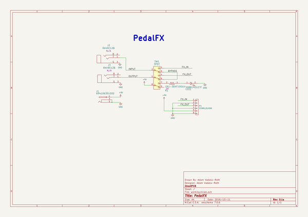
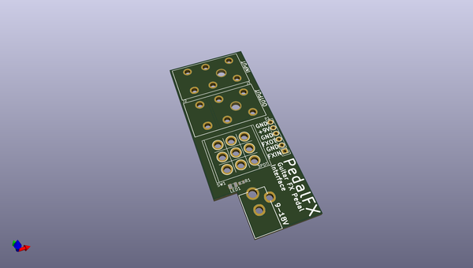
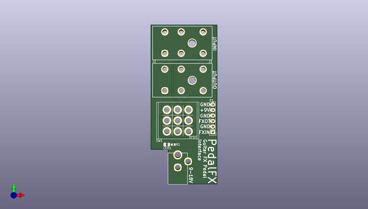
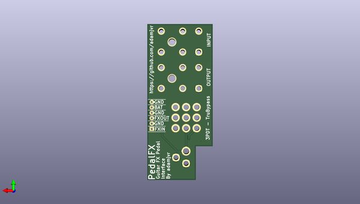

# audioexperiments
 
## summary 
* id: adamjvr_audioexperiments_pedalfx
* user: adamjvr
* name: audioexperiments
* board: pedalfx
* repo: https://github.com/adamjvr/AudioExperiments
* src_file_repo_kicad_pcb: Projects-KiCAD/PedalFX/PCB/PedalFX.kicad_pcb
* src_file_repo_kicad_pcb_link: https://github.com/adamjvr/AudioExperiments/tree/master/Projects-KiCAD/PedalFX/PCB/PedalFX.kicad_pcb

* src_file_repo_sch: Projects-KiCAD/PedalFX/PCB/PedalFX.sch
* src_file_repo_sch_link: https://github.com/adamjvr/AudioExperiments/tree/master/Projects-KiCAD/PedalFX/PCB/PedalFX.sch
* full details link: https://github.com/oomlout/oomlout_oomp_project_bot_v_2/tree/main/projects/adamjvr_audioexperiments_pedalfx/current_version/working  

## schematic  
  
[schematic (pdf)](working_schematic.pdf)  

## pcb  
 
  
  
  
[board (pdf)](working.pdf)  

## working_bom
| Id | Designator | Footprint | Quantity | Designation | Supplier and ref |  | None | 
| --- | --- | --- | --- | --- | --- | --- | --- | 
| 1 | J1 | 694106301002 | 1 | 694106301002 |  |  | [''] | 
| 2 | LED1 | LED0805Y | 1 | 5988140107F |  |  | [''] | 
| 3 | P1 | Pin_Header_Straight_1x06 | 1 | CONN_01X06 |  |  | [''] | 
| 4 | R1 | R0603 | 1 | ERJ-3EKF1001V |  |  | [''] | 
| 5 | SW1 | Switches_Stomp_Switch_3PDT | 1 | 3PDT |  |  | [''] | 
| 6 | J2,J3 | RA49C12B | 2 | RA49C12B |  |  | [''] | 

## bom_schematic
| Ref | Qnty | Value | Cmp name | Footprint | Description | Vendor | DNP | 
| --- | --- | --- | --- | --- | --- | --- | --- | 
| J1 | 1 | 694106301002 | 694106301002 | AudioLibFootprints:694106301002 |  |  |  | 
| J2, J3 | 2 | RA49C12B | RA49C12B | AudioLibFootprints:RA49C12B |  |  |  | 
| LED1 | 1 | 5988140107F | 5988140107F | OnHand-Components:LED0805Y |  |  |  | 
| P1 | 1 | CONN_01X06 | CONN_01X06 | Pin_Headers:Pin_Header_Straight_1x06 |  |  |  | 
| R1 | 1 | ERJ-3EKF1001V | ERJ-3EKF1001V | OnHand-Components:R0603 |  |  |  | 
| SW1 | 1 | 3PDT | 3PDT | AudioLibFootprints:Switches_Stomp_Switch_3PDT |  |  |  | 

