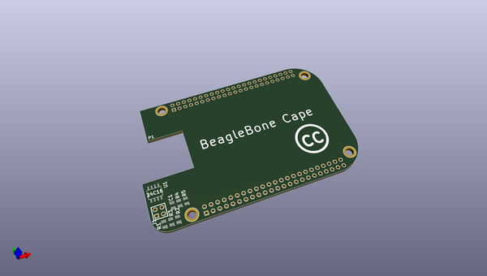

# barebonecape
 
## summary 
* id: adamjvr_barebonecape_beaglebone_cape
* user: adamjvr
* name: barebonecape
* board: beaglebone_cape
* repo: https://github.com/adamjvr/BareBoneCape
* src_file_repo_kicad_pcb: beaglebone-cape.kicad_pcb
* src_file_repo_kicad_pcb_link: https://github.com/adamjvr/BareBoneCape/tree/master/beaglebone-cape.kicad_pcb

* src_file_repo_sch: beaglebone-cape.sch
* src_file_repo_sch_link: https://github.com/adamjvr/BareBoneCape/tree/master/beaglebone-cape.sch
* full details link: https://github.com/oomlout/oomlout_oomp_project_bot_v_2/tree/main/projects/adamjvr_barebonecape_beaglebone_cape/current_version/working  

## schematic  
  
[schematic (pdf)](working_schematic.pdf)  

## pcb  
 
  
  
  
[board (pdf)](working.pdf)  

## working_bom
| Id | Designator | Footprint | Quantity | Designation | Supplier and ref |  | None | 
| --- | --- | --- | --- | --- | --- | --- | --- | 
| 1 | U1 | SO8E | 1 | 24C16 |  |  | [''] | 
| 2 | R3,R2,R1 | SM0805 | 3 | 4.7k |  |  | [''] | 
| 3 | R4,R5 | SM0805 | 2 | 1.5k |  |  | [''] | 
| 4 | C1 | SM0805 | 1 | 0.1u |  |  | [''] | 
| 5 | J1 | PIN_ARRAY_2X2 | 1 | CONN_2X2 |  |  | [''] | 
| 6 | P1 | BEAGLEBONE_BLACK | 1 | BEAGLEBONE_BLACK |  |  | [''] | 

## bom_schematic
| Ref | Qnty | Value | Cmp name | Footprint | Description | Vendor | DNP | 
| --- | --- | --- | --- | --- | --- | --- | --- | 
| P1 | 1 | BEAGLEBONE_BLACK | BEAGLEBONE_BLACK |  |  |  |  | 

