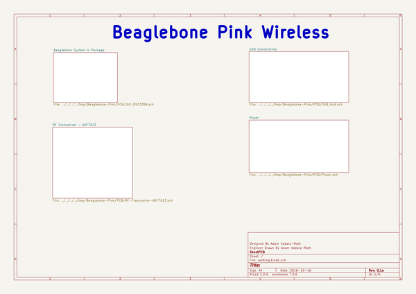

# beaglebone_pink
 
## summary 
* id: adamjvr_beaglebone_pink_beaglebone_pink
* user: adamjvr
* name: beaglebone_pink
* board: beaglebone_pink
* repo: https://github.com/adamjvr/Beaglebone-Pink
* src_file_repo_kicad_pcb: PCB/Beaglebone-Pink.kicad_pcb
* src_file_repo_kicad_pcb_link: https://github.com/adamjvr/Beaglebone-Pink/tree/master/PCB/Beaglebone-Pink.kicad_pcb

* src_file_repo_sch: 
* src_file_repo_sch_link: https://github.com/adamjvr/Beaglebone-Pink/tree/master/
* full details link: https://github.com/oomlout/oomlout_oomp_project_bot_v_2/tree/main/projects/adamjvr_beaglebone_pink_beaglebone_pink/current_version/working  

## schematic  
  
[schematic (pdf)](working_schematic.pdf) 

## pcb  
 
  
  
  
[board (pdf)](working.pdf)  

## bom_schematic
no data

