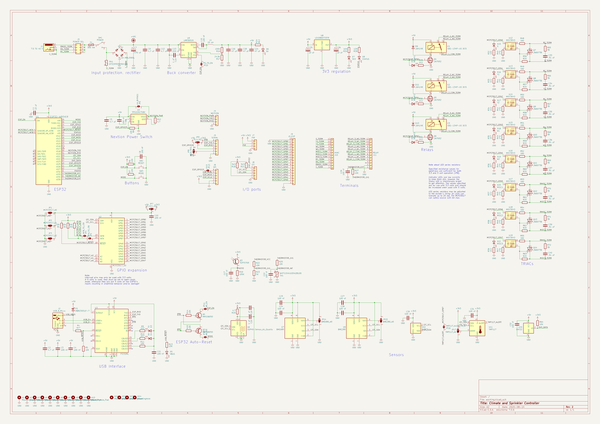
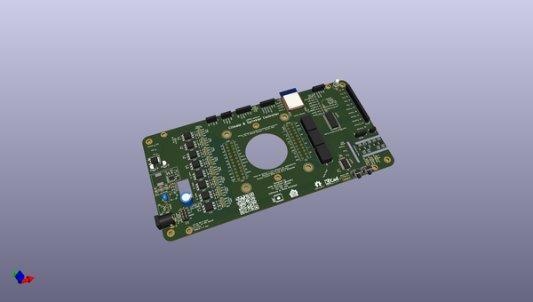
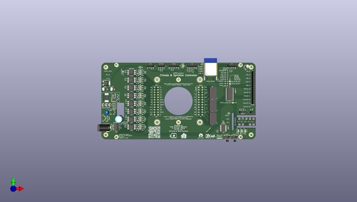
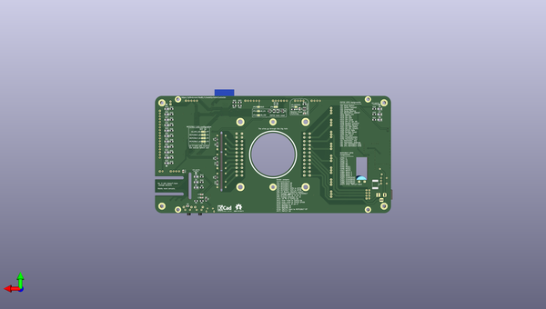

# climatesprinklercontroller
 
## summary 
* id: adamjvr_climatesprinklercontroller_climatesprinklercontroller
* user: adamjvr
* name: climatesprinklercontroller
* board: climatesprinklercontroller
* repo: https://github.com/adamjvr/ClimateSprinklerController
* src_file_repo_kicad_pcb: WROVER-Nextion7/ClimateSprinklerController.kicad_pcb
* src_file_repo_kicad_pcb_link: https://github.com/adamjvr/ClimateSprinklerController/tree/master/WROVER-Nextion7/ClimateSprinklerController.kicad_pcb

* src_file_repo_sch: WROVER-Nextion7/ClimateSprinklerController.sch
* src_file_repo_sch_link: https://github.com/adamjvr/ClimateSprinklerController/tree/master/WROVER-Nextion7/ClimateSprinklerController.sch
* full details link: https://github.com/oomlout/oomlout_oomp_project_bot_v_2/tree/main/projects/adamjvr_climatesprinklercontroller_climatesprinklercontroller/current_version/working  

## schematic  
  
[schematic (pdf)](working_schematic.pdf) 

## pcb  
 
  
  
  
[board (pdf)](working.pdf)  

## working_bom
| Id | Designator | Footprint | Quantity | Designation | Supplier and ref |  | None | 
| --- | --- | --- | --- | --- | --- | --- | --- | 
| 1 | R18,R21 | R_0805_2012Metric_Pad1.20x1.40mm_HandSolder | 2 | 3K3 |  |  | [''] | 
| 2 | SW3 | SW_Tactile_SPST_Angled_PTS645Vx58-2LFS | 1 | MODE |  |  | [''] | 
| 3 | C1 | C_0805_2012Metric | 1 | 10 uF |  |  | [''] | 
| 4 | J7 | PinSocket_1x04_P2.54mm_Vertical | 1 | PIR |  |  | [''] | 
| 5 | TH1 | PinSocket_1x02_P2.54mm_Vertical | 1 | NXFT15XH103FA2B100 |  |  | [''] | 
| 6 | U20 | PinSocket_1x04_P2.54mm_Vertical | 1 | DHT22 |  |  | [''] | 
| 7 | C26,C25 | CP_Elec_5x5.8 | 2 | 10 uF |  |  | [''] | 
| 8 | QR***** | ClimateSprinklerControllerQR | 1 | ClimateSprinklerControllerQR |  |  | [''] | 
| 9 | U16,U17,U18,U19,U15,U13,U14,U12 | SMDIP-6_W9.53mm | 8 | MOC3043 |  |  | [''] | 
| 10 | C37,C39,C38,C40,C34,C35,C36,C33 | C_0805_2012Metric | 8 | .01 uF |  |  | [''] | 
| 11 | Q11,Q12,Q13,Q14,Q9,Q8,Q10,Q7 | TO-225-3_Vertical | 8 | 2N6073B |  |  | [''] | 
| 12 | R45,R40,R41,R42,R43,R44,R46,R47 | R_0805_2012Metric_Pad1.20x1.40mm_HandSolder | 8 | 270 |  |  | [''] | 
| 13 | R60,R61,R62,R63,R57,R58,R59,R56 | R_0805_2012Metric_Pad1.20x1.40mm_HandSolder | 8 | 820 |  |  | [''] | 
| 14 | R52,R53,R54,R55,R49,R51,R48,R50 | R_0805_2012Metric_Pad1.20x1.40mm_HandSolder | 8 | 180 |  |  | [''] | 
| 15 | R69,R70,R71,R72,R66,R67,R68,R65 | R_0805_2012Metric_Pad1.20x1.40mm_HandSolder | 8 | 39 |  |  | [''] | 
| 16 | K1,K2,K3 | Relay_SPDT_Omron_G6E | 3 | G6E-134P-US DC5 |  |  | [''] | 
| 17 | J11 | PhoenixContact_SPTAF_1_12-3.5-IL_1x12_P3.50mm_Vertical | 1 | RELAY |  |  | [''] | 
| 18 | C10,C27,C28,C30,C23,C24,C31,C11,C4,C29,C22,C17,C15,C8,C32,C3,C6 | C_0805_2012Metric | 17 | 100 nF |  |  | [''] | 
| 19 | C19,C20,C14 | C_0805_2012Metric | 3 | 1 uF |  |  | [''] | 
| 20 | R20,R12 | R_0805_2012Metric_Pad1.20x1.40mm_HandSolder | 2 | 4.7 |  |  | [''] | 
| 21 | U11 | WSON-6-1EP_2x2mm_P0.65mm_EP1x1.6mm | 1 | TMP117 |  |  | [''] | 
| 22 | U10 | AMS_QFN-4-1EP_2x2mm_P0.95mm_EP0.7x1.6mm | 1 | SHTC3 |  |  | [''] | 
| 23 | U9 | Bosch_LGA-8_2.5x2.5mm_P0.65mm_ClockwisePinNumbering | 1 | BME280 |  |  | [''] | 
| 24 | J4 | PinSocket_1x04_P2.54mm_Vertical | 1 | NEXTION |  |  | [''] | 
| 25 | SW2 | SW_Tactile_SPST_Angled_PTS645Vx58-2LFS | 1 | RESET |  |  | [''] | 
| 26 | J9 | PinSocket_1x18_P2.54mm_Vertical | 1 | IO_EXP |  |  | [''] | 
| 27 | U6 | DFN-6-1EP_2.44x2.44mm_P0.8mm_EP1.25x1.7mm | 1 | SGP40-Sensor_Air_Quality |  |  | [''] | 
| 28 | J3 | PinHeader_2x04_P2.54mm_Vertical | 1 | POWER SEL |  |  | [''] | 
| 29 | Q3 | LED_D5.0mm_Clear | 1 | TEPT5700 |  |  | [''] | 
| 30 | R3,R7,R11,R6,R2,R1,R64,R22,R25,R32,R14,R15,R5,R13,R27,R8 | R_0805_2012Metric_Pad1.20x1.40mm_HandSolder | 16 | 10K |  |  | [''] | 
| 31 | U2 | SOIC-28W_7.5x17.9mm_P1.27mm | 1 | MCP23017_SO |  |  | [''] | 
| 32 | J10 | PhoenixContact_SPTAF_1_12-3.5-IL_1x12_P3.50mm_Vertical | 1 | HVAC |  |  | [''] | 
| 33 | J2 | USB_Micro-B_Molex-105017-0001 | 1 | USB_B_Micro |  |  | [''] | 
| 34 | U3 | SSOP-28_5.3x10.2mm_P0.65mm | 1 | FT232RL |  |  | [''] | 
| 35 | J5 | PinSocket_1x06_P2.54mm_Vertical | 1 | SERIAL |  |  | [''] | 
| 36 | J8 | PinSocket_1x05_P2.54mm_Vertical | 1 | I2C |  |  | [''] | 
| 37 | U7 | Bosch_LGA-8_3x3mm_P0.8mm_ClockwisePinNumbering | 1 | BME680 |  |  | [''] | 
| 38 | G*** | ESPHome_slik_logo | 1 | LOGO |  |  | [''] | 
| 39 | G*** | HomeAssistant_slik_logo | 1 | LOGO |  |  | [''] | 
| 40 | C7 | CP_Radial_Cutout_L20.0mm_D10.0mm_P5.00mm | 1 | 470 uF |  |  | [''] | 
| 41 | SW1 | SW_Push_1P2T_Vertical_E-Switch_800UDP8P1A1M6 | 1 | POWER |  |  | [''] | 
| 42 | U1 | ESP32-WROVER | 1 | ESP32-WROVER |  |  | [''] | 
| 43 | R19,R16 | R_0805_2012Metric_Pad1.20x1.40mm_HandSolder | 2 | 100K |  |  | [''] | 
| 44 | R17 | R_0805_2012Metric_Pad1.20x1.40mm_HandSolder | 1 | 24.9K |  |  | [''] | 
| 45 | U5 | Texas_HSOP-8-1EP_3.9x4.9mm_P1.27mm_ThermalVias | 1 | LMR36520 |  |  | [''] | 
| 46 | C13 | C_0805_2012Metric | 1 | 220 nF |  |  | [''] | 
| 47 | C16,C21,C18 | C_1210_3225Metric | 3 | 47 uF |  |  | [''] | 
| 48 | L1 | L_Wuerth_WE-PD-Typ-LS | 1 | 15 uH |  |  | [''] | 
| 49 | C9,C12,C2,C5 | C_0805_2012Metric | 4 | 4.7 uF |  |  | [''] | 
| 50 | D2 | Diode_Bridge_Bourns_CD-MBL2xxS | 1 | CD-MBL206SL |  |  | [''] | 
| 51 | RV1 | RV_Disc_D7mm_W4mm_P5mm | 1 | B72205S0400K101 |  |  | [''] | 
| 52 | U8 | TO-252-2 | 1 | LD1086DT33TR |  |  | [''] | 
| 53 | J6 | PinSocket_1x06_P2.54mm_Vertical | 1 | SPI |  |  | [''] | 
| 54 | J1 | BarrelJack_Horizontal | 1 | 7.5 TO 40 V |  |  | [''] | 
| 55 | R31,R30,R29,R33,R34,R37,R38,R39,R9 | R_0805_2012Metric_Pad1.20x1.40mm_HandSolder | 9 | 1K2 |  |  | [''] | 
| 56 | D16 | LED_1206_3216Metric_ReverseMount_Hole1.8x2.4mm | 1 | Y1 |  |  | [''] | 
| 57 | D17 | LED_1206_3216Metric_ReverseMount_Hole1.8x2.4mm | 1 | Y2 |  |  | [''] | 
| 58 | D21 | LED_1206_3216Metric_ReverseMount_Hole1.8x2.4mm | 1 | MISC2 |  |  | [''] | 
| 59 | D12 | LED_1206_3216Metric_ReverseMount_Hole1.8x2.4mm | 1 | RELAY2 |  |  | [''] | 
| 60 | D20 | LED_1206_3216Metric_ReverseMount_Hole1.8x2.4mm | 1 | MISC1 |  |  | [''] | 
| 61 | D15 | LED_1206_3216Metric_ReverseMount_Hole1.8x2.4mm | 1 | G |  |  | [''] | 
| 62 | D18 | LED_1206_3216Metric_ReverseMount_Hole1.8x2.4mm | 1 | W1 |  |  | [''] | 
| 63 | D19 | LED_1206_3216Metric_ReverseMount_Hole1.8x2.4mm | 1 | W2 |  |  | [''] | 
| 64 | R35,R36,R10 | R_0805_2012Metric_Pad1.20x1.40mm_HandSolder | 3 | 2K7 |  |  | [''] | 
| 65 | D14 | LED_1206_3216Metric_ReverseMount_Hole1.8x2.4mm | 1 | RELAY3 |  |  | [''] | 
| 66 | D10 | LED_1206_3216Metric_ReverseMount_Hole1.8x2.4mm | 1 | RELAY1 |  |  | [''] | 
| 67 | D22 | LED_1206_3216Metric_ReverseMount_Hole1.8x2.4mm | 1 | MISC3 |  |  | [''] | 
| 68 | Q5,Q4,Q6 | SOT-23 | 3 | 2N7002 |  |  | [''] | 
| 69 | D7 | LED_1206_3216Metric_ReverseMount_Hole1.8x2.4mm | 1 | 3V3 |  |  | [''] | 
| 70 | R24 | R_0805_2012Metric_Pad1.20x1.40mm_HandSolder | 1 | 8K2 |  |  | [''] | 
| 71 | R28 | R_0805_2012Metric_Pad1.20x1.40mm_HandSolder | 1 | 120 |  |  | [''] | 
| 72 | D9,D13,D11 | D_SOD-123 | 3 | 1N4148 |  |  | [''] | 
| 73 | R26 | R_0805_2012Metric_Pad1.20x1.40mm_HandSolder | 1 | 1K6 |  |  | [''] | 
| 74 | Q1,Q2 | SOT-23 | 2 | MMSS8050 |  |  | [''] | 
| 75 | D3 | LED_1206_3216Metric_ReverseMount_Hole1.8x2.4mm | 1 | TX |  |  | [''] | 
| 76 | R4 | R_0805_2012Metric_Pad1.20x1.40mm_HandSolder | 1 | 4K7 |  |  | [''] | 
| 77 | D6 | LED_1206_3216Metric_ReverseMount_Hole1.8x2.4mm | 1 | 5V |  |  | [''] | 
| 78 | D4 | LED_1206_3216Metric_ReverseMount_Hole1.8x2.4mm | 1 | RX |  |  | [''] | 
| 79 | U4 | SOT-23-6 | 1 | TPS22917DBV |  |  | [''] | 
| 80 | D8 | LED_1206_3216Metric_ReverseMount_Hole1.8x2.4mm | 1 | STATUS |  |  | [''] | 
| 81 | D5 | LED_1206_3216Metric_ReverseMount_Hole1.8x2.4mm | 1 | VBUS |  |  | [''] | 
| 82 | F1 | Fuse_2920_7451Metric | 1 | 300 mA |  |  | [''] | 
| 83 | R23 | R_0805_2012Metric_Pad1.20x1.40mm_HandSolder | 1 | 5K |  |  | [''] | 
| 84 | D1 | D_SOD-123F | 1 | MBR230S1F-7 |  |  | [''] | 

## bom_schematic
| Ref | Qnty | Value | Cmp name | Footprint | Description | Vendor | DNP | 
| --- | --- | --- | --- | --- | --- | --- | --- | 
| C1 | 1 | 10 uF | C | Capacitor_SMD:C_0805_2012Metric | Unpolarized capacitor |  |  | 
| C2, C5, C9, C12 | 4 | 4.7 uF | C | Capacitor_SMD:C_0805_2012Metric | Unpolarized capacitor |  |  | 
| C3, C4, C6, C8, C10, C11, C15, C17, C22, C23, C24, C27, C28, C29, C30, C31, C32 | 17 | 100 nF | C | Capacitor_SMD:C_0805_2012Metric | Unpolarized capacitor |  |  | 
| C7 | 1 | 470 uF | CP-Device | ClimateSprinklerController:CP_Radial_Cutout_L20.0mm_D10.0mm_P5.00mm |  |  |  | 
| C13 | 1 | 220 nF | C | Capacitor_SMD:C_0805_2012Metric | Unpolarized capacitor |  |  | 
| C14, C19, C20 | 3 | 1 uF | C | Capacitor_SMD:C_0805_2012Metric | Unpolarized capacitor |  |  | 
| C16, C18, C21 | 3 | 47 uF | C | Capacitor_SMD:C_1210_3225Metric | Unpolarized capacitor |  |  | 
| C25, C26 | 2 | 10 uF | CP-Device | Capacitor_SMD:CP_Elec_5x5.8 |  |  |  | 
| C33, C34, C35, C36, C37, C38, C39, C40 | 8 | .01 uF | C | Capacitor_SMD:C_0805_2012Metric | Unpolarized capacitor |  |  | 
| D1 | 1 | MBR230S1F-7 | D_Schottky | Diode_SMD:D_SOD-123F | Schottky diode |  |  | 
| D2 | 1 | CD-MBL206SL | D_Bridge_+AA- | Diode_SMD:Diode_Bridge_Bourns_CD-MBL2xxS | Diode bridge, +ve/AC/AC/-ve |  |  | 
| D3 | 1 | TX | LED | LED_SMD:LED_1206_3216Metric_ReverseMount_Hole1.8x2.4mm | Light emitting diode |  |  | 
| D4 | 1 | RX | LED | LED_SMD:LED_1206_3216Metric_ReverseMount_Hole1.8x2.4mm | Light emitting diode |  |  | 
| D5 | 1 | VBUS | LED | LED_SMD:LED_1206_3216Metric_ReverseMount_Hole1.8x2.4mm | Light emitting diode |  |  | 
| D6 | 1 | 5V | LED | LED_SMD:LED_1206_3216Metric_ReverseMount_Hole1.8x2.4mm | Light emitting diode |  |  | 
| D7 | 1 | 3V3 | LED | LED_SMD:LED_1206_3216Metric_ReverseMount_Hole1.8x2.4mm | Light emitting diode |  |  | 
| D8 | 1 | STATUS | LED | LED_SMD:LED_1206_3216Metric_ReverseMount_Hole1.8x2.4mm | Light emitting diode |  |  | 
| D9, D11, D13 | 3 | 1N4148 | 1N4148W | Diode_SMD:D_SOD-123 | 75V 0.15A Fast Switching Diode, SOD-123 |  |  | 
| D10 | 1 | RELAY1 | LED | LED_SMD:LED_1206_3216Metric_ReverseMount_Hole1.8x2.4mm | Light emitting diode |  |  | 
| D12 | 1 | RELAY2 | LED | LED_SMD:LED_1206_3216Metric_ReverseMount_Hole1.8x2.4mm | Light emitting diode |  |  | 
| D14 | 1 | RELAY3 | LED | LED_SMD:LED_1206_3216Metric_ReverseMount_Hole1.8x2.4mm | Light emitting diode |  |  | 
| D15 | 1 | G | LED | LED_SMD:LED_1206_3216Metric_ReverseMount_Hole1.8x2.4mm | Light emitting diode |  |  | 
| D16 | 1 | Y1 | LED | LED_SMD:LED_1206_3216Metric_ReverseMount_Hole1.8x2.4mm | Light emitting diode |  |  | 
| D17 | 1 | Y2 | LED | LED_SMD:LED_1206_3216Metric_ReverseMount_Hole1.8x2.4mm | Light emitting diode |  |  | 
| D18 | 1 | W1 | LED | LED_SMD:LED_1206_3216Metric_ReverseMount_Hole1.8x2.4mm | Light emitting diode |  |  | 
| D19 | 1 | W2 | LED | LED_SMD:LED_1206_3216Metric_ReverseMount_Hole1.8x2.4mm | Light emitting diode |  |  | 
| D20 | 1 | MISC1 | LED | LED_SMD:LED_1206_3216Metric_ReverseMount_Hole1.8x2.4mm | Light emitting diode |  |  | 
| D21 | 1 | MISC2 | LED | LED_SMD:LED_1206_3216Metric_ReverseMount_Hole1.8x2.4mm | Light emitting diode |  |  | 
| D22 | 1 | MISC3 | LED | LED_SMD:LED_1206_3216Metric_ReverseMount_Hole1.8x2.4mm | Light emitting diode |  |  | 
| F1 | 1 | 300 mA | Polyfuse | Fuse:Fuse_2920_7451Metric | Resettable fuse, polymeric positive temperature coefficient |  |  | 
| H1, H2, H3, H4, H5, H6 | 6 | MountingHole_Pad | MountingHole_Pad | MountingHole:MountingHole_3.2mm_M3_Pad_Via | Mounting Hole with connection |  |  | 
| H7, H8, H9, H10 | 4 | MountingHole_Pad | MountingHole_Pad | MountingHole:MountingHole_3.2mm_M3_DIN965_Pad | Mounting Hole with connection |  |  | 
| H11, H12, H13, H14 | 4 | MountingHole | MountingHole | MountingHole:MountingHole_4.3mm_M4_DIN965_Pad | Mounting Hole without connection |  |  | 
| J1 | 1 | 7.5 TO 40 V | Barrel_Jack_Switch | Connector_BarrelJack:BarrelJack_Horizontal | DC Barrel Jack with an internal switch |  |  | 
| J2 | 1 | USB_B_Micro | USB_B_Micro | Connector_USB:USB_Micro-B_Molex-105017-0001 | USB Micro Type B connector |  |  | 
| J3 | 1 | POWER SEL | Conn_02x04_Odd_Even | Connector_PinHeader_2.54mm:PinHeader_2x04_P2.54mm_Vertical | Generic connector, double row, 02x04, odd/even pin numbering scheme (row 1 odd numbers, row 2 even numbers), script generated (kicad-library-utils/schlib/autogen/connector/) |  |  | 
| J4 | 1 | NEXTION | Conn_01x04 | Connector_PinSocket_2.54mm:PinSocket_1x04_P2.54mm_Vertical | Generic connector, single row, 01x04, script generated (kicad-library-utils/schlib/autogen/connector/) |  |  | 
| J5 | 1 | SERIAL | Conn_01x06 | Connector_PinSocket_2.54mm:PinSocket_1x06_P2.54mm_Vertical | Generic connector, single row, 01x06, script generated (kicad-library-utils/schlib/autogen/connector/) |  |  | 
| J6 | 1 | SPI | Conn_01x06 | Connector_PinSocket_2.54mm:PinSocket_1x06_P2.54mm_Vertical | Generic connector, single row, 01x06, script generated (kicad-library-utils/schlib/autogen/connector/) |  |  | 
| J7 | 1 | PIR | Conn_01x04 | Connector_PinSocket_2.54mm:PinSocket_1x04_P2.54mm_Vertical | Generic connector, single row, 01x04, script generated (kicad-library-utils/schlib/autogen/connector/) |  |  | 
| J8 | 1 | I2C | Conn_01x05 | Connector_PinSocket_2.54mm:PinSocket_1x05_P2.54mm_Vertical | Generic connector, single row, 01x05, script generated (kicad-library-utils/schlib/autogen/connector/) |  |  | 
| J9 | 1 | IO_EXP | Conn_01x18 | Connector_PinSocket_2.54mm:PinSocket_1x18_P2.54mm_Vertical | Generic connector, single row, 01x18, script generated (kicad-library-utils/schlib/autogen/connector/) |  |  | 
| J10 | 1 | HVAC | Screw_Terminal_01x12 | ClimateSprinklerController:PhoenixContact_SPTAF_1_12-3.5-IL_1x12_P3.50mm_Vertical | Generic screw terminal, single row, 01x12, script generated (kicad-library-utils/schlib/autogen/connector/) |  |  | 
| J11 | 1 | RELAY | Screw_Terminal_01x12 | ClimateSprinklerController:PhoenixContact_SPTAF_1_12-3.5-IL_1x12_P3.50mm_Vertical | Generic screw terminal, single row, 01x12, script generated (kicad-library-utils/schlib/autogen/connector/) |  |  | 
| JP1 | 1 | MCP23017_A0 | SolderJumper_3_Bridged12-Jumper | Jumper:SolderJumper-3_P1.3mm_Bridged12_RoundedPad1.0x1.5mm |  |  |  | 
| JP2 | 1 | MCP23017_A1 | SolderJumper_3_Bridged12-Jumper | Jumper:SolderJumper-3_P1.3mm_Bridged12_RoundedPad1.0x1.5mm |  |  |  | 
| JP3 | 1 | MCP23017_A2 | SolderJumper_3_Bridged12-Jumper | Jumper:SolderJumper-3_P1.3mm_Bridged12_RoundedPad1.0x1.5mm |  |  |  | 
| JP4 | 1 | INTB_TO_I39 | SolderJumper_2_Open | Jumper:SolderJumper-2_P1.3mm_Open_RoundedPad1.0x1.5mm | Solder Jumper, 2-pole, open |  |  | 
| JP5 | 1 | INTA_TO_I36 | SolderJumper_2_Open | Jumper:SolderJumper-2_P1.3mm_Open_RoundedPad1.0x1.5mm | Solder Jumper, 2-pole, open |  |  | 
| JP6 | 1 | U4_BYPASS | SolderJumper_2_Open | Jumper:SolderJumper-2_P1.3mm_Open_RoundedPad1.0x1.5mm | Solder Jumper, 2-pole, open |  |  | 
| JP7 | 1 | U2_VCC_SEL | SolderJumper_3_Open-Jumper | Jumper:SolderJumper-3_P1.3mm_Open_RoundedPad1.0x1.5mm |  |  |  | 
| JP8 | 1 | IO26/RTS | SolderJumper_3_Open-Jumper | Jumper:SolderJumper-3_P1.3mm_Open_RoundedPad1.0x1.5mm |  |  |  | 
| JP9 | 1 | J5_V_SEL | SolderJumper_3_Open-Jumper | Jumper:SolderJumper-3_P1.3mm_Open_RoundedPad1.0x1.5mm |  |  |  | 
| JP10 | 1 | PG_TO_EN | SolderJumper_2_Open | Jumper:SolderJumper-2_P1.3mm_Open_RoundedPad1.0x1.5mm | Solder Jumper, 2-pole, open |  |  | 
| JP11 | 1 | AR_EN | SolderJumper_2_Open | Jumper:SolderJumper-2_P1.3mm_Open_RoundedPad1.0x1.5mm | Solder Jumper, 2-pole, open |  |  | 
| JP12 | 1 | AR_IO0 | SolderJumper_2_Open | Jumper:SolderJumper-2_P1.3mm_Open_RoundedPad1.0x1.5mm | Solder Jumper, 2-pole, open |  |  | 
| JP13 | 1 | IO15 | SolderJumper_2_Open | Jumper:SolderJumper-2_P1.3mm_Open_RoundedPad1.0x1.5mm | Solder Jumper, 2-pole, open |  |  | 
| JP14 | 1 | BME680_A0 | SolderJumper_3_Bridged12-Jumper | Jumper:SolderJumper-3_P1.3mm_Bridged12_RoundedPad1.0x1.5mm |  |  |  | 
| JP15 | 1 | BME280_A0 | SolderJumper_3_Bridged12-Jumper | Jumper:SolderJumper-3_P1.3mm_Bridged12_RoundedPad1.0x1.5mm |  |  |  | 
| JP16 | 1 | TMP117_ALERT_TO_B7 | SolderJumper_2_Open | Jumper:SolderJumper-2_P1.3mm_Open_RoundedPad1.0x1.5mm | Solder Jumper, 2-pole, open |  |  | 
| JP17 | 1 | TMP117_A0 | SolderJumper_3_Bridged12-Jumper | Jumper:SolderJumper-3_P1.3mm_Bridged12_RoundedPad1.0x1.5mm |  |  |  | 
| K1, K2, K3 | 3 | G6E-134P-US DC5 | G6E | Relay_THT:Relay_SPDT_Omron_G6E | Omron Subminiature Sensitive SPDT Signal Switching Relay, Single-Side Stable |  |  | 
| L1 | 1 | 15 uH | L | Inductor_SMD:L_Wuerth_WE-PD-Typ-LS | Inductor |  |  | 
| Q1, Q2 | 2 | MMSS8050 | MMSS8050 | Package_TO_SOT_SMD:SOT-23 | 1.5A Ic, 25V Vce, NPN Transistor, SOT-23 |  |  | 
| Q3 | 1 | TEPT5700 | Q_Photo_NPN | LED_THT:LED_D5.0mm_Clear | NPN phototransistor, collector/emitter |  |  | 
| Q4, Q5, Q6 | 3 | 2N7002 | 2N7002 | Package_TO_SOT_SMD:SOT-23 | 0.115A Id, 60V Vds, N-Channel MOSFET, SOT-23 |  |  | 
| Q7, Q8, Q9, Q10, Q11, Q12, Q13, Q14 | 8 | 2N6073B | 2N6073B | ClimateSprinklerController:TO-225-3_Vertical | 4A RMS, 400V Off-State Voltage, Triac, TO-225 |  |  | 
| R1, R2, R3, R5, R6, R7, R8, R11, R13, R14, R15, R22, R25, R27, R32, R64 | 16 | 10K | R | Resistor_SMD:R_0805_2012Metric_Pad1.20x1.40mm_HandSolder | Resistor |  |  | 
| R4 | 1 | 4K7 | R | Resistor_SMD:R_0805_2012Metric_Pad1.20x1.40mm_HandSolder | Resistor |  |  | 
| R9, R29, R30, R31, R33, R34, R37, R38, R39 | 9 | 1K2 | R | Resistor_SMD:R_0805_2012Metric_Pad1.20x1.40mm_HandSolder | Resistor |  |  | 
| R10, R35, R36 | 3 | 2K7 | R | Resistor_SMD:R_0805_2012Metric_Pad1.20x1.40mm_HandSolder | Resistor |  |  | 
| R12, R20 | 2 | 4.7 | R | Resistor_SMD:R_0805_2012Metric_Pad1.20x1.40mm_HandSolder | Resistor |  |  | 
| R16, R19 | 2 | 100K | R | Resistor_SMD:R_0805_2012Metric_Pad1.20x1.40mm_HandSolder | Resistor |  |  | 
| R17 | 1 | 24.9K | R | Resistor_SMD:R_0805_2012Metric_Pad1.20x1.40mm_HandSolder | Resistor |  |  | 
| R18, R21 | 2 | 3K3 | R | Resistor_SMD:R_0805_2012Metric_Pad1.20x1.40mm_HandSolder | Resistor |  |  | 
| R23 | 1 | 5K | R | Resistor_SMD:R_0805_2012Metric_Pad1.20x1.40mm_HandSolder | Resistor |  |  | 
| R24 | 1 | 8K2 | R | Resistor_SMD:R_0805_2012Metric_Pad1.20x1.40mm_HandSolder | Resistor |  |  | 
| R26 | 1 | 1K6 | R | Resistor_SMD:R_0805_2012Metric_Pad1.20x1.40mm_HandSolder | Resistor |  |  | 
| R28 | 1 | 120 | R | Resistor_SMD:R_0805_2012Metric_Pad1.20x1.40mm_HandSolder | Resistor |  |  | 
| R40, R41, R42, R43, R44, R45, R46, R47 | 8 | 270 | R | Resistor_SMD:R_0805_2012Metric_Pad1.20x1.40mm_HandSolder | Resistor |  |  | 
| R48, R49, R50, R51, R52, R53, R54, R55 | 8 | 180 | R | Resistor_SMD:R_0805_2012Metric_Pad1.20x1.40mm_HandSolder | Resistor |  |  | 
| R56, R57, R58, R59, R60, R61, R62, R63 | 8 | 820 | R | Resistor_SMD:R_0805_2012Metric_Pad1.20x1.40mm_HandSolder | Resistor |  |  | 
| R65, R66, R67, R68, R69, R70, R71, R72 | 8 | 39 | R | Resistor_SMD:R_0805_2012Metric_Pad1.20x1.40mm_HandSolder | Resistor |  |  | 
| RV1 | 1 | B72205S0400K101 | Varistor | ClimateSprinklerController:RV_Disc_D7mm_W4mm_P5mm | Voltage dependent resistor |  |  | 
| SW1 | 1 | POWER | SW_SPDT | Button_Switch_THT:SW_Push_1P2T_Vertical_E-Switch_800UDP8P1A1M6 | Switch, single pole double throw |  |  | 
| SW2 | 1 | RESET | SW_Push | Button_Switch_THT:SW_Tactile_SPST_Angled_PTS645Vx58-2LFS | Push button switch, generic, two pins |  |  | 
| SW3 | 1 | MODE | SW_Push | Button_Switch_THT:SW_Tactile_SPST_Angled_PTS645Vx58-2LFS | Push button switch, generic, two pins |  |  | 
| TH1 | 1 | NXFT15XH103FA2B100 | Thermistor_NTC | Connector_PinSocket_2.54mm:PinSocket_1x02_P2.54mm_Vertical | Temperature dependent resistor, negative temperature coefficient |  |  | 
| U1 | 1 | ESP32-WROVER | ESP32-WROVER | ClimateSprinklerController:ESP32-WROVER |  |  |  | 
| U2 | 1 | MCP23017_SO | MCP23017_SO | Package_SO:SOIC-28W_7.5x17.9mm_P1.27mm | 16-bit I/O expander, I2C, interrupts, w pull-ups, SOIC-28 |  |  | 
| U3 | 1 | FT232RL | FT232RL | Package_SO:SSOP-28_5.3x10.2mm_P0.65mm | USB to Serial Interface, SSOP-28 |  |  | 
| U4 | 1 | TPS22917DBV | TPS22917DBV | Package_TO_SOT_SMD:SOT-23-6 | 1V to 5.5V, 2A, 80mΩ Ultra-Low Leakage Load Switch, SOT23-6 |  |  | 
| U5 | 1 | LMR36520 | LMR33630ADDA | Package_SO:Texas_HSOP-8-1EP_3.9x4.9mm_P1.27mm_ThermalVias | Simple Switcher Synchronous Buck Regulator, Vin=3.8-36V, Iout=3A, F=400kHz, Adjustable output voltage, HSOP-8 |  |  | 
| U6 | 1 | SGP40-Sensor_Air_Quality | SGP40-Sensor_Air_Quality | ClimateSprinklerController:DFN-6-1EP_2.44x2.44mm_P0.8mm_EP1.25x1.7mm | Indoor Air Quality Sensor for VOC Measurements |  |  | 
| U7 | 1 | BME680 | BME680 | Package_LGA:Bosch_LGA-8_3x3mm_P0.8mm_ClockwisePinNumbering | 4-in-1 sensor, gas, humidity, pressure, temperature, I2C and SPI interface, 1.71-3.6V, LGA-8 |  |  | 
| U8 | 1 | LD1086DT33TR | LD1086DT33TR | Package_TO_SOT_SMD:TO-252-2 | Positive, 1.5A 30V, Linear Regulator, Fixed Output 3.3V, TO-252 |  |  | 
| U9 | 1 | BME280 | BME280 | Package_LGA:Bosch_LGA-8_2.5x2.5mm_P0.65mm_ClockwisePinNumbering | 3-in-1 sensor, humidity, pressure, temperature, I2C and SPI interface, 1.71-3.6V, LGA-8 |  |  | 
| U10 | 1 | SHTC3 | SHTC3 | Package_DFN_QFN:AMS_QFN-4-1EP_2x2mm_P0.95mm_EP0.7x1.6mm | Humidity and Temperature Sensor, +/-2%RH, +/-0.2degC, I2C, 1.62-3.6V, DFN-4 |  |  | 
| U11 | 1 | TMP117 | TMP117-Sensor_Temperature | Package_SON:WSON-6-1EP_2x2mm_P0.65mm_EP1x1.6mm |  |  |  | 
| U12, U13, U14, U15, U16, U17, U18, U19 | 8 | MOC3043 | MOC3043M | Package_DIP:SMDIP-6_W9.53mm | Zero Cross Opto-Triac, Vdrm 400V, Ift 5mA, DIP6 |  |  | 
| U20 | 1 | DHT22 | DHT11 | Connector_PinSocket_2.54mm:PinSocket_1x04_P2.54mm_Vertical | Temperature and humidity module |  |  | 

