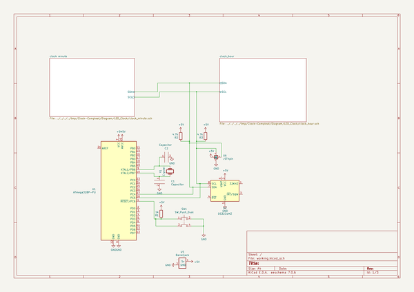
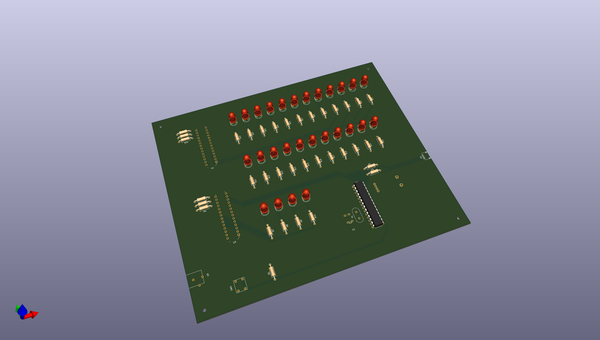
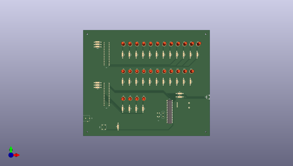
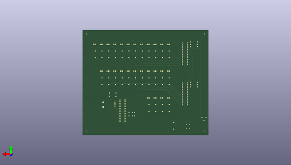

# clock_compleat
 
## summary 
* id: adamjvr_clock_compleat_led_clock
* user: adamjvr
* name: clock_compleat
* board: led_clock
* repo: https://github.com/adamjvr/Clock-Compleat
* src_file_repo_kicad_pcb: Diagram/LED_Clock/LED_Clock.kicad_pcb
* src_file_repo_kicad_pcb_link: https://github.com/adamjvr/Clock-Compleat/tree/master/Diagram/LED_Clock/LED_Clock.kicad_pcb

* src_file_repo_sch: 
* src_file_repo_sch_link: https://github.com/adamjvr/Clock-Compleat/tree/master/
* full details link: https://github.com/oomlout/oomlout_oomp_project_bot_v_2/tree/main/projects/adamjvr_clock_compleat_led_clock/current_version/working  

## schematic  
  
[schematic (pdf)](working_schematic.pdf)  

## pcb  
 
  
  
  
[board (pdf)](working.pdf)  

## working_bom
| Id | Designator | Footprint | Quantity | Designation | Supplier and ref |  | None | 
| --- | --- | --- | --- | --- | --- | --- | --- | 
| 1 | C1,C2 | Capacitor | 2 | Capacitor |  |  | [''] | 
| 2 | D1,D2,D3,D4,D5,D6,D7,D8,D9,D10,D11,D12,D13,D14,D15,D16,D17,D18,D19,D20,D21,D22,D23,D24,D25,D26,D27 | LED_D5.0mm | 27 | Blue |  |  | [''] | 
| 3 | R1,R4,R5,R6,R7,R8,R9,R10,R11,R12,R13,R14,R15,R16,R17,R18,R19,R20,R21,R22,R23,R24,R25,R26,R27,R28,R29,R30,R31,R32,R33,R34,R35,R36 | R_Axial_DIN0207_L6.3mm_D2.5mm_P10.16mm_Horizontal | 34 | 1k |  |  | [''] | 
| 4 | R2,R3 | R_Axial_DIN0207_L6.3mm_D2.5mm_P10.16mm_Horizontal | 2 | 4.7k |  |  | [''] | 
| 5 | SW1 | Pushbutton | 1 | SW_Push_Dual |  |  | [''] | 
| 6 | U1 | DIP-28_W7.62mm | 1 | ATmega328P-PU |  |  | [''] | 
| 7 | U3,U4 | DIP-28_W7.62mm | 2 | MCP23017-E_SP |  |  | [''] | 
| 8 | Y1 | Crystal | 1 | Crystal |  |  | [''] | 
| 9 | U5 | BarrelJack | 1 | Barreljack |  |  | [''] | 
| 10 | U2 | DS3231 | 1 | DS3231MZ |  |  | [''] | 
| 11 | U6 | JST_SH_SM04B-SRSS-TB_1x04-1MP_P1.00mm_Horizontal | 1 | JST4pin |  |  | [''] | 

## bom_schematic
| Ref | Qnty | Value | Cmp name | Footprint | Description | Vendor | DNP | 
| --- | --- | --- | --- | --- | --- | --- | --- | 
| C1, C2 | 2 | Capacitor | Capacitor-Custom_symbol | Personal:Capacitor |  |  |  | 
| R1 | 1 | 1k | R | Resistor_THT:R_Axial_DIN0207_L6.3mm_D2.5mm_P10.16mm_Horizontal | Resistor |  |  | 
| R2, R3 | 2 | 4.7k | R | Resistor_THT:R_Axial_DIN0207_L6.3mm_D2.5mm_P10.16mm_Horizontal | Resistor |  |  | 
| SW1 | 1 | SW_Push_Dual | SW_Push_Dual | Personal:Pushbutton | Push button switch, generic, symbol, four pins |  |  | 
| U1 | 1 | ATmega328P-PU | ATmega328P-PU-MCU_Microchip_ATmega | Package_DIP:DIP-28_W7.62mm |  |  |  | 
| U2 | 1 | DS3231MZ | DS3231MZ | Personal:DS3231 | ±5ppm, I2C Real-Time Clock SOIC-8 |  |  | 
| U5 | 1 | Barreljack | Barreljack-Personal | Personal:BarrelJack |  |  |  | 
| U6 | 1 | JST4pin | JST4pin-Personal | Connector_JST:JST_SH_SM04B-SRSS-TB_1x04-1MP_P1.00mm_Horizontal |  |  |  | 
| Y1 | 1 | Crystal | Crystal | Personal:Crystal | Two pin crystal |  |  | 

