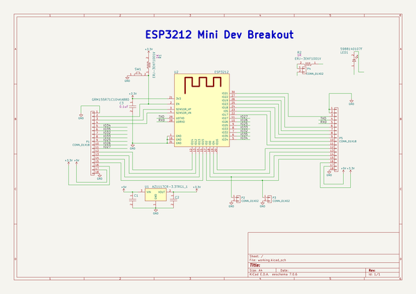

# esp3212_breakout
 
## summary 
* id: adamjvr_esp3212_breakout_esp3212_breakout
* user: adamjvr
* name: esp3212_breakout
* board: esp3212_breakout
* repo: https://github.com/adamjvr/ESP3212-breakout
* src_file_repo_kicad_pcb: ESP3212-Breakout/ESP3212-Breakout.kicad_pcb
* src_file_repo_kicad_pcb_link: https://github.com/adamjvr/ESP3212-breakout/tree/master/ESP3212-Breakout/ESP3212-Breakout.kicad_pcb

* src_file_repo_sch: ESP3212-Breakout/ESP3212-Breakout.sch
* src_file_repo_sch_link: https://github.com/adamjvr/ESP3212-breakout/tree/master/ESP3212-Breakout/ESP3212-Breakout.sch
* full details link: https://github.com/oomlout/oomlout_oomp_project_bot_v_2/tree/main/projects/adamjvr_esp3212_breakout_esp3212_breakout/current_version/working  

## schematic  
  
[schematic (pdf)](working_schematic.pdf) 

## pcb  
 
  
  
  
[board (pdf)](working.pdf)  

## working_bom
| Id | Designator | Footprint | Quantity | Designation | Supplier and ref |  | None | 
| --- | --- | --- | --- | --- | --- | --- | --- | 
| 1 | C1 | C0603 | 1 | CL10A106KQ8NNNC |  |  | [''] | 
| 2 | C2 | C0402 | 1 | CL05B104JP5NNNC |  |  | [''] | 
| 3 | U1 | AZ1117CR-3.3TRG1 | 1 | AZ1117CR-3.3TRG1_1 |  |  | [''] | 
| 4 | U2 | ESP3212 | 1 | ESP3212 |  |  | [''] | 
| 5 | C3 | C0402 | 1 | GRM155R71C104KA88D |  |  | [''] | 
| 6 | LED1 | LED0805Y | 1 | 5988140107F |  |  | [''] | 
| 7 | P1,P5 | Pin_Header_Straight_1x18 | 2 | CONN_01X18 |  |  | [''] | 
| 8 | P2,P3,P4 | Pin_Header_Straight_1x02 | 3 | CONN_01X02 |  |  | [''] | 
| 9 | R1,R2 | R0603 | 2 | ERJ-3EKF1001V |  |  | [''] | 
| 10 | SW1 | TL3301AF160QG | 1 | TL3301AF160QG |  |  | [''] | 

## bom_schematic
| Ref | Qnty | Value | Cmp name | Footprint | Description | Vendor | DNP | 
| --- | --- | --- | --- | --- | --- | --- | --- | 
| C1 | 1 | CL10A106KQ8NNNC | CL10A106KQ8NNNC | PCB_Footprints:C0603 |  |  |  | 
| C2 | 1 | CL05B104JP5NNNC | CL05B104JP5NNNC | PCB_Footprints:C0402 |  |  |  | 
| C3 | 1 | GRM155R71C104KA88D | GRM155R71C104KA88D | OnHand-Components:C0402 |  |  |  | 
| LED1 | 1 | 5988140107F | 5988140107F | OnHand-Components:LED0805Y |  |  |  | 
| P1, P5 | 2 | CONN_01X18 | CONN_01X18 | Pin_Headers:Pin_Header_Straight_1x18 |  |  |  | 
| P2, P3, P4 | 3 | CONN_01X02 | CONN_01X02 | Pin_Headers:Pin_Header_Straight_1x02 |  |  |  | 
| R1, R2 | 2 | ERJ-3EKF1001V | ERJ-3EKF1001V | OnHand-Components:R0603 |  |  |  | 
| SW1 | 1 | TL3301AF160QG | TL3301AF160QG | OnHand-Components:TL3301AF160QG |  |  |  | 
| U1 | 1 | AZ1117CR-3.3TRG1_1 | AZ1117CR-3.3TRG1_1 | PCB_Footprints:AZ1117CR-3.3TRG1 |  |  |  | 
| U2 | 1 | ESP3212 | ESP3212 | ESP32-footprints-Lib:ESP3212 |  |  |  | 

