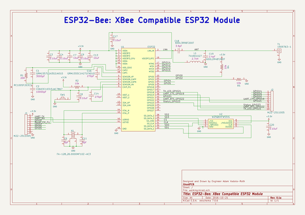

# esp32bee
 
## summary 
* id: adamjvr_esp32bee_esp32_bee
* user: adamjvr
* name: esp32bee
* board: esp32_bee
* repo: https://github.com/adamjvr/ESP32Bee
* src_file_repo_kicad_pcb: PCB/ESP32-Bee.kicad_pcb
* src_file_repo_kicad_pcb_link: https://github.com/adamjvr/ESP32Bee/tree/master/PCB/ESP32-Bee.kicad_pcb

* src_file_repo_sch: PCB/ESP32-Bee.sch
* src_file_repo_sch_link: https://github.com/adamjvr/ESP32Bee/tree/master/PCB/ESP32-Bee.sch
* full details link: https://github.com/oomlout/oomlout_oomp_project_bot_v_2/tree/main/projects/adamjvr_esp32bee_esp32_bee/current_version/working  

## schematic  
  
[schematic (pdf)](working_schematic.pdf) 

## pcb  
 
  
  
  
[board (pdf)](working.pdf)  

## working_bom
| Id | Designator | Footprint | Quantity | Designation | Supplier and ref |  | None | 
| --- | --- | --- | --- | --- | --- | --- | --- | 
| 1 | U2 | W25Q64FWSSIG | 1 | W25Q64FWSSIG |  |  | [''] | 
| 2 | R1 | R0402 | 1 | RC1005F203CS |  |  | [''] | 
| 3 | J2,J1 | M22-2511005 | 2 | M22-2511005 |  |  | [''] | 
| 4 | X1 | FA-128_26.0000MF10Z-AC3 | 1 | FA-128_26.0000MF10Z-AC3 |  |  | [''] | 
| 5 | C7,C13 | C0603 | 2 | CL10A106KQ8NNNC |  |  | [''] | 
| 6 | C2 | C0603 | 1 | C0603C103J5JAC7867 |  |  | [''] | 
| 7 | C20,C9,C3,C4,C17,C8 | C0402 | 6 | CL05B104JP5NNNC |  |  | [''] | 
| 8 | C18 | C0402 | 1 | 600L3R9BT200T |  |  | [''] | 
| 9 | C1 | C0402 | 1 | GRM1557U1A302JA01D |  |  | [''] | 
| 10 | C6,C11 | C0402 | 2 | CL05C090CB5NNNC |  |  | [''] | 
| 11 | C19 | C0402 | 1 | 600L2R4BT200T |  |  | [''] | 
| 12 | C14,C16 | C0402 | 2 | GRM1555C1H271FA01D |  |  | [''] | 
| 13 | L1 | BLM15HG601SN1D | 1 | 744901027 |  |  | [''] | 
| 14 | U1 | ESP32 | 1 | ESP32 |  |  | [''] | 
| 15 | R2,R5,R4 | R0402 | 3 | RC1005F103CS |  |  | [''] | 
| 16 | SW1 | B3U-1000P | 1 | B3U-1000P |  |  | [''] | 
| 17 | T1 | 1909763-1 | 1 | 1909763-1 |  |  | [''] | 

## bom_schematic
| Ref | Qnty | Value | Cmp name | Footprint | Description | Vendor | DNP | 
| --- | --- | --- | --- | --- | --- | --- | --- | 
| C1 | 1 | GRM1557U1A302JA01D | GRM1557U1A302JA01D | PCB_Footprints:C0402 |  |  |  | 
| C2 | 1 | C0603C103J5JAC7867 | C0603C103J5JAC7867 | PCB_Footprints:C0603 |  |  |  | 
| C3, C4, C8, C9, C17, C20 | 6 | CL05B104JP5NNNC | CL05B104JP5NNNC | PCB_Footprints:C0402 |  |  |  | 
| C6, C11 | 2 | CL05C090CB5NNNC | CL05C090CB5NNNC | PCB_Footprints:C0402 |  |  |  | 
| C7, C13 | 2 | CL10A106KQ8NNNC | CL10A106KQ8NNNC | PCB_Footprints:C0603 |  |  |  | 
| C14, C16 | 2 | GRM1555C1H271FA01D | GRM1555C1H271FA01D | PCB_Footprints:C0402 |  |  |  | 
| C18 | 1 | 600L3R9BT200T | 600L3R9BT200T | PCB_Footprints:C0402 |  |  |  | 
| C19 | 1 | 600L2R4BT200T | 600L2R4BT200T | PCB_Footprints:C0402 |  |  |  | 
| J1, J2 | 2 | M22-2511005 | M22-2511005 | PCB_Footprints:M22-2511005 |  |  |  | 
| L1 | 1 | 744901027 | 744901027 | PCB_Footprints:BLM15HG601SN1D |  |  |  | 
| R1 | 1 | RC1005F203CS | RC1005F203CS | PCB_Footprints:R0402 |  |  |  | 
| R2, R4, R5 | 3 | RC1005F103CS | RC1005F103CS | PCB_Footprints:R0402 |  |  |  | 
| SW1 | 1 | B3U-1000P | B3U-1000P | PCB_Footprints:B3U-1000P |  |  |  | 
| T1 | 1 | 1909763-1 | 1909763-1 | PCB_Footprints:1909763-1 |  |  |  | 
| U1 | 1 | ESP32 | ESP32 | ESP32-footprints-Lib:ESP32 |  |  |  | 
| U2 | 1 | W25Q64FWSSIG | W25Q64FWSSIG | PCB_Footprints:W25Q64FWSSIG |  |  |  | 
| X1 | 1 | FA-128_26.0000MF10Z-AC3 | FA-128_26.0000MF10Z-AC3 | PCB_Footprints:FA-128_26.0000MF10Z-AC3 |  |  |  | 

