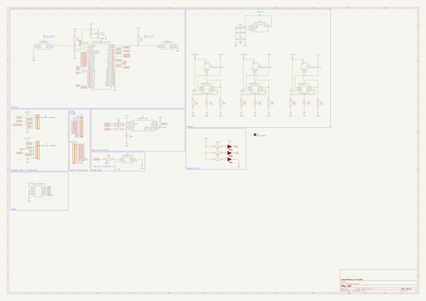
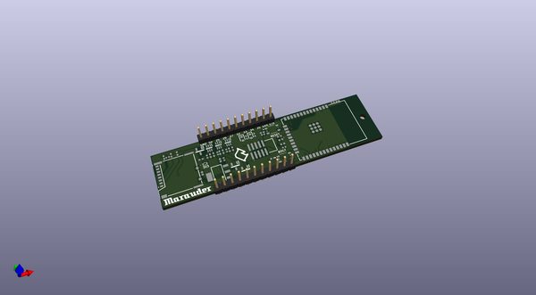
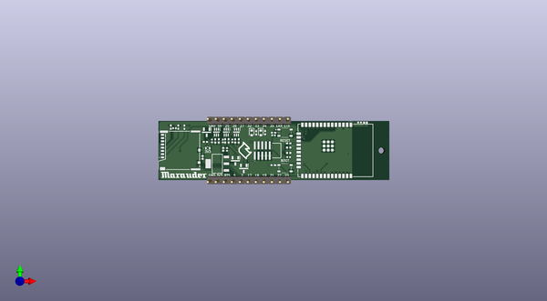
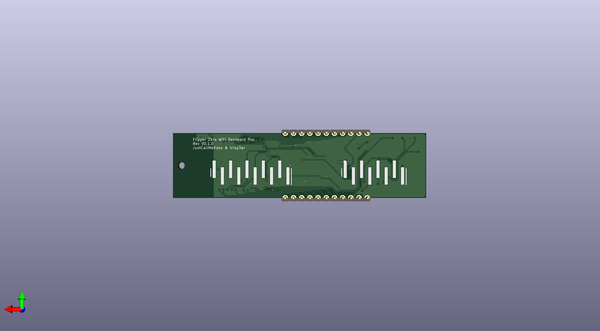

# esp32marauder
 
## summary 
* id: adamjvr_esp32marauder_wifi_devboard_pro
* user: adamjvr
* name: esp32marauder
* board: wifi_devboard_pro
* repo: https://github.com/adamjvr/ESP32Marauder
* src_file_repo_kicad_pcb: PCBs/FlipperZero/WiFi-Devboard-Pro/WiFi-Devboard-Pro.kicad_pcb
* src_file_repo_kicad_pcb_link: https://github.com/adamjvr/ESP32Marauder/tree/master/PCBs/FlipperZero/WiFi-Devboard-Pro/WiFi-Devboard-Pro.kicad_pcb
* src_file_repo_kicad_sch: PCBs/FlipperZero/WiFi-Devboard-Pro/WiFi-Devboard-Pro.kicad_sch
* src_file_repo_kicad_sch_link: https://github.com/adamjvr/ESP32Marauder/tree/master/PCBs/FlipperZero/WiFi-Devboard-Pro/WiFi-Devboard-Pro.kicad_sch

* src_file_repo_sch: 
* src_file_repo_sch_link: https://github.com/adamjvr/ESP32Marauder/tree/master/
* full details link: https://github.com/oomlout/oomlout_oomp_project_bot_v_2/tree/main/projects/adamjvr_esp32marauder_wifi_devboard_pro/current_version/working  

## schematic  
  
[schematic (pdf)](working_schematic.pdf) 

## pcb  
 
  
  
  
[board (pdf)](working.pdf)  

## working_bom
| Id | Designator | Footprint | Quantity | Designation | Supplier and ref |  | None | 
| --- | --- | --- | --- | --- | --- | --- | --- | 
| 1 | R10,R8,R12,R11,R9,R7 | RESC1005X40N | 6 | 100K |  |  | [''] | 
| 2 | R15,R5,R4,R13,R14,R3 | RESC1005X40N | 6 | 1K |  |  | [''] | 
| 3 | R6,R1 | RESC1005X40N | 2 | 10k |  |  | [''] | 
| 4 | C7,C11,C3,C8,C9,C10 | CAPC1005X55N | 6 | 100n |  |  | [''] | 
| 5 | IC2,IC4,IC5 | SOT96P240X120-3N | 3 | DMP1045U-7 |  |  | [''] | 
| 6 | J4,J5 | PinHeader_1x11_P2.54mm_Vertical | 2 | Conn_01x11 |  |  | [''] | 
| 7 | C2,C5 | CAPC1005X80N | 2 | 22uF |  |  | [''] | 
| 8 | J6 | 503398-1892 | 1 | 503398-1892 |  |  | [''] | 
| 9 | LED1 | WS2812B2020 | 1 | WS2812B-2020 |  |  | [''] | 
| 10 | C6 | CAPC1005X70N | 1 | 10uF |  |  | [''] | 
| 11 | IC1 | ESP32WROOM32EN4 | 1 | ESP32-WROOM-32E-N4 |  |  | [''] | 
| 12 | LED4 | 19217R6CAL1M2VY3T | 1 | 3V3 |  |  | [''] | 
| 13 | R2 | RESC1005X40N | 1 | 220 |  |  | [''] | 
| 14 | J1 | 322010030000 | 1 | 3220-10-0300-00 |  |  | [''] | 
| 15 | LED2 | LEDC1608X50N | 1 | TX |  |  | [''] | 
| 16 | S2,S1 | SKRPABE010 | 2 | SKRPABE010 |  |  | [''] | 
| 17 | C4 | CAPC1005X55N | 1 | 100nF |  |  | [''] | 
| 18 | IC3 | SOT230P700X180-4N | 1 | AZ1117H-3.3TRE1 |  |  | [''] | 
| 19 |  |  | 1 |  |  |  | [''] | 
| 20 | U3,U2,U1 | SOT65P210X110-6N | 3 | MMDT2907A-7-F |  |  | [''] | 
| 21 | C1 | CAPC1005X60N | 1 | 1u |  |  | [''] | 
| 22 | LED3 | LEDC1608X50N | 1 | RX |  |  | [''] | 
| 23 | J3 | HUSRSP10W66P254_2500X250X850P | 1 | DZ254S-11-10-48 |  |  | [''] | 

## bom_schematic
| Ref | Qnty | Value | Cmp name | Footprint | Description | Vendor | DNP | 
| --- | --- | --- | --- | --- | --- | --- | --- | 
| C1 | 1 | 1u | CL05A105KA5NQNC | 0402 | Cap Ceramic 1uF 25V X5R 10% Pad SMD 0402 85C T/R |  |  | 
| C2, C5 | 2 | 22uF | CM05X5R226M06AH080 | 0402 | Multilayer Ceramic Capacitors MLCC - SMD/SMT 22UF    6.3V   20%        0402 |  |  | 
| C3, C7, C8, C9, C10, C11 | 6 | 100n | CL05B104KO5NNNC | 0402 | Samsung Electro-Mechanics CL05B104KO5NNNC 100nF Multilayer Ceramic Capacitor MLCC 16V dc +/-10% Tolerance SMD |  |  | 
| C4 | 1 | 100nF | CC0402KRX7R7BB104 | 0402 | Cap 100nF 16V 0402 SMD 10% X7R Phycomp 100nF Multilayer Ceramic Capacitor (MLCC) 16 V dc +/-10% X7R dielectric Standard max op. temp. +125C |  |  | 
| C6 | 1 | 10uF | CL05A106MQ5NUNC | 0402 | CAP CER 10UF 6.3V X5R 0402 |  |  | 
| H1 | 1 | MountingHole | MountingHole |  | Mounting Hole without connection |  |  | 
| IC1 | 1 | ESP32-WROOM-32E-N4 | ESP32-WROOM-32E-N4 | SMD-38P,18x25.5x3.1mm | RX TXRX MOD WIFI TRACE ANT SMD |  |  | 
| IC2, IC4, IC5 | 3 | SI2333CDS-T1-E3 | DMP1045U-7 | SOT-23 | P-Channel Enhancement MOSFET SOT-23 Diodes Inc DMP1045U-7 P-channel MOSFET Transistor, 5.2 A, -12 V, 3-Pin SOT23 |  |  | 
| IC3 | 1 | AZ1117H-3.3TRE1 | AZ1117H-3.3TRE1 | SOT-223-3 | 3.3V 1A Pos LDO Regulator SOT-223 DiodesZetex AZ1117H-3.3TRE1, LDO Voltage Regulator, 1A, 3.3 V 1%, maximum of 15 Vin, 3+Tab-Pin SOT-223 |  |  | 
| J1 | 1 | 3220-10-0300-00 | 3220-10-0300-00 | 322010030000 | Conn Shrouded Header (4 Sides) HDR 10 POS 1.27mm Solder ST SMD |  |  | 
| J2 | 1 | X6511WVS-08H-C60D48R1 | Conn_01x08 | SMD,P=2.54mm(交错脚) | Generic connector, single row, 01x08, script generated (kicad-library-utils/schlib/autogen/connector/) |  |  | 
| J3 | 1 | X6511WVS-10H-C60D48R1 | Conn_01x10 | HUSRSP10W66P254_2500X250X850P | Generic connector, single row, 01x10, script generated (kicad-library-utils/schlib/autogen/connector/) |  |  | 
| J4, J5 | 2 | Conn_01x11 | Conn_01x11 | SMD,P=2.54mm(交错脚) | Generic connector, single row, 01x11, script generated (kicad-library-utils/schlib/autogen/connector/) |  |  | 
| J6 | 1 | 503398-1892 | 503398-1892 | SMD | MicroSD SMT Push-Push 1.28mm height MicroSD SMT Push-Push 1.28mm height |  |  | 
| LED1 | 1 | WS2812B-2020 | WS2812B-2020 | WS2812B2020 | LED; SMD; 2020; RGB; 2x2x0.84mm; 3.75.3V; Lens: transparent; 2kHz |  |  | 
| LED2 | 1 | TX | 19-217_Y5C-AP1Q2_3T | 0603 | Standard LEDs - SMD SMD LED |  |  | 
| LED3 | 1 | RX | 19-217_Y5C-AP1Q2_3T | 0603 | Standard LEDs - SMD SMD LED |  |  | 
| LED4 | 1 | 3V3 | 19-217_R6C-AL1M2VY_3T | 0603 | LED Uni-Color Brilliant Red 632nm T/R |  |  | 
| R1, R6 | 2 | 10k | RC0402FR-0710KL | 0402 | YAGEO (PHYCOMP) - RC0402FR-0710KL. - RES, THICK FILM, 10K, 1%, 0.0625W, 0402 |  |  | 
| R2 | 1 | 220 | RC0402FR-07220RL | 0402 | YAGEO (PHYCOMP) - RC0402FR-07220RL - RES, THICK FILM, 220R, 1%, 0.063W, 0402 |  |  | 
| R3, R4, R5, R13, R14, R15 | 6 | 1K | RC0402FR-071KL | 0402 | GENERAL PURPOSE CHIP RESISTORS |  |  | 
| R7, R8, R9, R10, R11, R12 | 6 | 100K | RC0402FR-07100KL | 0402 | GENERAL PURPOSE CHIP RESISTORS |  |  | 
| S1, S2 | 2 | SKRPABE010 | SKRPABE010 | SMD | Switch Tactile N.O. SPST Button J-Bend 0.05A 16VDC 1.57N SMD Automotive T/R |  |  | 
| U1, U2, U3 | 3 | MMDT2907A-7-F | MMDT2907A-7-F | SOT65P210X110-6N | Diodes Inc MMDT2907A-7-F Dual PNP Bipolar Transistor, -600 mA, -60 V, 6-Pin SOT-363 |  |  | 

