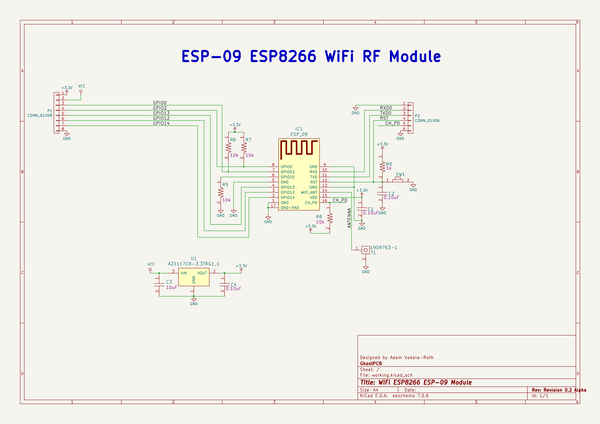

# esp_09_test
 
## summary 
* id: adamjvr_esp_09_test_esp_09_bo_test
* user: adamjvr
* name: esp_09_test
* board: esp_09_bo_test
* repo: https://github.com/adamjvr/ESP-09-Test
* src_file_repo_kicad_pcb: PCB/ESP-09-BO-Test.kicad_pcb
* src_file_repo_kicad_pcb_link: https://github.com/adamjvr/ESP-09-Test/tree/master/PCB/ESP-09-BO-Test.kicad_pcb

* src_file_repo_sch: PCB/ESP-09-BO-Test.sch
* src_file_repo_sch_link: https://github.com/adamjvr/ESP-09-Test/tree/master/PCB/ESP-09-BO-Test.sch
* full details link: https://github.com/oomlout/oomlout_oomp_project_bot_v_2/tree/main/projects/adamjvr_esp_09_test_esp_09_bo_test/current_version/working  

## schematic  
  
[schematic (pdf)](working_schematic.pdf)  

## pcb  
 
  
  
  
[board (pdf)](working.pdf)  

## working_bom
| Id | Designator | Footprint | Quantity | Designation | Supplier and ref |  | None | 
| --- | --- | --- | --- | --- | --- | --- | --- | 
| 1 | R8,R7,R5,R6 | R0402 | 4 | RC1005F103CS |  |  | [''] | 
| 2 | R9 | R0402 | 1 | RC1005F102CS |  |  | [''] | 
| 3 | IC1 | ESP-09 | 1 | ESP_09 |  |  | [''] | 
| 4 | C1,C2,C4 | C0402 | 3 | CL05B104JP5NNNC |  |  | [''] | 
| 5 | SW1 | B3U-1000P | 1 | B3U-1000P |  |  | [''] | 
| 6 | T1 | 1909763-1 | 1 | 1909763-1 |  |  | [''] | 
| 7 | P1 | Pin_Header_Straight_1x08 | 1 | CONN_01X08 |  |  | [''] | 
| 8 | P2 | Pin_Header_Straight_1x06 | 1 | CONN_01X06 |  |  | [''] | 
| 9 | C3 | C0603 | 1 | CL10A106KQ8NNNC |  |  | [''] | 
| 10 | U1 | AZ1117CR-3.3TRG1 | 1 | AZ1117CR-3.3TRG1_1 |  |  | [''] | 

## bom_schematic
| Ref | Qnty | Value | Cmp name | Footprint | Description | Vendor | DNP | 
| --- | --- | --- | --- | --- | --- | --- | --- | 
| C1, C2, C4 | 3 | CL05B104JP5NNNC | CL05B104JP5NNNC | PCB_Footprints:C0402 |  |  |  | 
| C3 | 1 | CL10A106KQ8NNNC | CL10A106KQ8NNNC | PCB_Footprints:C0603 |  |  |  | 
| IC1 | 1 | ESP_09 | ESP_09 | PCB_Footprints:ESP-09 |  |  |  | 
| P1 | 1 | CONN_01X08 | CONN_01X08 | Pin_Headers:Pin_Header_Straight_1x08 |  |  |  | 
| P2 | 1 | CONN_01X06 | CONN_01X06 | Pin_Headers:Pin_Header_Straight_1x06 |  |  |  | 
| R5, R6, R7, R8 | 4 | RC1005F103CS | RC1005F103CS | PCB_Footprints:R0402 |  |  |  | 
| R9 | 1 | RC1005F102CS | RC1005F102CS | PCB_Footprints:R0402 |  |  |  | 
| SW1 | 1 | B3U-1000P | B3U-1000P | PCB_Footprints:B3U-1000P |  |  |  | 
| T1 | 1 | 1909763-1 | 1909763-1 | PCB_Footprints:1909763-1 |  |  |  | 
| U1 | 1 | AZ1117CR-3.3TRG1_1 | AZ1117CR-3.3TRG1_1 | PCB_Footprints:AZ1117CR-3.3TRG1 |  |  |  | 

