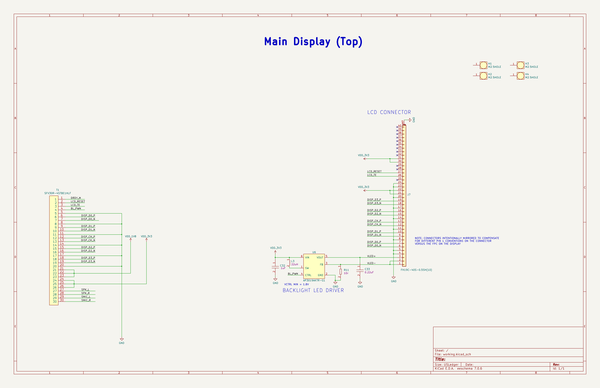
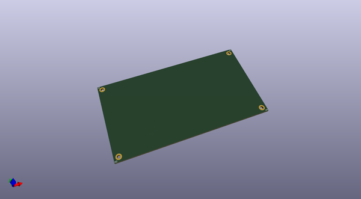
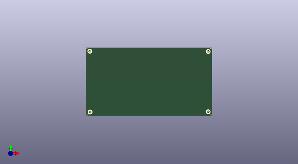
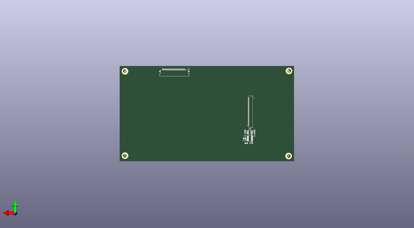

# kimchi_bbq_lid
 
## summary 
* id: adamjvr_kimchi_bbq_lid_kimchi_ulid
* user: adamjvr
* name: kimchi_bbq_lid
* board: kimchi_ulid
* repo: https://github.com/adamjvr/kimchi-bbq-lid
* src_file_repo_kicad_pcb: BBQ_TOP_PCB.kicad_pcb
* src_file_repo_kicad_pcb_link: https://github.com/adamjvr/kimchi-bbq-lid/tree/master/BBQ_TOP_PCB.kicad_pcb

* src_file_repo_sch: 
* src_file_repo_sch_link: https://github.com/adamjvr/kimchi-bbq-lid/tree/master/
* full details link: https://github.com/oomlout/oomlout_oomp_project_bot_v_2/tree/main/projects/adamjvr_kimchi_bbq_lid_kimchi_ulid/current_version/working  

## schematic  
  
[schematic (pdf)](working_schematic.pdf) 

## pcb  
 
  
  
  
[board (pdf)](working.pdf)  

## working_bom
| Id | Designator | Footprint | Quantity | Designation | Supplier and ref |  | None | 
| --- | --- | --- | --- | --- | --- | --- | --- | 
| 1 | H1,H2,H3,H4 | M2.5HOLE | 4 | M2.5HOLE |  |  | [''] | 
| 2 | J7 | HRS_FH19C-40S-0.5SH_1x40-1MP_P0.50mm | 1 | FH19C-40S-0.5SH(10) |  |  | [''] | 
| 3 | L3 | L_Taiyo-Yuden_MD-4040 | 1 | TYA4012220M-10 |  |  | [''] | 
| 4 | C33 | C0603 | 1 | CGA3E3X7R1H224K080AB |  |  | [''] | 
| 5 | C29 | C0603 | 1 | C0603C104M5RACAUTO |  |  | [''] | 
| 6 | R11 | R0603 | 1 | RE0603FRE0710RL |  |  | [''] | 
| 7 | U6 | SOT-23-6_Handsoldering | 1 | AP3019AKTR-G1 |  |  | [''] | 
| 8 | T1 | SFV30R-4STBE1HLF | 1 | SFV30R-4STBE1HLF |  |  | [''] | 
| 9 | C32 | C0603 | 1 | C0603C105K4PAC7411 |  |  | [''] | 

## bom_schematic
| Ref | Qnty | Value | Cmp name | Footprint | Description | Vendor | DNP | 
| --- | --- | --- | --- | --- | --- | --- | --- | 
| C32 | 1 | C0603C105K4PAC7411 | C0603C105K4PAC7411 | kimchi_ulid:C0603 |  | Digikey |  | 
| C33 | 1 | CGA3E3X7R1H224K080AB | CGA3E3X7R1H224K080AB | kimchi_ulid:C0603 |  | Digikey |  | 
| H1, H2, H3, H4 | 4 | M2.5HOLE | M2.5HOLE | kimchi_ulid:M2.5HOLE |  |  |  | 
| J7 | 1 | FH19C-40S-0.5SH(10) | Conn_01x40_MountingPin | kimchi_ulid:HRS_FH19C-40S-0.5SH_1x40-1MP_P0.50mm | Generic connectable mounting pin connector, single row, 01x40, script generated (kicad-library-utils/schlib/autogen/connector/) |  |  | 
| L3 | 1 | TYA4012220M-10 | TYA4012220M-10 | kimchi_ulid:L_Taiyo-Yuden_MD-4040 |  | Digikey |  | 
| R11 | 1 | RE0603FRE0710RL | RE0603FRE0710RL | kimchi_ulid:R0603 |  | Digikey |  | 
| T1 | 1 | SFV30R-4STBE1HLF | SFV30R-4STBE1HLF | kimchi_ulid:SFV30R-4STBE1HLF |  |  |  | 
| U6 | 1 | AP3019AKTR-G1 | AP3019AKTR-G1 | kimchi_ulid:SOT-23-6_Handsoldering |  |  |  | 

