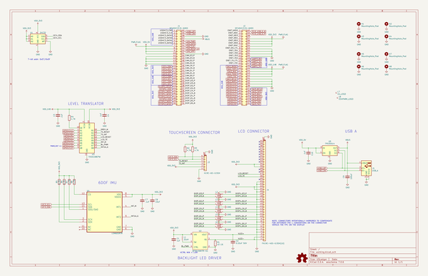

# kimchi_display_lid
 
## summary 
* id: adamjvr_kimchi_display_lid_kimchi_display_lid
* user: adamjvr
* name: kimchi_display_lid
* board: kimchi_display_lid
* repo: https://github.com/adamjvr/kimchi-display-lid
* src_file_repo_kicad_pcb: kimchi_display_lid.kicad_pcb
* src_file_repo_kicad_pcb_link: https://github.com/adamjvr/kimchi-display-lid/tree/master/kimchi_display_lid.kicad_pcb

* src_file_repo_sch: kimchi_display_lid.sch
* src_file_repo_sch_link: https://github.com/adamjvr/kimchi-display-lid/tree/master/kimchi_display_lid.sch
* full details link: https://github.com/oomlout/oomlout_oomp_project_bot_v_2/tree/main/projects/adamjvr_kimchi_display_lid_kimchi_display_lid/current_version/working  

## schematic  
  
[schematic (pdf)](working_schematic.pdf) 

## pcb  
 
  
  
  
[board (pdf)](working.pdf)  

## working_bom
| Id | Designator | Footprint | Quantity | Designation | Supplier and ref |  | None | 
| --- | --- | --- | --- | --- | --- | --- | --- | 
| 1 | J2,J1 | DF40HC(3.5)-60DS | 2 | DF40HC(3.5)-60DS |  |  | [''] | 
| 2 | U1 | DFN-8-1EP_3x2mm_P0.5mm_EP1.36x1.46mm | 1 | 24C32 |  |  | [''] | 
| 3 | L1 | L_Taiyo-Yuden_MD-4040 | 1 | 22uH |  |  | [''] | 
| 4 | J4 | HRS_FH19C-40S-0.5SH_1x40-1MP_P0.50mm | 1 | FH19C-40S-0.5SH(10) |  |  | [''] | 
| 5 | J3 | HRS_FH19C-6S-0.5SH_1x06-1MP_P0.50mm | 1 | H19C-6S-0.5SH |  |  | [''] | 
| 6 | R2,R3,R4,R5,R7,R8,R6 | R_0603_1608Metric | 7 | 4.7K |  |  | [''] | 
| 7 | LOGO2 | kimchi-micro-3d-model | 1 | Logo_Open_Hardware_Small |  |  | [''] | 
| 8 | R1 | R_0603_1608Metric | 1 | 10 1% |  |  | [''] | 
| 9 | U2 | SOT-23-6 | 1 | AP3019AKTR-G1 |  |  | [''] | 
| 10 | C2 | C_0603_1608Metric | 1 | 0.22uF 50V |  |  | [''] | 
| 11 | C1 | C_0603_1608Metric | 1 | 1uF |  |  | [''] | 
| 12 | C3,C4,C7,C10 | C_0603_1608Metric | 4 | .1uF |  |  | [''] | 
| 13 | U3 | TSSOP-20_4.4x6.5mm_P0.65mm | 1 | TXS0108EPW |  |  | [''] | 
| 14 | J5 | TE_1-292303-6 | 1 | USB_A |  |  | [''] | 
| 15 | C8 | C_0603_1608Metric | 1 | 10uF |  |  | [''] | 
| 16 | C9 | C_1206_3216Metric | 1 | 100uF |  |  | [''] | 
| 17 | U5 | SOT-23-6 | 1 | TPD3S014 |  |  | [''] | 
| 18 | L3,L4,L5,L6,L2 | LCFE121002 | 5 | LCFE121002 |  |  | [''] | 
| 19 | U4 | LSM6DSRTR | 1 | LSM6DSRTR |  |  | [''] | 
| 20 | L7 | groupgets_logo | 1 | GG_LOGO |  |  | [''] | 
| 21 | L8 | oshpark_logo | 1 | OSHPARK_LOGO |  |  | [''] | 

## bom_schematic
| Ref | Qnty | Value | Cmp name | Footprint | Description | Vendor | DNP | 
| --- | --- | --- | --- | --- | --- | --- | --- | 
| C1 | 1 | 1uF | C-Device | Capacitor_SMD:C_0603_1608Metric |  |  |  | 
| C2 | 1 | 0.22uF 50V | C-Device | Capacitor_SMD:C_0603_1608Metric |  |  |  | 
| C3, C4, C7, C10 | 4 | .1uF | C-Device | Capacitor_SMD:C_0603_1608Metric |  |  |  | 
| C8 | 1 | 10uF | C-Device | Capacitor_SMD:C_0603_1608Metric |  |  |  | 
| C9 | 1 | 100uF | C-Device | Capacitor_SMD:C_1206_3216Metric |  |  |  | 
| H1, H2, H3, H4, H5, H6, H7, H8 | 8 | MountingHole_Pad | MountingHole_Pad-Mechanical | kimchi_ulid:MountingHole_3mm_Pad |  |  |  | 
| J1, J2 | 2 | DF40HC(3.5)-60DS | Conn_02x30_Counter_Clockwise | kimchi_ulid:DF40HC(3.5)-60DS | Generic connector, double row, 02x30, counter clockwise pin numbering scheme (similar to DIP package numbering), script generated (kicad-library-utils/schlib/autogen/connector/) |  |  | 
| J3 | 1 | H19C-6S-0.5SH | Conn_01x06_MountingPin | kimchi_ulid:HRS_FH19C-6S-0.5SH_1x06-1MP_P0.50mm | Generic connectable mounting pin connector, single row, 01x06, script generated (kicad-library-utils/schlib/autogen/connector/) |  |  | 
| J4 | 1 | FH19C-40S-0.5SH(10) | Conn_01x40_MountingPin | kimchi_ulid:HRS_FH19C-40S-0.5SH_1x40-1MP_P0.50mm | Generic connectable mounting pin connector, single row, 01x40, script generated (kicad-library-utils/schlib/autogen/connector/) |  |  | 
| J5 | 1 | USB_A | USB_A-Connector | kimchi_ulid:TE_1-292303-6 |  |  |  | 
| L1 | 1 | 22uH | L_Small-Device | Inductor_SMD:L_Taiyo-Yuden_MD-4040 |  |  |  | 
| L2, L3, L4, L5, L6 | 5 | LCFE121002 | LCFE121002 | kimchi_ulid:LCFE121002 | Coupled inductor with iron core, small symbol |  |  | 
| L7 | 1 | GG_LOGO | GG_LOGO | kimchi_ulid:groupgets_logo |  |  |  | 
| L8 | 1 | OSHPARK_LOGO | OSHPARK_LOGO | kimchi_ulid:oshpark_logo |  |  |  | 
| LOGO1 | 1 | Logo_Open_Hardware_Small | Logo_Open_Hardware_Small-Graphic | Symbol:OSHW-Logo_5.7x6mm_SilkScreen |  |  |  | 
| LOGO2 | 1 | Logo_Open_Hardware_Small | Logo_Open_Hardware_Small-Graphic | kimchi_ulid:kimchi-micro-3d-model |  |  |  | 
| R1 | 1 | 10 1% | R-Device | Resistor_SMD:R_0603_1608Metric |  |  |  | 
| R2, R3, R4, R5, R6, R7, R8 | 7 | 4.7K | R-Device | Resistor_SMD:R_0603_1608Metric |  |  |  | 
| U1 | 1 | 24C32 | 24LC16 | Package_DFN_QFN:DFN-8-1EP_3x2mm_P0.5mm_EP1.36x1.46mm | I2C Serial EEPROM, 16Kb, DIP-8/SOIC-8/TSSOP-8/DFN-8 |  |  | 
| U2 | 1 | AP3019AKTR-G1 | AP3019AKTR-G1 | Package_TO_SOT_SMD:SOT-23-6 |  |  |  | 
| U3 | 1 | TXS0108EPW | TXS0108EPW | Package_SO:TSSOP-20_4.4x6.5mm_P0.65mm | Bidirectional  level-shifting voltage translator, TSSOP-20 |  |  | 
| U4 | 1 | LSM6DSRTR | LSM6DSRTR_1 | kimchi_ulid:LSM6DSRTR |  |  |  | 
| U5 | 1 | TPD3S014 | TPD3S014 | Package_TO_SOT_SMD:SOT-23-6 | Current Limit Switch and D+/D– ESD Protection for USB Host Port, 0.5A, SOT-23-6 |  |  | 

