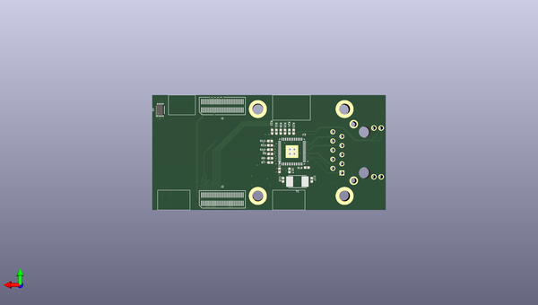

# kimchi_ethernet_lid
 
## summary 
* id: adamjvr_kimchi_ethernet_lid_kimchi_ethernet_lid
* user: adamjvr
* name: kimchi_ethernet_lid
* board: kimchi_ethernet_lid
* repo: https://github.com/adamjvr/kimchi-ethernet-lid
* src_file_repo_kicad_pcb: PCB/kimchi-ethernet-lid.kicad_pcb
* src_file_repo_kicad_pcb_link: https://github.com/adamjvr/kimchi-ethernet-lid/tree/main/PCB/kimchi-ethernet-lid.kicad_pcb

* src_file_repo_sch: PCB/kimchi-ethernet-lid.sch
* src_file_repo_sch_link: https://github.com/adamjvr/kimchi-ethernet-lid/tree/main/PCB/kimchi-ethernet-lid.sch
* full details link: https://github.com/oomlout/oomlout_oomp_project_bot_v_2/tree/main/projects/adamjvr_kimchi_ethernet_lid_kimchi_ethernet_lid/current_version/working  

## schematic  
  
[schematic (pdf)](working_schematic.pdf)  

## pcb  
 
  
  
  
[board (pdf)](working.pdf)  

## working_bom
| Id | Designator | Footprint | Quantity | Designation | Supplier and ref |  | None | 
| --- | --- | --- | --- | --- | --- | --- | --- | 
| 1 | C1,C2,C3,C4,C5,C6,C7,C8,C10,C11,C12,C13,C14,C19,C20 | R0402 | 15 | C0402C104K9PACTU |  |  | [''] | 
| 2 | C9,C15 | R0402 | 2 | 0402ZD105KAT2A |  |  | [''] | 
| 3 | R15,R16,R20,R1,R2,R3,R4,R27,R28 | R0402 | 9 | RC0402FR-071KL |  |  | [''] | 
| 4 | J3 | ABRACON_ARJM11C7-502-AB-ER2-T | 1 | ARJM11C7-502-AB-ER2-T |  |  | [''] | 
| 5 | C16 | C0402 | 1 | GRM155R61A475MEAAD |  |  | [''] | 
| 6 | C21 | C0603 | 1 | C0603C103KARACAUTO |  |  | [''] | 
| 7 | FB1,FB2,FB3 | R0402 | 3 | MMZ1005S601CTD25 |  |  | [''] | 
| 8 | U2 | TLV75712PDBVR | 1 | TLV75712PDBVR |  |  | [''] | 
| 9 | L1 | groupgets_logo | 1 | GG_LOGO |  |  | [''] | 
| 10 | FB4 | R0603 | 1 | FBMJ1608HM180NTR |  |  | [''] | 
| 11 | R13,R5,R6,R14,R19,R17 | R0402 | 6 | RC0402FR-0710KL |  |  | [''] | 
| 12 | J2,J1 | DF40HC(3.5)-60DS | 2 | DF40HC(3.5)-60DS |  |  | [''] | 
| 13 | U1 | DFN-8-1EP_3x2mm_P0.5mm_EP1.36x1.46mm | 1 | 24C32 |  |  | [''] | 
| 14 | U3 | QFN50P700X700X90-49N | 1 | KSZ9031RNXCC |  |  | [''] | 
| 15 | R7,R8,R9,R10,R11,R12,R21,R22,R23,R24,R25,R26 | R0402 | 12 | RC0402FR-0722RL |  |  | [''] | 
| 16 | C17,C18 | C0402 | 2 | 04025A180GAT2A |  |  | [''] | 
| 17 | Y1 | XTAL500X320X130N | 1 | ABM3-25.000MHZ-D2Y-T |  |  | [''] | 
| 18 | R18 | R0402 | 1 | RMCF0402FT12K1 |  |  | [''] | 
| 19 | R13 | R0402 | 1 | RC0402FR-074K7L |  |  | [''] | 

## bom_schematic
| Ref | Qnty | Value | Cmp name | Footprint | Description | Vendor | DNP | 
| --- | --- | --- | --- | --- | --- | --- | --- | 
| C1, C2, C3, C4, C5, C6, C7, C8, C10, C11, C12, C13, C14, C19, C20 | 15 | C0402C104K9PACTU | C0402C104K9PACTU | AVR-KiCAD-Lib-Resistors:R0402 |  | Digikey |  | 
| C9, C15 | 2 | 0402ZD105KAT2A | 0402ZD105KAT2A | AVR-KiCAD-Lib-Resistors:R0402 |  | Digikey |  | 
| C16 | 1 | GRM155R61A475MEAAD | GRM155R61A475MEAAD | kimchi_ulid:C0402 |  | Digikey |  | 
| C17, C18 | 2 | 04025A180GAT2A | 04025A180GAT2A | kimchi_ulid:C0402 |  | Digikey |  | 
| C21 | 1 | C0603C103KARACAUTO | C0603C103KARACAUTO | kimchi_ulid:C0603 |  | Digikey |  | 
| FB1, FB2, FB3 | 3 | MMZ1005S601CTD25 | MMZ1005S601CTD25 | kimchi_ulid:R0402 |  | Digikey |  | 
| FB4 | 1 | FBMJ1608HM180NTR | FBMJ1608HM180NTR | kimchi_ulid:R0603 |  | Digikey |  | 
| H1, H2, H3, H4 | 4 | Mechanical_MountingHole_Pad | Mechanical_MountingHole_Pad | kimchi_ulid:MountingHole_3mm_Pad |  |  |  | 
| J1, J2 | 2 | DF40HC(3.5)-60DS | Conn_02x30_Counter_Clockwise | kimchi_ulid:DF40HC(3.5)-60DS | Generic connector, double row, 02x30, counter clockwise pin numbering scheme (similar to DIP package numbering), script generated (kicad-library-utils/schlib/autogen/connector/) |  |  | 
| J3 | 1 | ARJM11C7-502-AB-ER2-T | ARJM11C7-502-AB-ER2-T | ABRACON_ARJM11C7-502-AB-ER2-T |  |  |  | 
| L1 | 1 | GG_LOGO | GG_LOGO | kimchi_ulid:groupgets_logo |  |  |  | 
| LOGO1 | 1 | Graphic_Logo_Open_Hardware_Small | Graphic_Logo_Open_Hardware_Small | kimchi_ulid:OSHW-Logo_5.7x6mm_SilkScreen |  |  |  | 
| R1, R2, R3, R4, R15, R16, R20, R27, R28 | 9 | RC0402FR-071KL | RC0402FR-071KL | kimchi_ulid:R0402 |  | Digikey |  | 
| R5, R6, R13, R14, R17, R19 | 6 | RC0402FR-0710KL | RC0402FR-0710KL | kimchi_ulid:R0402 |  | Digikey |  | 
| R7, R8, R9, R10, R11, R12, R21, R22, R23, R24, R25, R26 | 12 | RC0402FR-0722RL | RC0402FR-0722RL | kimchi_ulid:R0402 |  | Digikey |  | 
| R18 | 1 | RMCF0402FT12K1 | RMCF0402FT12K1 | kimchi_ulid:R0402 |  | Digikey |  | 
| U1 | 1 | 24C32 | 24LC16 | Package_DFN_QFN:DFN-8-1EP_3x2mm_P0.5mm_EP1.36x1.46mm | I2C Serial EEPROM, 16Kb, DIP-8/SOIC-8/TSSOP-8/DFN-8 |  |  | 
| U2 | 1 | TLV75712PDBVR | TLV75712PDBVR | kimchi_ulid:TLV75712PDBVR |  |  |  | 
| U3 | 1 | KSZ9031RNXCC | KSZ9031RNXCC | kimchi_ulid:QFN50P700X700X90-49N |  |  |  | 
| Y1 | 1 | ABM3-25.000MHZ-D2Y-T | ABM3-25.000MHZ-D2Y-T | XTAL500X320X130N |  |  |  | 

