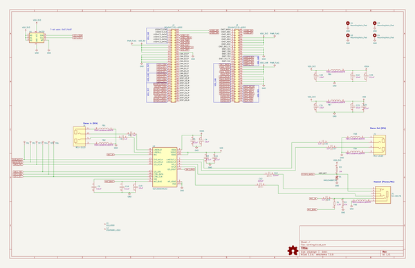
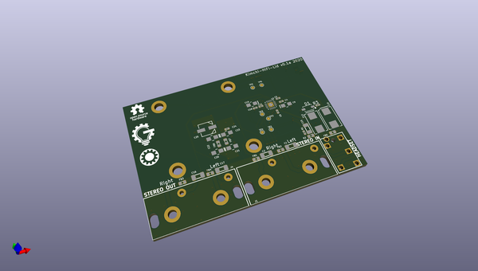
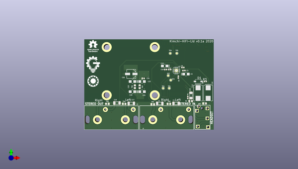
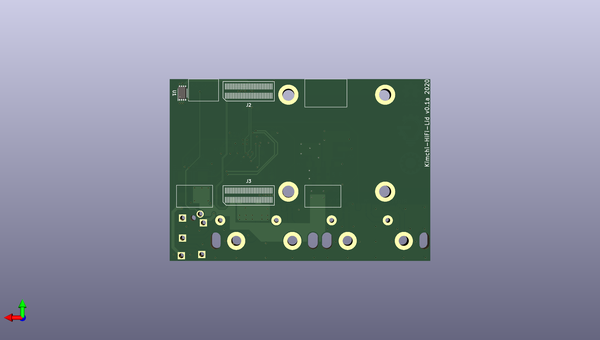

# kimchi_hifi_lid
 
## summary 
* id: adamjvr_kimchi_hifi_lid_kimchi_ulid
* user: adamjvr
* name: kimchi_hifi_lid
* board: kimchi_ulid
* repo: https://github.com/adamjvr/kimchi-HiFi-lid
* src_file_repo_kicad_pcb: PCB - SGTL/kimchi_ulid.kicad_pcb
* src_file_repo_kicad_pcb_link: https://github.com/adamjvr/kimchi-HiFi-lid/tree/main/PCB - SGTL/kimchi_ulid.kicad_pcb

* src_file_repo_sch: PCB - SGTL/kimchi_ulid.sch
* src_file_repo_sch_link: https://github.com/adamjvr/kimchi-HiFi-lid/tree/main/PCB - SGTL/kimchi_ulid.sch
* full details link: https://github.com/oomlout/oomlout_oomp_project_bot_v_2/tree/main/projects/adamjvr_kimchi_hifi_lid_kimchi_ulid/current_version/working  

## schematic  
  
[schematic (pdf)](working_schematic.pdf) 

## pcb  
 
  
  
  
[board (pdf)](working.pdf)  

## working_bom
| Id | Designator | Footprint | Quantity | Designation | Supplier and ref |  | None | 
| --- | --- | --- | --- | --- | --- | --- | --- | 
| 1 | C15,C2,C1,C16,C17 | C1206 | 5 | T491A105K010AT |  |  | [''] | 
| 2 | J1,J4 | RCJ-2123 | 2 | RCJ-2123 |  |  | [''] | 
| 3 | FB3,FB4,FB1,FB2,FB5,FB6,FB7 | R0603 | 7 | FBMJ1608HM180NTR |  |  | [''] | 
| 4 | R1 | R0402 | 1 | RC0402JR-072K2L |  |  | [''] | 
| 5 | R2 | R0603 | 1 | RC0603FR-0747KL |  |  | [''] | 
| 6 | J5 | 54-00176 | 1 | 54-00176 |  |  | [''] | 
| 7 | C10,C12 | T491D227M010AT | 2 | T491D227M010AT |  |  | [''] | 
| 8 | C21,C22,C20,C23,C9,C19 | T494A106M006AT | 6 | T494A106M006AT |  |  | [''] | 
| 9 | C25 | UZP1H0R1MCL1GB | 1 | UZP1H0R1MCL1GB |  |  | [''] | 
| 10 | C24,C4,C8,C11,C5,C18 | C0402 | 6 | C0402C104K9PACTU |  |  | [''] | 
| 11 | L1 | groupgets_logo | 1 | GG_LOGO |  |  | [''] | 
| 12 | L2 | oshpark_logo | 1 | OSHPARK_LOGO |  |  | [''] | 
| 13 | U2 | QFN40P300X300X60-21N | 1 | SGTL5000XNLA3 |  |  | [''] | 
| 14 | R3 | R0402 | 1 | AC0402FR-071ML |  |  | [''] | 
| 15 | D1 | MMSZ4688T3G | 1 | MMSZ4688T3G |  |  | [''] | 
| 16 | J3,J2 | DF40HC(3.5)-60DS | 2 | DF40HC(3.5)-60DS |  |  | [''] | 
| 17 | U1 | DFN-8-1EP_3x2mm_P0.5mm_EP1.36x1.46mm | 1 | 24C32 |  |  | [''] | 

## bom_schematic
| Ref | Qnty | Value | Cmp name | Footprint | Description | Vendor | DNP | 
| --- | --- | --- | --- | --- | --- | --- | --- | 
| C1, C2, C15, C16, C17 | 5 | T491A105K010AT | T491A105K010AT | kimchi_ulid:C1206 |  | Digikey |  | 
| C4, C5, C8, C11, C18, C24 | 6 | C0402C104K9PACTU | C0402C104K9PACTU | kimchi_ulid:C0402 |  | Digikey |  | 
| C9, C19, C20, C21, C22, C23 | 6 | T494A106M006AT | T494A106M006AT | kimchi_ulid:T494A106M006AT |  | Digikey |  | 
| C10, C12 | 2 | T491D227M010AT | T491D227M010AT | kimchi_ulid:T491D227M010AT |  | Digikey |  | 
| C25 | 1 | UZP1H0R1MCL1GB | UZP1H0R1MCL1GB | kimchi_ulid:UZP1H0R1MCL1GB |  | Digikey |  | 
| D1 | 1 | MMSZ4688T3G | MMSZ4688T3G | kimchi_ulid:MMSZ4688T3G | test point |  |  | 
| FB1, FB2, FB3, FB4, FB5, FB6, FB7 | 7 | FBMJ1608HM180NTR | FBMJ1608HM180NTR | kimchi_ulid:R0603 |  | Digikey |  | 
| H1, H2, H3, H4 | 4 | MountingHole_Pad | MountingHole_Pad-Mechanical | kimchi_ulid:MountingHole_3mm_Pad |  |  |  | 
| J1, J4 | 2 | RCJ-2123 | RCJ-2123 | kimchi_ulid:RCJ-2123 |  | Digikey |  | 
| J2, J3 | 2 | DF40HC(3.5)-60DS | Conn_02x30_Counter_Clockwise-Connector_Generic | kimchi_ulid:DF40HC(3.5)-60DS |  |  |  | 
| J5 | 1 | 54-00176 | 54-00176 | kimchi_ulid:54-00176 |  | Digikey |  | 
| L1 | 1 | GG_LOGO | GG_LOGO | kimchi_ulid:groupgets_logo |  |  |  | 
| L2 | 1 | OSHPARK_LOGO | OSHPARK_LOGO | kimchi_ulid:oshpark_logo |  |  |  | 
| LOGO1 | 1 | Logo_Open_Hardware_Small | Logo_Open_Hardware_Small-Graphic | Symbol:OSHW-Logo_5.7x6mm_SilkScreen |  |  |  | 
| R1 | 1 | RC0402JR-072K2L | RC0402JR-072K2L | AVR-KiCAD-Lib-Resistors:R0402 |  | Digikey |  | 
| R2 | 1 | RC0603FR-0747KL | RC0603FR-0747KL-AVR-KiCAD-Lib-Resistors | AVR-KiCAD-Lib-Resistors:R0603 |  | Digikey |  | 
| R3 | 1 | AC0402FR-071ML | AC0402FR-071ML | kimchi_ulid:R0402 |  | Digikey |  | 
| TP1, TP2, TP3, TP4, TP5, TP6 | 6 | TestPoint | TestPoint | kimchi_ulid:TestPoint_Pad_D1.0mm | test point |  |  | 
| U1 | 1 | 24C32 | 24LC16-Memory_EEPROM | Package_DFN_QFN:DFN-8-1EP_3x2mm_P0.5mm_EP1.36x1.46mm |  |  |  | 
| U2 | 1 | SGTL5000XNLA3 | SGTL5000XNLA3-kimchi_ulid | kimchi_ulid:QFN40P300X300X60-21N |  | Digikey |  | 

