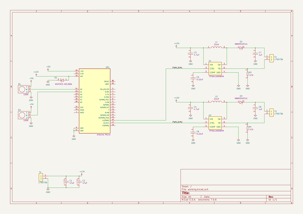

# led_board_mw
 
## summary 
* id: adamjvr_led_board_mw_led_board_mw
* user: adamjvr
* name: led_board_mw
* board: led_board_mw
* repo: https://github.com/adamjvr/LED-board-MW
* src_file_repo_kicad_pcb: PCB/LED-Board-MW/LED-Board-MW.kicad_pcb
* src_file_repo_kicad_pcb_link: https://github.com/adamjvr/LED-board-MW/tree/master/PCB/LED-Board-MW/LED-Board-MW.kicad_pcb

* src_file_repo_sch: PCB/LED-Board-MW/LED-Board-MW.sch
* src_file_repo_sch_link: https://github.com/adamjvr/LED-board-MW/tree/master/PCB/LED-Board-MW/LED-Board-MW.sch
* full details link: https://github.com/oomlout/oomlout_oomp_project_bot_v_2/tree/main/projects/adamjvr_led_board_mw_led_board_mw/current_version/working  

## schematic  
  
[schematic (pdf)](working_schematic.pdf) 

## pcb  
 
  
  
  
[board (pdf)](working.pdf)  

## working_bom
| Id | Designator | Footprint | Quantity | Designation | Supplier and ref |  | None | 
| --- | --- | --- | --- | --- | --- | --- | --- | 
| 1 | C1,C2 | CP_Radial_D6.3mm_P2.50mm | 2 | UFW1H470MED1TD |  |  | [''] | 
| 2 | C3,C4 | C0805 | 2 | CL21A475KACLRNC |  |  | [''] | 
| 3 | C5,C6 | C0805 | 2 | CL21B224KBFNNNE |  |  | [''] | 
| 4 | C7,C8 | C1206 | 2 | C1206C105K3RACAUTO |  |  | [''] | 
| 5 | D1 | MSP3V3 | 1 | MSP3V3-M3_89A |  |  | [''] | 
| 6 | D2,D3 | D_SOD-123 | 2 | MBR0540T1G |  |  | [''] | 
| 7 | L1,L2 | SRN8040-220M | 2 | SRN8040-220M |  |  | [''] | 
| 8 | R1,R2 | P0915N-FC15BR10K | 2 | P0915N-EC15BR100K |  |  | [''] | 
| 9 | R3,R4 | R2512 | 2 | WSLT2512R5000FEA |  |  | [''] | 
| 10 | SP1 | ARDUINO_A000053 | 1 | Arduino_Micro |  |  | [''] | 
| 11 | T1,T2,T3 | PhoenixContact_MSTBVA-G_02x5.08mm_Vertical | 3 | 1755736 |  |  | [''] | 
| 12 | U1,U2 | SOT-23-6_Handsoldering | 2 | TPS61165DBVR |  |  | [''] | 

## bom_schematic
| Ref | Qnty | Value | Cmp name | Footprint | Description | Vendor | DNP | 
| --- | --- | --- | --- | --- | --- | --- | --- | 
| C1, C2 | 2 | UFW1H470MED1TD | UFW1H470MED1TD-AVR-KiCAD-Lib-Capacitors | AVR-KiCAD-Lib-Capacitors:CP_Radial_D6.3mm_P2.50mm |  | Digikey |  | 
| C3, C4 | 2 | CL21A475KACLRNC | CL21A475KACLRNC-AVR-KiCAD-Lib-Capacitors | AVR-KiCAD-Lib-Capacitors:C0805 |  | Digikey |  | 
| C5, C6 | 2 | CL21B224KBFNNNE | CL21B224KBFNNNE-AVR-KiCAD-Lib-Capacitors | AVR-KiCAD-Lib-Capacitors:C0805 |  | Digikey |  | 
| C7, C8 | 2 | C1206C105K3RACAUTO | C1206C105K3RACAUTO-AVR-KiCAD-Lib-Capacitors | AVR-KiCAD-Lib-Capacitors:C1206 |  | Digikey |  | 
| D1 | 1 | MSP3V3-M3_89A | MSP3V3-M3_89A-AVR-KiCAD-Lib-Diodes | growbox-KiCAD-Diodes:MSP3V3 |  | Digikey |  | 
| D2, D3 | 2 | MBR0540T1G | MBR0540T1G-AVR-KiCAD-Lib-Diodes | AVR-KiCAD-Lib-Diodes:D_SOD-123 |  | Digikey |  | 
| L1, L2 | 2 | SRN8040-220M | SRN8040-220M-AVR-KiCAD-Lib-Inductors | AVR-KiCAD-Lib-Inductors:SRN8040-220M |  | Digikey |  | 
| R1, R2 | 2 | P0915N-EC15BR100K | P0915N-EC15BR100K-AVR-KiCAD-Lib-Potentiometers | AVR-KiCAD-Lib-Potentiometers:P0915N-FC15BR10K |  | Digikey |  | 
| R3, R4 | 2 | WSLT2512R5000FEA | WSLT2512R5000FEA-AVR-KiCAD-Lib-Resistors | AVR-KiCAD-Lib-Resistors:R2512 |  | Digikey |  | 
| SP1 | 1 | Arduino_Micro | Arduino_Micro-AVR-KiCAD-Lib-Special | AVR-KiCAD-Lib-Special:ARDUINO_A000053 |  | Digikey |  | 
| T1, T2, T3 | 3 | 1755736 | 1755736-AVR-KiCAD-Lib-Connectors | growbox-KiCAD-Connectors:PhoenixContact_MSTBVA-G_02x5.08mm_Vertical |  | Digikey |  | 
| U1, U2 | 2 | TPS61165DBVR | TPS61165DBVR-AVR-KiCAD-Lib-ICs | AVR-KiCAD-Lib-ICs:SOT-23-6_Handsoldering |  | Digikey |  | 

