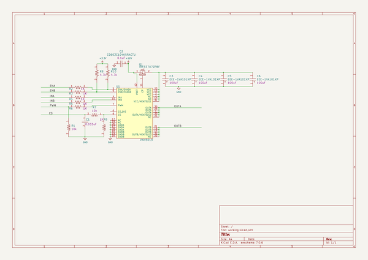

# muscolo
 
## summary 
* id: adamjvr_muscolo_muscolo
* user: adamjvr
* name: muscolo
* board: muscolo
* repo: https://github.com/adamjvr/muscolo
* src_file_repo_kicad_pcb: PDF/Muscolo.kicad_pcb
* src_file_repo_kicad_pcb_link: https://github.com/adamjvr/muscolo/tree/master/PDF/Muscolo.kicad_pcb

* src_file_repo_sch: PDF/Muscolo.sch
* src_file_repo_sch_link: https://github.com/adamjvr/muscolo/tree/master/PDF/Muscolo.sch
* full details link: https://github.com/oomlout/oomlout_oomp_project_bot_v_2/tree/main/projects/adamjvr_muscolo_muscolo/current_version/working  

## schematic  
  
[schematic (pdf)](working_schematic.pdf) 

## pcb  
 
  
  
  
[board (pdf)](working.pdf)  

## bom_schematic
| Ref | Qnty | Value | Cmp name | Footprint | Description | Vendor | DNP | 
| --- | --- | --- | --- | --- | --- | --- | --- | 
| C1 | 1 | VJ0603Y333KXQCW1BC | VJ0603Y333KXQCW1BC | OnHand-Components:C0603 |  |  |  | 
| C2 | 1 | C0603C104K5RACTU | C0603C104K5RACTU | OnHand-Components:C0805 |  |  |  | 
| C3, C4, C5, C6 | 4 | EEE-1VA101XP | EEE-1VA101XP | OnHand-Components:EEE-1VA101XP |  |  |  | 
| Q1 | 1 | IRFR3707ZPBF | IRFR3707ZPBF | OnHand-Components:IRFR3707ZPBF |  |  |  | 
| R1, R7 | 2 | RC2012F305CS | RC2012F305CS | OnHand-Components:R0603 |  |  |  | 
| R2, R3, R4, R5, R6, R9 | 6 | ERJ-3EKF1001V | ERJ-3EKF1001V | OnHand-Components:R0603 |  |  |  | 
| R8, R10 | 2 | ERJ-3GEYJ472V | ERJ-3GEYJ472V | OnHand-Components:R0603 |  |  |  | 
| U1 | 1 | VNH5019 | VNH5019 | OnHand-Components:VNH5019ATR-E |  |  |  | 

