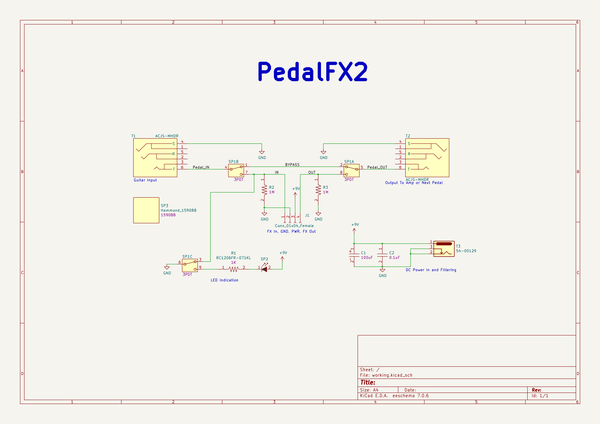
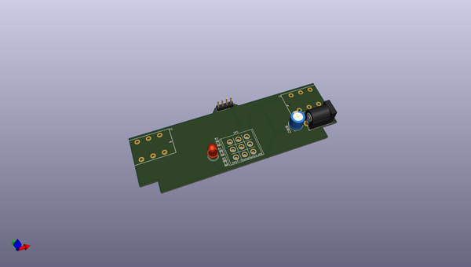
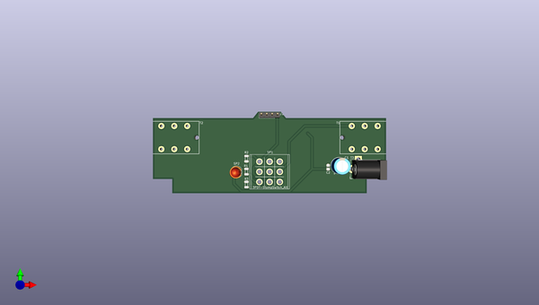
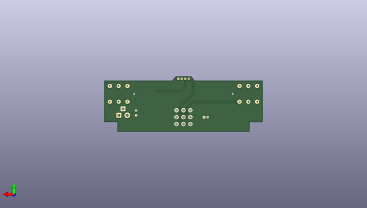

# pedalfx2
 
## summary 
* id: adamjvr_pedalfx2_pedalfx2_1590bb
* user: adamjvr
* name: pedalfx2
* board: pedalfx2_1590bb
* repo: https://github.com/adamjvr/PedalFX2
* src_file_repo_kicad_pcb: PCB/PedalFX2 - 1590BB/PedalFX2_1590BB.kicad_pcb
* src_file_repo_kicad_pcb_link: https://github.com/adamjvr/PedalFX2/tree/master/PCB/PedalFX2 - 1590BB/PedalFX2_1590BB.kicad_pcb

* src_file_repo_sch: PCB/PedalFX2 - 1590BB/PedalFX2_1590BB.sch
* src_file_repo_sch_link: https://github.com/adamjvr/PedalFX2/tree/master/PCB/PedalFX2 - 1590BB/PedalFX2_1590BB.sch
* full details link: https://github.com/oomlout/oomlout_oomp_project_bot_v_2/tree/main/projects/adamjvr_pedalfx2_pedalfx2_1590bb/current_version/working  

## schematic  
  
[schematic (pdf)](working_schematic.pdf) 

## pcb  
 
  
  
  
[board (pdf)](working.pdf)  

## working_bom
| Id | Designator | Footprint | Quantity | Designation | Supplier and ref |  | None | 
| --- | --- | --- | --- | --- | --- | --- | --- | 
| 1 | C2 | C0805 | 1 | CL21B104KCFNNNE |  |  | [''] | 
| 2 | J1 | PinHeader_1x04_P2.54mm_Vertical | 1 | Conn_01x04_Female |  |  | [''] | 
| 3 | R1 | R1206 | 1 | RC1206FR-071KL |  |  | [''] | 
| 4 | R2,R3 | R1206 | 2 | RC1206FR-071ML |  |  | [''] | 
| 5 | SP2 | LED_D5.0mm | 1 | HLMP-4700-C0002 |  |  | [''] | 
| 6 | T1,T2 | ACJS-MHDR | 2 | ACJS-MHDR |  |  | [''] | 
| 7 | SP1 | Switches_Stomp_Switch_3PDT | 1 | 3PDT-StompSwitch_Alt |  |  | [''] | 
| 8 | C1 | CP_Radial_D8.0mm_P3.50mm | 1 | UFW1H101MPD |  |  | [''] | 
| 9 | T3 | BarrelJack_Horizontal | 1 | 54-00129 |  |  | [''] | 
| 10 | SP3 | 1590BB | 1 | Hammond_1590BB |  |  | [''] | 

## bom_schematic
| Ref | Qnty | Value | Cmp name | Footprint | Description | Vendor | DNP | 
| --- | --- | --- | --- | --- | --- | --- | --- | 
| C1 | 1 | UFW1H101MPD | UFW1H101MPD-AVR-KiCAD-Lib-Capacitors | AVR-KiCAD-Lib-Capacitors:CP_Radial_D8.0mm_P3.50mm |  | Digikey |  | 
| C2 | 1 | CL21B104KCFNNNE | CL21B104KCFNNNE-AVR-KiCAD-Lib-Capacitors | AVR-KiCAD-Lib-Capacitors:C0805 |  | Digikey |  | 
| J1 | 1 | Conn_01x04_Female | Conn_01x04_Female-Connector | Connector_PinHeader_2.54mm:PinHeader_1x04_P2.54mm_Vertical |  |  |  | 
| R1 | 1 | RC1206FR-071KL | RC1206FR-071KL-Resistors | AVR-KiCAD-Lib-Resistors:R1206 |  | Digikey |  | 
| R2, R3 | 2 | RC1206FR-071ML | RC1206FR-071ML-Resistors | AVR-KiCAD-Lib-Resistors:R1206 |  | Digikey |  | 
| SP1 | 1 | 3PDT-StompSwitch_Alt | 3PDT-StompSwitch_Alt-Special | AVR-KiCAD-Lib-Special:Switches_Stomp_Switch_3PDT |  | * |  | 
| SP2 | 1 | HLMP-4700-C0002 | HLMP-4700-C0002-Special | AVR-KiCAD-Lib-Diodesl:LED_D5.0mm |  | Digikey |  | 
| SP3 | 1 | Hammond_1590BB | Hammond_1590BB-Special | AVR-KiCAD-Lib-Special:1590BB |  | Digikey |  | 
| T1, T2 | 2 | ACJS-MHDR | ACJS-MHDR-Connectors | AVR-KiCAD-Lib-Connectors:ACJS-MHDR |  | Digikey |  | 
| T3 | 1 | 54-00129 | 54-00129-Connectors | AVR-KiCAD-Lib-Connectors:BarrelJack_Horizontal |  | Digikey |  | 

