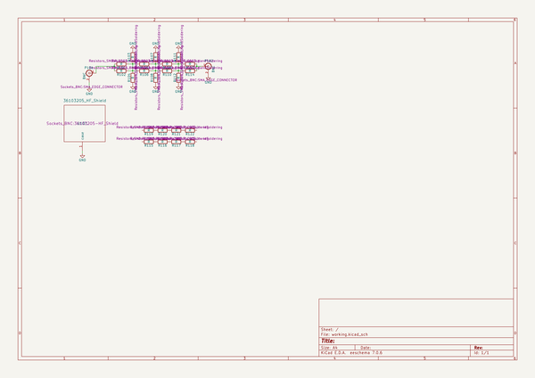
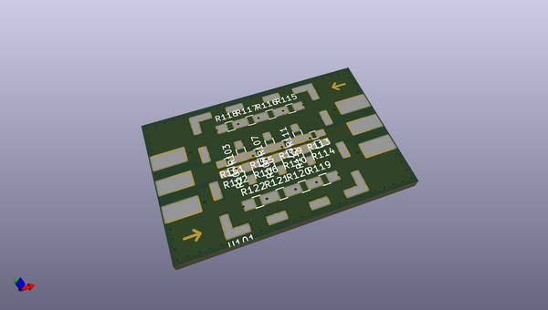
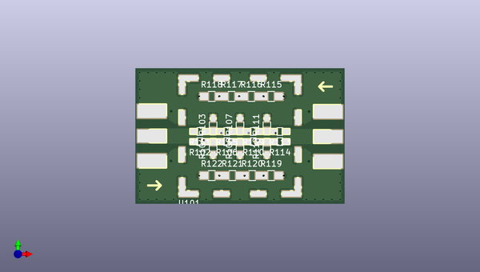
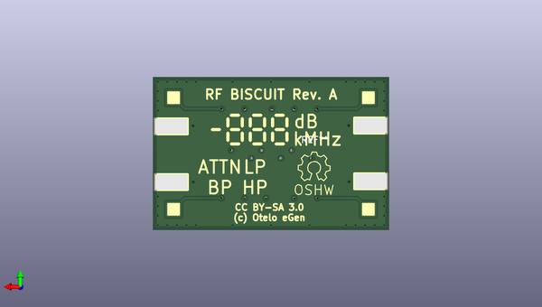

# rf_biscuit
 
## summary 
* id: adamjvr_rf_biscuit_rf_biscuit
* user: adamjvr
* name: rf_biscuit
* board: rf_biscuit
* repo: https://github.com/adamjvr/rf-biscuit
* src_file_repo_kicad_pcb: rf_biscuit.kicad_pcb
* src_file_repo_kicad_pcb_link: https://github.com/adamjvr/rf-biscuit/tree/master/rf_biscuit.kicad_pcb

* src_file_repo_sch: rf_biscuit.sch
* src_file_repo_sch_link: https://github.com/adamjvr/rf-biscuit/tree/master/rf_biscuit.sch
* full details link: https://github.com/oomlout/oomlout_oomp_project_bot_v_2/tree/main/projects/adamjvr_rf_biscuit_rf_biscuit/current_version/working  

## schematic  
  
[schematic (pdf)](working_schematic.pdf) 

## pcb  
 
  
  
  
[board (pdf)](working.pdf)  

## working_bom
| Id | Designator | Footprint | Quantity | Designation | Supplier and ref |  | None | 
| --- | --- | --- | --- | --- | --- | --- | --- | 
| 1 | REF**,REF**,REF**,REF**,REF**,REF**,REF**,REF**,REF**,REF**,REF**,REF**,REF**,REF**,REF**,REF**,REF**,REF**,REF**,REF**,REF**,REF**,REF**,REF**,REF**,REF**,REF**,REF**,REF**,REF**,REF**,REF**,REF**,REF**,REF**,REF**,REF**,REF** | StichVIA | 38 | StichVIA |  |  | [''] | 
| 2 | P101,P102 | SMA_EDGE_CONNECTOR | 2 | BNC |  |  | [''] | 
| 3 | R101,R102,R103,R104,R105,R106,R107,R108,R109,R110,R111,R112,R113,R114 | R_0603_HandSoldering | 14 | R |  |  | [''] | 
| 4 | U101 | 36103205-HF_Shield | 1 | 36103205_HF_Shield |  |  | [''] | 
| 5 | R115,R116,R117,R118,R119,R120,R121,R122 | R_0805_HandSoldering | 8 | R |  |  | [''] | 
| 6 | REF** | Symbol_OSHW-Logo_Mask | 1 | Symbol_OSHW-Logo_Mask |  |  | [''] | 

## bom_schematic
| Ref | Qnty | Value | Cmp name | Footprint | Description | Vendor | DNP | 
| --- | --- | --- | --- | --- | --- | --- | --- | 
| P101, P102 | 2 | BNC | BNC | Sockets_BNC:SMA_EDGE_CONNECTOR |  |  |  | 
| R101, R102, R103, R104, R105, R106, R107, R108, R109, R110, R111, R112, R113, R114 | 14 | R | R | Resistors_SMD:R_0603_HandSoldering |  |  |  | 
| R115, R116, R117, R118, R119, R120, R121, R122 | 8 | R | R | Resistors_SMD:R_0805_HandSoldering |  |  |  | 
| U101 | 1 | 36103205_HF_Shield | 36103205_HF_Shield | Sockets_BNC:36103205-HF_Shield |  |  |  | 

