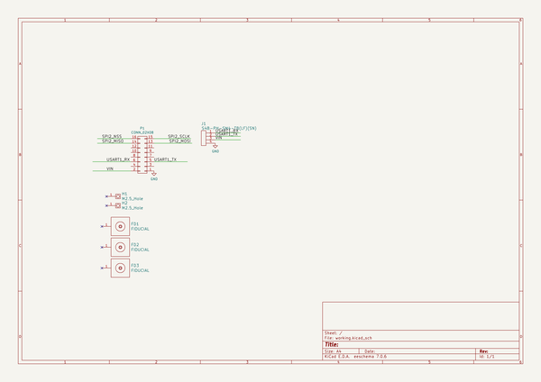

# s1g_mod
 
## summary 
* id: adamjvr_s1g_mod_jst_adapter
* user: adamjvr
* name: s1g_mod
* board: jst_adapter
* repo: https://github.com/adamjvr/S1G-Mod
* src_file_repo_kicad_pcb: Adapters/JST - USART/PCB/JST_Adapter.kicad_pcb
* src_file_repo_kicad_pcb_link: https://github.com/adamjvr/S1G-Mod/tree/master/Adapters/JST - USART/PCB/JST_Adapter.kicad_pcb

* src_file_repo_sch: Adapters/JST - USART/PCB/JST_Adapter.sch
* src_file_repo_sch_link: https://github.com/adamjvr/S1G-Mod/tree/master/Adapters/JST - USART/PCB/JST_Adapter.sch
* full details link: https://github.com/oomlout/oomlout_oomp_project_bot_v_2/tree/main/projects/adamjvr_s1g_mod_jst_adapter/current_version/working  

## schematic  
  
[schematic (pdf)](working_schematic.pdf) 

## pcb  
 
  
  
  
[board (pdf)](working.pdf)  

## working_bom
| Id | Designator | Footprint | Quantity | Designation | Supplier and ref |  | None | 
| --- | --- | --- | --- | --- | --- | --- | --- | 
| 1 | H1,H2 | M2.5_HOLE | 2 | M2.5_Hole |  |  | [''] | 
| 2 | FD1,FD2,FD3 | FIDUCIAL | 3 | FIDUCIAL |  |  | [''] | 
| 3 | P1 | Socket_Strip_Straight_2x08 | 1 | CONN_02X08 |  |  | [''] | 
| 4 | J1 | S4B-PH-SM4-TB(LF)(SN) | 1 | S4B-PH-SM4-TB(LF)(SN) |  |  | [''] | 

## bom_schematic
| Ref | Qnty | Value | Cmp name | Footprint | Description | Vendor | DNP | 
| --- | --- | --- | --- | --- | --- | --- | --- | 
| FD1, FD2, FD3 | 3 | FIDUCIAL | FIDUCIAL | PCB_Footprints:FIDUCIAL |  |  |  | 
| H1, H2 | 2 | M2.5_Hole | M2.5_Hole | PCB_Footprints:M2.5_HOLE |  |  |  | 
| J1 | 1 | S4B-PH-SM4-TB(LF)(SN) | S4B-PH-SM4-TB(LF)(SN) | PCB_Footprints:S4B-PH-SM4-TB(LF)(SN) |  |  |  | 
| P1 | 1 | CONN_02X08 | CONN_02X08 | Socket_Strips:Socket_Strip_Straight_2x08 |  |  |  | 

