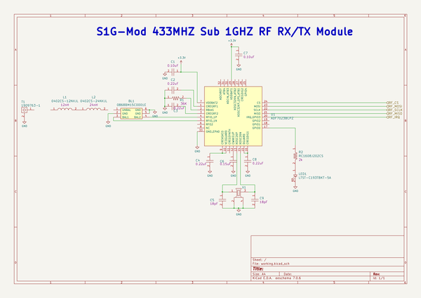

# s1g_mod
 
## summary 
* id: adamjvr_s1g_mod_s1g_mod_433
* user: adamjvr
* name: s1g_mod
* board: s1g_mod_433
* repo: https://github.com/adamjvr/S1G-Mod
* src_file_repo_kicad_pcb: PCB_433_Separate/S1G_Mod_433.kicad_pcb
* src_file_repo_kicad_pcb_link: https://github.com/adamjvr/S1G-Mod/tree/master/PCB_433_Separate/S1G_Mod_433.kicad_pcb

* src_file_repo_sch: PCB_433_Separate/S1G_Mod_433.sch
* src_file_repo_sch_link: https://github.com/adamjvr/S1G-Mod/tree/master/PCB_433_Separate/S1G_Mod_433.sch
* full details link: https://github.com/oomlout/oomlout_oomp_project_bot_v_2/tree/main/projects/adamjvr_s1g_mod_s1g_mod_433/current_version/working  

## schematic  
  
[schematic (pdf)](working_schematic.pdf) 

## pcb  
 
  
  
  
[board (pdf)](working.pdf)  

## bom_schematic
| Ref | Qnty | Value | Cmp name | Footprint | Description | Vendor | DNP | 
| --- | --- | --- | --- | --- | --- | --- | --- | 
| BL1 | 1 | 0868BM15C0001E | 0868BM15C0001E | PCB_Footprints:0868BM15C0001E |  |  |  | 
| C1, C7 | 2 | CL05B104JP5NNNC | CL05B104JP5NNNC | PCB_Footprints:C0402 |  |  |  | 
| C2, C3, C4, C8 | 4 | CL10B224JO8NNNC | CL10B224JO8NNNC | PCB_Footprints:C0402 |  |  |  | 
| C5, C9 | 2 | CL05C180GB5NCNC | CL05C180GB5NCNC | PCB_Footprints:C0402 |  |  |  | 
| C6 | 1 | GRM155R71H152KA01D | GRM155R71H152KA01D | PCB_Footprints:C0402 |  |  |  | 
| L1 | 1 | 0402CS-12NXJL | 0402CS-12NXJL | PCB_Footprints:L0402 |  |  |  | 
| L2 | 1 | 0402CS-24NXJL | 0402CS-24NXJL | PCB_Footprints:L0402 |  |  |  | 
| LED1 | 1 | LTST-C193TBKT-5A | LTST-C193TBKT-5A | PCB_Footprints:LED0603 |  |  |  | 
| R1 | 1 | ERA-2AED363X | ERA-2AED363X | PCB_Footprints:R0603 |  |  |  | 
| R2 | 1 | RC1608J202CS | RC1608J202CS | PCB_Footprints:R0603 |  |  |  | 
| T1 | 1 | 1909763-1 | 1909763-1 | PCB_Footprints:1909763-1 |  |  |  | 
| U1 | 1 | ADF7023BCPZ | ADF7023BCPZ | PCB_Footprints:ADF7023BCPZ |  |  |  | 
| X1 | 1 | FA-128_26.0000MF10Z-AC3 | FA-128_26.0000MF10Z-AC3 | PCB_Footprints:FA-128_26.0000MF10Z-AC3 |  |  |  | 

