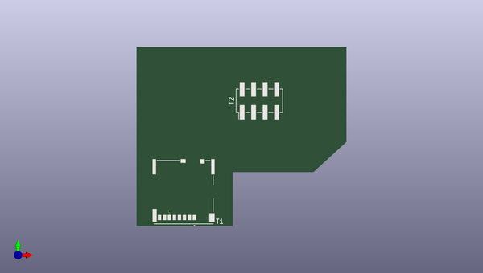

# sd2sp2_usa
 
## summary 
* id: adamjvr_sd2sp2_usa_gc_sd2sp2_sdboard
* user: adamjvr
* name: sd2sp2_usa
* board: gc_sd2sp2_sdboard
* repo: https://github.com/adamjvr/SD2SP2-USA
* src_file_repo_kicad_pcb: PCB/GC_SD2SP2_SDBOARD/GC_SD2SP2_SDBOARD.kicad_pcb
* src_file_repo_kicad_pcb_link: https://github.com/adamjvr/SD2SP2-USA/tree/master/PCB/GC_SD2SP2_SDBOARD/GC_SD2SP2_SDBOARD.kicad_pcb

* src_file_repo_sch: PCB/GC_SD2SP2_SDBOARD/GC_SD2SP2_SDBOARD.sch
* src_file_repo_sch_link: https://github.com/adamjvr/SD2SP2-USA/tree/master/PCB/GC_SD2SP2_SDBOARD/GC_SD2SP2_SDBOARD.sch
* full details link: https://github.com/oomlout/oomlout_oomp_project_bot_v_2/tree/main/projects/adamjvr_sd2sp2_usa_gc_sd2sp2_sdboard/current_version/working  

## schematic  
  
[schematic (pdf)](working_schematic.pdf) 

## pcb  
 
  
  
  
[board (pdf)](working.pdf)  

## working_bom
| Id | Designator | Footprint | Quantity | Designation | Supplier and ref |  | None | 
| --- | --- | --- | --- | --- | --- | --- | --- | 
| 1 | T1 | MOLEX_503398-1892 | 1 | 5033981892 |  |  | [''] | 
| 2 | T2 | TSM-104-01-S-DV_2x04_Pitch2.54mm_SMD | 1 | TSM-104-01-S-DV |  |  | [''] | 

## bom_schematic
| Ref | Qnty | Value | Cmp name | Footprint | Description | Vendor | DNP | 
| --- | --- | --- | --- | --- | --- | --- | --- | 
| T1 | 1 | 5033981892 | 5033981892-AVR-KiCAD-Lib-Special | AVR-KiCAD-Lib-Special:MOLEX_503398-1892 |  | Digikey |  | 
| T2 | 1 | TSM-104-01-S-DV | TSM-104-01-S-DV-AVR-KiCAD-Lib-Connectors | AVR-KiCAD-Lib-Connectors:TSM-104-01-S-DV_2x04_Pitch2.54mm_SMD |  | Digikey |  | 

