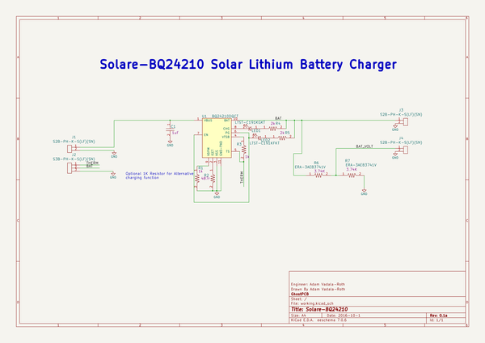

# solare_bq24210
 
## summary 
* id: adamjvr_solare_bq24210_solare_bq24210
* user: adamjvr
* name: solare_bq24210
* board: solare_bq24210
* repo: https://github.com/adamjvr/Solare-BQ24210
* src_file_repo_kicad_pcb: PCB/Solare-BQ24210.kicad_pcb
* src_file_repo_kicad_pcb_link: https://github.com/adamjvr/Solare-BQ24210/tree/master/PCB/Solare-BQ24210.kicad_pcb

* src_file_repo_sch: PCB/Solare-BQ24210.sch
* src_file_repo_sch_link: https://github.com/adamjvr/Solare-BQ24210/tree/master/PCB/Solare-BQ24210.sch
* full details link: https://github.com/oomlout/oomlout_oomp_project_bot_v_2/tree/main/projects/adamjvr_solare_bq24210_solare_bq24210/current_version/working  

## schematic  
  
[schematic (pdf)](working_schematic.pdf) 

## pcb  
 
  
  
  
[board (pdf)](working.pdf)  

## working_bom
| Id | Designator | Footprint | Quantity | Designation | Supplier and ref |  | None | 
| --- | --- | --- | --- | --- | --- | --- | --- | 
| 1 | C1 | C0402 | 1 | CL05A105KA5NQNC |  |  | [''] | 
| 2 | J1,J3,J4 | S2B-PH-K-S(LF)(SN) | 3 | S2B-PH-K-S(LF)(SN) |  |  | [''] | 
| 3 | J2 | S3B-PH-K-S(LF)(SN) | 1 | S3B-PH-K-S(LF)(SN) |  |  | [''] | 
| 4 | LED1 | LED0603 | 1 | LTST-C191KGKT |  |  | [''] | 
| 5 | LED2 | LED0603 | 1 | LTST-C191KFKT |  |  | [''] | 
| 6 | R1,R3 | R0402 | 2 | RC1005F102CS |  |  | [''] | 
| 7 | R2 | R0402 | 1 | RC1005F4870CS |  |  | [''] | 
| 8 | R4,R5 | R0603 | 2 | RC1608J202CS |  |  | [''] | 
| 9 | R6,R7 | R0603 | 2 | ERA-3AEB3741V |  |  | [''] | 
| 10 | U1 | BQ24210 | 1 | BQ24210DQCT |  |  | [''] | 

## bom_schematic
| Ref | Qnty | Value | Cmp name | Footprint | Description | Vendor | DNP | 
| --- | --- | --- | --- | --- | --- | --- | --- | 
| C1 | 1 | CL05A105KA5NQNC | CL05A105KA5NQNC | PCB_Footprints:C0402 |  |  |  | 
| J1, J3, J4 | 3 | S2B-PH-K-S(LF)(SN) | S2B-PH-K-S(LF)(SN) | PCB_Footprints:S2B-PH-K-S(LF)(SN) |  |  |  | 
| J2 | 1 | S3B-PH-K-S(LF)(SN) | S3B-PH-K-S(LF)(SN) | PCB_Footprints:S3B-PH-K-S(LF)(SN) |  |  |  | 
| LED1 | 1 | LTST-C191KGKT | LTST-C191KGKT | PCB_Footprints:LED0603 |  |  |  | 
| LED2 | 1 | LTST-C191KFKT | LTST-C191KFKT | PCB_Footprints:LED0603 |  |  |  | 
| R1, R3 | 2 | RC1005F102CS | RC1005F102CS | PCB_Footprints:R0402 |  |  |  | 
| R2 | 1 | RC1005F4870CS | RC1005F4870CS | PCB_Footprints:R0402 |  |  |  | 
| R4, R5 | 2 | RC1608J202CS | RC1608J202CS | PCB_Footprints:R0603 |  |  |  | 
| R6, R7 | 2 | ERA-3AEB3741V | ERA-3AEB3741V | PCB_Footprints:R0603 |  |  |  | 
| U1 | 1 | BQ24210DQCT | BQ24210DQCT | PCB_Footprints:BQ24210 |  |  |  | 

